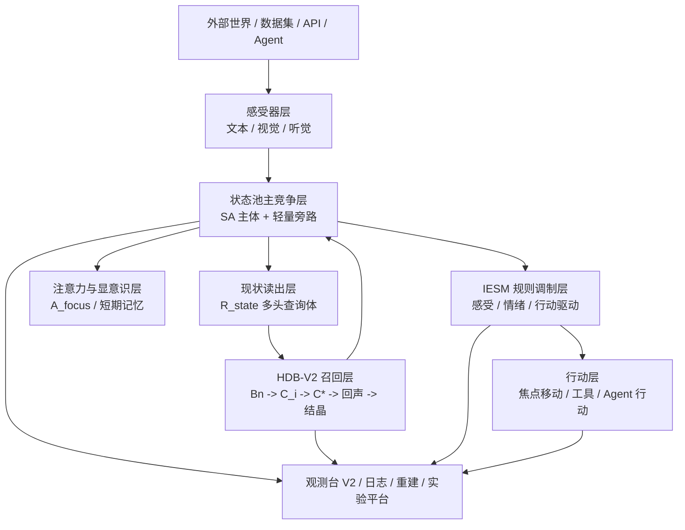

# AP 二期 V2 总蓝图详细设计草案

版本：Draft v0.1  
撰写日期：2026-05-18  
适用范围：AP 二期实验原型总体架构 / HDB-V2 / 感受器 V1 / IESM V2 / 观测台 V2 / 后续 Agent 对接  
文档性质：上位总图 / 子系统协同蓝图 / V1 到 V2 的统一迁移口径

---

## 目录

1. 文档定位  
2. 为什么需要这份总蓝图  
3. 二期 V2 的总目标  
4. 一句话总定义  
5. V2 的总体架构分层  
6. 主认知闭环总流程  
7. 核心对象与统一术语  
8. 各模块职责总览  
9. HDB-V2 在总系统中的位置  
10. 感受器 V1 在总系统中的位置  
11. IESM / 先天规则系统在总系统中的位置  
12. 观测台 V2 在总系统中的位置  
13. 数据层、日志层、读模型层的统一关系  
14. 运行模式总览  
15. 输入、记忆、预测、行动、奖惩的完整链条  
16. 状态池、短期记忆与长期记忆的分工  
17. 向量召回、局部重建、回声与结晶的关系  
18. 白箱与可解释性的总设计  
19. 导入导出、checkpoint 与实验资产管理  
20. Agent / 电脑控制 / 多模态扩展接口  
21. 实验、验证与论文导向设计  
22. V2 相比 V1 的总差异概览  
23. 分章节说明 V2 相比 V1 的区别  
24. 推荐实现顺序  
25. 当前最推荐的正式方案组合  
26. 最终结论

---

## 1. 文档定位

这份文档不是替代 HDB-V2 草案、感受器草案、规则草案、观测台草案。  
相反，它的职责是站在更高一层，把这四份草案统一成一个 **可执行、可扩展、可协作、可对照 V1 的二期总体蓝图**。

如果说前面几份文档分别回答的是：

1. 长期记忆系统怎么设计
2. 多模态输入怎么接
3. 先天规则到底能读什么、改什么
4. 观测和实验平台怎么设计

那么这份总蓝图回答的是：

1. 整个 V2 系统现在到底长什么样
2. 各个模块之间是怎样协作的
3. 为什么要这样分工
4. 和 V1 比，哪些东西保留、哪些东西升级、哪些东西被替换
5. 后面真正开做时，先做什么、后做什么

因此它适合作为：

1. 未来开工实现时的总入口文档
2. 新的人类开发者或大模型接手时的第一份总说明
3. 后续论文方法部分和系统总图的统一口径来源

---

## 2. 为什么需要这份总蓝图

AP 二期当前已经不是一个“单点模块想法”了，而是至少包含四个互相耦合的方向：

1. **HDB-V2**
   - 统一记忆库
   - `R_state -> Bn -> C_i -> C*`
   - 在线回声抽象与低频结晶

2. **感受器 V1**
   - 文本、图片、音频输入
   - 固定预算刺激包
   - 视觉焦点 / 听觉采样 / 感受器疲劳

3. **IESM / 先天规则系统**
   - 认知感受、期待/压力、违和/正确、情绪通道、行动驱动
   - 可追踪条件字典
   - 统一规则编辑与审计基础

4. **观测台 V2**
   - 在线轻观测
   - 离线重建
   - run 管理
   - 导入导出
   - 批量实验

如果没有总蓝图，很容易出现几个问题：

1. 每个子文档都自洽，但拼起来时接口不一致
2. 同一个概念在不同文档里口径轻微漂移
3. 后面实现顺序混乱
4. 未来接手的人要同时翻多份文档才能理解全貌

所以总蓝图的意义，本质上是：

> **把“模块级正确”提升成“系统级正确”。**

---

## 3. 二期 V2 的总目标

AP 二期 V2 的总目标可以概括为五类。

### 3.1 理论目标

1. 保持 AP 的持续认知闭环哲学
2. 保持“理解、学习、预测、反哺、行动”共用一套主路径
3. 从更接近拟人的长期运行机制上，验证 AP 架构的可扩展性

### 3.2 工程目标

1. 用更稳定、更可规模化的方式替换 V1 中最重的热路径
2. 支持百万级到千万级记忆下的可运行实验原型
3. 支持文本、多模态、Agent 对接三类场景

### 3.3 白箱目标

1. 运行过程可观测
2. 召回、预测、规则、行动链条可审计
3. 长跑时仍可做细节重建

### 3.4 实验目标

1. 支持单次 demo
2. 支持批量数据集实验
3. 支持长期连续运行
4. 支持未来对照实验、消融实验、论文证据积累

### 3.5 产品化原型目标

虽然二期不是最终产品，但要具备未来演化成下列方向的能力：

1. 电脑主观能动性心智核心
2. 具身感知-行动代理
3. 可训练、可长期记忆、可被 LLM 辅导和约束的实验平台

---

## 4. 一句话总定义

如果必须用一句话定义 AP 二期 V2，我会这样写：

> **AP 二期 V2 是一个以 SA 能量场为运行主体、以 `R_state -> Bn -> C_i -> C*` 为记忆召回主链、以多模态固定预算感受器为输入前端、以 IESM 为规则调制层、以观测台 V2 为白箱实验底座的持续认知闭环系统。**

---

## 5. V2 的总体架构分层

建议从总体上把二期系统看成八层。

这八层不是八个完全独立进程，而是功能层次。

---

## 6. 主认知闭环总流程

二期当前最推荐的标准 tick 流程可以总结为：

1. 感受器接收外源输入
2. 感受器按固定预算输出外源刺激包
3. 状态池维护已有对象、疲劳、近因、轻量旁路
4. 外源输入与现有热态对象共同形成当前现状
5. 从完整现状中读出固定预算的 `R_state`
6. HDB-V2 基于 `R_state` 做混合召回，得到 Bn
7. 基于 Bn 的邻域提取形成多个 `C_i`
8. 多个 `C_i` 聚合为主综合预测包 `C*`
9. Bn / `C*` / 回声 / 必要结晶结果回投状态池
10. IESM 在全局现状上计算认知感受、情绪与行动驱动
11. 注意力从更新后的状态池读出 `A_focus`
12. `A_focus` 写入短期记忆，并作为显意识链的一环
13. 行动系统在驱动力竞争下执行当前行动
14. 观测台记录该 tick 的关键事实，供在线轻观测与离线重建

### 6.1 为什么这个顺序是当前最优口径

因为它统一满足了以下目标：

1. 召回不是只依赖一个很短的小焦点词元
2. 显意识链又不会因此消失
3. 规则系统基于整个现状而不是只基于狭窄片段
4. 连续语言生成、主观锚点、预测推进、外界打断都能在同一竞争图景里出现

---

## 7. 核心对象与统一术语

二期系统中，最关键的对象是以下几类。

### 7.1 SA

SA 仍然是最小能量承载单元。  
但二期的 SA 已经不再只是 V1 那种偏静态定义，而是：

1. 支持 Registry
2. 支持 family
3. 支持多尺度竞争
4. 支持结晶
5. 支持属性实例化

### 7.2 状态池主竞争面

二期状态池推荐：

1. 主体尽量 SA 化
2. 仍保留极轻量在线锚点层
3. 不走“完全纯全局唯一 SA 无任何壳”的极端路线

### 7.3 `R_state`

`R_state` 是：

> **对完整状态池现状做固定预算、多视角读出后得到的召回查询体。**

它不是完整状态池原样复制，也不是单个微小显意识片段。

### 7.4 Bn

Bn 是当前 tick 的一级召回记忆对象集合。  
它是 HDB-V2 后续预测与回声生成的入口。

### 7.5 `C_i` 与 `C*`

1. `C_i`：由某个 `B_i` 的时空邻域提取出的局部预测包
2. `C*`：多个 `C_i` 聚合后的当前主综合预测包

### 7.6 `A_focus`

`A_focus` 是：

> **更新后的状态池中，被注意力压缩读出的短小显意识片段。**

它更偏语言链、显意识链，而不是召回主查询源。

### 7.7 旁路结构

包括：

1. focus chain
2. prediction branches
3. verification anchors
4. action targets
5. recent precise trace

它们用于：

1. 在线连续性
2. 规则绑定
3. 恢复与导出
4. 审计与重建

---

## 8. 各模块职责总览

二期总系统中各模块的职责可以这样划分。

### 8.1 感受器层

负责：

1. 接收高吞吐原始输入
2. 固定预算采样
3. 感受器疲劳抑制
4. 输出标准刺激包

不负责：

1. 长期记忆
2. Bn 召回
3. `C_i / C*`

### 8.2 HDB-V2

负责：

1. 长期记忆冷存
2. `R_state` 到 Bn 的召回
3. `C_i -> C*`
4. 回声抽象
5. 低频结晶

### 8.3 状态池

负责：

1. 当前认知场
2. 主竞争面
3. 近期热态承载
4. 供规则、注意力、行动读取

### 8.4 IESM / 规则层

负责：

1. 认知感受生成
2. 情绪通道调制
3. 属性实例化
4. 行动驱动力注入
5. 查询头预算、偏置、安全门控

### 8.5 注意力层

负责：

1. 从更新后的状态池读出显意识焦点
2. 形成短期显意识链
3. 支撑内心独白式连续输出

### 8.6 行动层

负责：

1. 本能与习惯驱动
2. 焦点移动
3. 未来工具调用 / 电脑控制 / Agent 行为

### 8.7 观测台 V2

负责：

1. 在线轻观测
2. 追加写日志
3. 离线重建
4. run 管理
5. 导入导出
6. 批量实验

---

## 9. HDB-V2 在总系统中的位置

HDB-V2 是二期最核心的升级点之一。

### 9.1 它不再只是“结构库”

V1 中的 HDB 更偏：

1. 结构级查存一体
2. 刺激级查存一体
3. 最大共同结构
4. 局部数据库链

V2 中的 HDB 则更像：

1. 统一记忆包冷存层
2. 混合召回层
3. 时空邻域层
4. 在线抽象回声层
5. 低频结晶缓存层

### 9.2 它和状态池的关系

HDB-V2 不替代状态池。  
它负责从状态池现状中读出 `R_state`，再把召回结果回投回状态池。

### 9.3 它和短期记忆的关系

短期记忆是：

1. 显意识链
2. 高分辨率近因窗口
3. 后继优势的重要来源

HDB-V2 会读它，但不会被它完全替代。

---

## 10. 感受器 V1 在总系统中的位置

感受器是二期真正迈向多模态和具身前端的第一步。

### 10.1 它是前端预算控制器

感受器层的本质是：

> **把高吞吐外界流压缩成 AP 主闭环可承受的固定预算刺激包。**

### 10.2 它必须白箱

因此感受器不应做成一个完全黑箱 embedding 前处理器。  
它必须保留：

1. 采样路径
2. 疲劳路径
3. 焦点路径
4. 输出刺激对象摘要

### 10.3 它为后续 Agent 铺路

未来：

1. 截图
2. 音频
3. 视频帧
4. 麦克风

都可走同一个感受器层抽象。

---

## 11. IESM / 先天规则系统在总系统中的位置

规则系统在二期不是“外挂”，而是 **横切式调制层**。

### 11.1 它的读接口更宽了

V2 中它可读取：

1. 完整状态池摘要
2. 对象级能量变化
3. `R_state` 查询头预算
4. Bn 结果
5. `C_i / C*`
6. 感受器摘要
7. 旁路结构摘要
8. 情绪通道
9. 行动候选

### 11.2 它的写接口也更系统了

V2 中它可以：

1. 生成认知感受节点
2. 修改情绪通道
3. 给对象写属性实例
4. 对注意力/查询头/行动竞争加偏置
5. 输出结构化行动驱动力

### 11.3 它是拟人性的关键来源之一

像下面这些效果都主要依赖 IESM：

1. 违和感 / 正确感
2. 期待 / 压力
3. 视焦点本能移动
4. 奖惩驱动的规避或趋近
5. 情绪递质对注意力和行动的调制

---

## 12. 观测台 V2 在总系统中的位置

观测台 V2 不只是“一个 UI”，而是整个二期系统的实验底座。

### 12.1 它负责把系统变成可做实验的东西

没有观测台 V2，二期很难稳定完成：

1. 批量实验
2. 长期运行
3. 白箱审计
4. checkpoint
5. 导入导出
6. 对照分析

### 12.2 它必须是轻在线 + 重离线

这点很重要。  
V2 明确反对再走 V1 那种“巨型运行态报告 + 前端频繁整包轮询”的模式。

---

## 13. 数据层、日志层、读模型层的统一关系

从总体上，二期的系统数据建议分成三层。

### 13.1 运行态层

包括：

1. 当前状态池
2. 当前旁路结构
3. 当前短期记忆
4. 当前感受器态
5. 当前情绪与规则态

### 13.2 原始日志层

包括：

1. tick metrics
2. tick summaries
3. sidecar summaries
4. rules/actions logs
5. sensor logs

### 13.3 读模型层

包括：

1. live preview
2. tick inspector index
3. chart rollup
4. continuity view
5. audit view

这个三层划分，是二期稳定性的关键。

---

## 14. 运行模式总览

二期建议正式支持三种运行模式：

1. 单次输入模式
2. 批量数据集模式
3. API / Agent 接入模式

这三种模式共用同一套：

1. 输入协议
2. tick 日志协议
3. run manifest
4. 导入导出口径

---

## 15. 输入、记忆、预测、行动、奖惩的完整链条

二期总图里，这条链必须明确：

1. 外源输入进入感受器
2. 感受器输出刺激包
3. 刺激包与当前热态共同形成现状
4. 现状读出 `R_state`
5. HDB-V2 输出 Bn、`C_i`、`C*`
6. 回投状态池
7. IESM 生成感受 / 情绪 / 行动偏置
8. 注意力读出 `A_focus`
9. 行动系统执行
10. 奖惩再反哺下一轮

这是一条真正闭合的链，而不是几个散模块。

---

## 16. 状态池、短期记忆与长期记忆的分工

### 16.1 状态池

代表当前认知场。  
强调“现在正在活跃什么”。

### 16.2 短期记忆

代表：

1. 最近显意识链
2. 高分辨率近因片段
3. 后继优势的重要来源

### 16.3 长期记忆

代表：

1. 冷保存经验
2. 可被召回的历史包
3. 结晶 SA 与抽象记忆

### 16.4 为什么三者不能合并成一个东西

因为它们在：

1. 生命周期
2. 分辨率
3. 查询方式
4. 运行成本
5. 认知角色

上都不同。

---

## 17. 向量召回、局部重建、回声与结晶的关系

这是二期最容易被误解的一块，所以总蓝图里要专门说明。

### 17.1 向量召回不是全部

V2 虽然引入了向量/ANN 思路，但它不是“纯向量数据库方案”。

它的正式组合是：

1. `R_state` 形成多头查询
2. ANN / posting 做候选召回
3. 在候选上做局部重建或精排
4. 再提取 `C_i`
5. 聚合为 `C*`
6. 叠加形成回声
7. 在低频条件下结晶少量高价值 SA

### 17.2 结晶 SA 的角色

当前最推荐口径不是“所有复杂结构都靠结晶 SA 表示”，而是：

> **复杂结构理解主要靠记忆召回 + 局部重建 + 抽象记忆回存。**
>
> **结晶 SA 更像节约算力的高频缓存和结构范式缓存。**

这点和 V1 很不一样。

---

## 18. 白箱与可解释性的总设计

二期白箱性来自四层。

### 18.1 运行态白箱

能看：

1. 状态池 top
2. `R_state`
3. Bn
4. `C*`
5. 规则摘要

### 18.2 日志事实白箱

能重建：

1. 每 tick 的关键事实
2. 旁路前后
3. 行动驱动

### 18.3 审计层白箱

能追：

1. 规则命中
2. 候选得分
3. 异常点

### 18.4 叙事层白箱

能在离线后处理里重建：

1. 主线连续链
2. 后继优势推进链
3. 为什么从“天气 有点”推进到“冷”

---

## 19. 导入导出、checkpoint 与实验资产管理

总蓝图层面，二期应正式支持：

1. 运行态 checkpoint
2. 记忆资产导出
3. 实验包导出
4. 基线导入
5. run 分支复制

这既服务长跑，也服务论文复现和对照实验。

---

## 20. Agent / 电脑控制 / 多模态扩展接口

二期当前虽然不必一次把具身全做完，但接口必须留好。

### 20.1 输入扩展

未来可接：

1. 截图
2. 视频帧
3. 麦克风
4. 系统消息
5. 浏览器 DOM 摘要

### 20.2 行动扩展

未来可接：

1. move_visual_focus
2. mouse move / click
3. keyboard input
4. browser navigation
5. tool call

### 20.3 安全与教师角色

在初期：

1. LLM 可充当辅导与解释器
2. 安全检查可作为外层 guardrail

后期：

1. LLM 可逐步退化成观察员、解释器、安全员

---

## 21. 实验、验证与论文导向设计

二期从一开始就不是只做 demo。  
它是论文导向实验平台，所以总蓝图必须要求：

1. 有清晰模块边界
2. 有消融空间
3. 有 run 级资产管理
4. 有可复现导出包
5. 有统一观测协议

这样未来才能合理回答：

1. 哪个模块真的带来收益
2. 规模化后是否比传统范式更有优势
3. 多模态和 Agent 场景下是否仍然稳定

---

## 22. V2 相比 V1 的总差异概览

如果只做总括，V2 相比 V1 的变化可以压缩成下面这张表。

| 维度 | V1 | V2 | 总体判断 |
|---|---|---|---|
| 长期记忆主形态 | 结构/局部数据库主导 | 统一记忆包 + 混合召回 + 时空邻域 | 升级替换 |
| 召回查询源 | 更偏局部刺激/焦点 | 完整现状读出 `R_state` | 升级替换 |
| 预测形态 | 更偏局部感应赋能 | `Bn -> C_i -> C*` | 升级替换 |
| 抽象形成 | 显式共同结构较重 | 在线回声 + 低频结晶 | 升级 |
| SA 体系 | 偏静态 | Registry + 多尺度竞争 + 结晶 | 升级 |
| 状态池 | 对象壳较重 | SA 主体 + 轻量旁路 | 重构保留 |
| 注意力 | 更偏筛显著对象 | 先调现状，再读 `A_focus` | 重写升级 |
| 输入前端 | 以文本为主 | 文本 + 视觉 + 听觉固定预算输入 | 扩展升级 |
| 规则系统 | 已有但接口较旧 | 更深嵌入 `R_state/Bn/C*` | 抬升升级 |
| 观测台 | 重页面、重 report | 轻在线 + 重离线 + 物化层 | 重构升级 |
| 实验平台能力 | 有雏形 | 正式 run / checkpoint / import-export / audit | 大幅增强 |

---

## 23. 分章节说明 V2 相比 V1 的区别

这部分是你特别要求的重点。

## 23.1 总体闭环层面的区别

### V1

1. 已经有完整认知闭环雏形
2. 但整体更偏文本实验、结构演示、局部机制打通

### V2

1. 闭环仍然保留
2. 但主目标转向：
   - 规模化
   - 多模态
   - 长时运行
   - 实验平台化

## 23.2 HDB 层面的区别

### V1

1. 结构级和刺激级查存一体比较重
2. 最大共同结构创建很重要也很耗算力
3. 对文本结构很友好

### V2

1. 统一记忆包存储
2. `R_state` 作为主查询体
3. ANN + posting + 局部重建
4. `Bn -> C_i -> C*`
5. 在线回声抽象代替高频显式共同结构
6. 少量结晶 SA 作为高频缓存

### 本质区别

V1 更像“结构主导记忆系统”，  
V2 更像“统一记忆库 + 混合召回 + 在线预测场”。

## 23.3 SA 层面的区别

### V1

1. SA 更偏输入侧预定义
2. 高阶结构更多由 HDB 结构操作承载

### V2

1. SA 有 Registry
2. 支持 family
3. 支持多尺度竞争
4. 支持结晶
5. 属性实例可进入系统主流程

### 本质区别

V2 的 SA 更像一个演化中的认知原子体系，而不是静态 token 表。

## 23.4 状态池层面的区别

### V1

1. 对象壳更重
2. 很多解释和绑定依赖壳对象

### V2

1. 主竞争面尽量 SA 化
2. 保留轻量旁路结构
3. 主预测态默认单 `C*`

### 本质区别

V2 在尽量降低运行热负担的同时，不丢掉在线归因能力。

## 23.5 注意力机制层面的区别

### V1

1. 更偏对内部显著对象做筛选与记忆化
2. 主焦点对召回影响更直接

### V2

1. 先对完整现状统一调制
2. 从现状读出 `R_state`
3. HDB-V2 完成召回与预测
4. 再从更新后的状态池读出 `A_focus`

### 本质区别

V2 把“召回查询”和“显意识输出”从一个对象拆成了两个角色：

1. `R_state`
2. `A_focus`

## 23.6 内源性连续语言链层面的区别

### V1

1. 内源链已有雏形
2. 但更容易和召回主路径缠在一起

### V2

1. 用 `A_focus` 承担显意识链
2. 用短期记忆与后继优势维持连续输出
3. 用 `R_state` 保证宽上下文召回

### 本质区别

V2 更容易既保持连续语言推进，又不牺牲宽上下文记忆召回。

## 23.7 感受器层面的区别

### V1

1. 主要是文本感受器
2. 输入更离散

### V2

1. 正式加入视觉和听觉感受器
2. 引入 micro-tick / cognitive tick 双时间
3. 固定预算采样
4. 视觉焦点控制
5. 感受器级疲劳抑制

### 本质区别

V2 从“文本实验系统”开始迈向“多模态持续认知系统”。

## 23.8 规则系统层面的区别

### V1

1. 已经有较强规则引擎和默认规则
2. 但主要绑定旧主流程语义

### V2

1. 规则读取面更宽
2. 规则可操作对象更多
3. 与 `R_state / Bn / C_i / C* / 旁路结构` 深度耦合

### 本质区别

V2 的 IESM 从“已有规则系统”升级成“二期全局调制层”。

## 23.9 观测台层面的区别

### V1

1. 已有很强的演示能力
2. 但过于依赖大 report 和重页面

### V2

1. 在线轻观测
2. 离线重建
3. 统一日志协议
4. 批量实验与 run 管理
5. import/export/checkpoint

### 本质区别

V2 不是“更漂亮的观察页面”，而是“正式实验底座”。

## 23.10 实验管理层面的区别

### V1

1. 有 experiment 骨架
2. 但还没有完全平台化

### V2

1. run 管理
2. lineage
3. checkpoint
4. import/export
5. audit bundle
6. compare

### 本质区别

V2 具备更强的长期工程与论文实验基础设施属性。

---

## 24. 推荐实现顺序

总蓝图层面，最稳的实现顺序是：

1. 打通感受器最小闭环
2. 打通 HDB-V2 最小召回闭环
3. 打通 `A_focus` 与短期记忆链
4. 迁移 IESM 到 V2 口径
5. 打通观测台 V2 最小日志骨架
6. 再上多模态批量 run
7. 再上 checkpoint / import-export
8. 最后再接 Agent

原因很简单：

1. 先让主认知闭环成立
2. 再让实验底座稳定
3. 再把外部系统接进来

---

## 25. 当前最推荐的正式方案组合

综合我们这轮讨论，到目前为止我最推荐的二期正式组合是：

### 25.1 记忆系统

1. 统一记忆库
2. `R_state` 多头读出
3. ANN + posting + 局部重建混合召回
4. `Bn -> C_i -> C*`
5. 在线回声抽象
6. 少量结晶 SA

### 25.2 状态池

1. SA 主体竞争面
2. 轻量在线旁路结构
3. 单主综合预测包 `C*`
4. `A_focus` 作为显意识链

### 25.3 输入层

1. 文本
2. 图片 / 截图
3. 音频
4. 固定预算采样
5. 视觉焦点控制
6. 感受器疲劳

### 25.4 规则层

1. 全局现状评估
2. 认知感受通道
3. 情绪通道
4. 对象级期待/压力
5. 行动驱动
6. 后继优势相关调制

### 25.5 观测与实验平台

1. 轻在线 live
2. 追加写日志
3. 离线物化
4. tick inspector
5. chart / continuity / audit
6. import/export / checkpoint

这套组合当前是最平衡、最优雅、也最有工程可行性的方案。

---

## 26. 最终结论

如果必须给 AP 二期 V2 总蓝图一个最终总结，我会这样写：

> **AP 二期 V2 不是在一期原型上做零碎修补，而是把一期已经证明可行的认知闭环，重构成一个更适合规模化、多模态、长期运行、白箱审计和实验复现的统一系统。**
>
> **其中，HDB-V2 负责统一记忆召回与预测主链，感受器 V1 负责多模态固定预算输入，IESM 负责横切式认知调制，观测台 V2 负责把整个系统变成真正可做实验、可恢复、可对比、可导出的平台。**
>
> **而 V2 相比 V1 的本质变化，不是“换了几个模块名字”，而是：从一个以结构热路径和单次展示为主的原型，升级为一个以统一记忆召回、连续预测场、多模态输入、规则调制和实验基础设施为核心的持续认知实验系统。**

换成最短的一句话就是：

> **V1 证明 AP 能跑起来，V2 要证明 AP 能长期、规模化、可审计地持续运行，并进入真正的系统研究阶段。**

