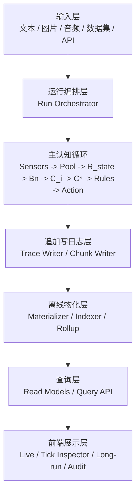

# AP 二期 观测台 V2 详细设计草案

版本：Draft v0.1  
撰写日期：2026-05-18  
适用范围：AP 二期实验原型 / HDB-V2 / 感受器 V1 / 先天规则编码系统 / 后续 PsyArch-Agent 对接  
文档性质：理论-工程一体化设计草案 / 运行观测、批量实验、日志审计、长期重建的统一口径

---

## 目录

1. 文档定位  
2. 为什么二期必须重做观测台  
3. 设计目标与非目标  
4. 与 HDB-V2 / 感受器 / 先天规则系统的关系  
5. 总体设计原则  
6. 观测台 V2 的总体分层架构  
7. 三种运行模式：单次输入 / 批量输入 / API 接入  
8. 输入协议与资产管理设计  
9. 运行中轻量进度与在线观测设计  
10. 离线日志体系设计  
11. 每个 tick 需要记录什么  
12. 旁路结构的观测与重建设计  
13. 离线重建与物化索引设计  
14. 前端页面架构设计  
15. 长期图表、连续记忆与回放设计  
16. 性能、内存与存储控制设计  
17. 追加写、缓存与闲时整理设计  
18. 遗忘系统的预留规划  
19. API 设计与 Agent 对接设计  
20. AP 状态池与记忆数据的导入导出设计  
21. 其它必要的常规功能设计  
22. 从一期观测台迁移到二期观测台的方案  
23. 详细示例：单次图片+音频运行  
24. 详细示例：多模态批量数据集运行  
25. 验证标准  
26. 风险与注意事项  
27. 分阶段实现路线图  
28. 最终建议

---

## 1. 文档定位

这份文档不是“前端界面改版建议”，而是 **AP 二期观测与实验基础设施的总设计草案**。

它要解决的不是单一页面美观问题，而是以下几个同时成立的问题：

1. 二期系统将从一期偏文本、偏单次演示，升级到支持 **多模态输入、长期运行、批量数据集、API 接入、Agent 对接** 的实验平台。
2. 一期观测台已经证明“白箱可观测”是 AP 的核心优势之一，但一期实现方式过于依赖 **大而重的运行期报告对象** 和 **前端直接拉取大量细节**，长期运行时容易拖累主系统。
3. 二期我们已经明确采用 **HDB-V2 + `R_state` + Bn + `C_i -> C*` + SA 主体状态池 + 轻量旁路结构** 的设计，因此观测台必须和这套新主线天然兼容。
4. 二期的观测台不应只是“演示面板”，它还必须成为：
   - 运行监控台
   - 实验记录器
   - 论文证据提取器
   - 白箱审计器
   - 长期回放器
   - 后续规则编辑和参数调优的基础设施

因此，本设计文档的目标是给出一套统一口径：

> **运行中尽量轻，运行后可忠实重建，长期运行不爆内存，批量实验可持续，细节白箱可审计。**

---

## 2. 为什么二期必须重做观测台

### 2.1 一期观测台的真实价值

一期观测台不是失败品。恰恰相反，它已经证明了几件非常重要的事情：

1. AP 的许多内部阶段确实可以被展示出来，而不是只能黑箱输出。
2. `state_pool / HDB / attention / induction / memory_feedback / innate_script / emotion / action` 这些模块可以被统一放进同一个观测界面中。
3. 运行时的关键指标、局部结构、阶段耗时、对象 top 排名、本轮输出等，都可以变成人可读的信息。
4. 数据集运行、指标导出、JSONL 记录、实验清单等基础能力其实已经有雏形。

这些成果在二期必须保留。

### 2.2 一期观测台暴露出的工程问题

但一期的做法也暴露出了若干结构性问题：

#### 问题 1：运行时报告对象过重

一期很多页面默认围绕一个很大的 `last_report` 展开。  
即使后面已经加入了 `compact report` 的补丁，这仍然说明：

> 原始思路是“先生成一份巨大的运行期报告，再想办法压缩给前端看”。

这在短跑演示里还能接受，但在长跑实验里不稳。

#### 问题 2：前端和主计算路径耦合过深

当 UI 想看什么，后端就容易被迫在运行时构造更多细节。  
久而久之，观测逻辑反过来污染主逻辑，形成：

1. 主循环为观测生成额外对象
2. API 每次轮询都要序列化大对象
3. 前端每次刷新都要反复解析大 JSON
4. 浏览器与后端一起吃内存

#### 问题 3：实时显示与离线审计没有分层

一期的很多细节本该属于“离线重建层”，却被塞进“在线实时层”。  
结果是：

1. 运行中想看太多
2. 长期运行时 RAM 增长快
3. 前端滚动和切 tab 也变成负担
4. 某些页面为了显示“全细节”，反而让真正的实验不稳定

#### 问题 4：输出目录职责混杂

一期 `observatory/outputs/` 下已经积累了多类产物：

1. 最新报告
2. 批量实验结果
3. 数据集导入产物
4. Agent 运行产物
5. 各种 JSON / JSONL / HTML / 运行快照

这说明一期已经很接近“实验平台”而不是“单页演示”，但目录职责还没有被明确设计成分层存储模型。

#### 问题 5：长跑视图与单次视图没有统一数据模型

一期既有 dashboard，也有 experiment 页面，也有 agent 页面。  
但这些页面虽然都在展示系统，却没有被一个明确统一的“观测数据协议”完全约束住。

二期如果继续在旧基础上只做修补，会越来越难维护。

### 2.3 二期的升级背景决定了观测台必须升级

二期的目标已经不是单纯“再跑一个文本 demo”，而是：

1. 单次输入支持图片、文字、音频
2. 后续支持视频帧和音频流拆解
3. 支持多模态批量数据集
4. 支持 API 方式接入外部系统和 Agent
5. 支持长期运行下的图表、回放、连续记忆重建
6. 支持未来遗忘系统、规模维护、离线物化分析

因此观测台必须从一期的“综合页面”升级为二期的：

> **观测基础设施 + 日志基础设施 + 离线重建基础设施 + 轻量 UI 壳。**

---

## 3. 设计目标与非目标

## 3.1 核心目标

### 目标 A：运行中轻量

运行时只保留：

1. 必要的当前状态
2. 小型 ring buffer
3. 少量 live preview
4. 日志写队列
5. 关键缓存

不允许再默认把所有详细历史一直堆在 RAM 里。

### 目标 B：运行后可忠实重建

运行结束后，应能根据日志重建：

1. 每个 tick 的状态池 top
2. 每个 tick 的 `R_state`
3. 每个 tick 的 top Bn
4. `C_i -> C*` 的聚合结果
5. 旁路结构的处理前/处理后/增量
6. 认知感受、情绪、先天规则、行动驱动
7. 长期图表、连续主线、记忆增长与缓存命中

### 目标 C：统一支持单次输入、批量实验、API 对接

同一套日志模型要同时适配：

1. 单次本地交互输入
2. 大规模数据集实验
3. 外部系统 API 接入
4. 后续 Agent 与具身接口

### 目标 D：白箱且可用于论文

观测台产物不能只是“好看”，还要：

1. 可审计
2. 可复现
3. 可对比
4. 可导出
5. 可作为实验报告和论文证据材料的来源

### 目标 E：从设计层面限制内存与浏览器负担

必须在架构上明确：

1. 哪些东西永远不进前端
2. 哪些东西只做 top-N
3. 哪些东西只在离线查询时按需取
4. 哪些东西可以物化缓存
5. 哪些东西必须分页、分块、下采样

## 3.2 非目标

### 非目标 1：二期一开始就做最重的 3D 可视化系统

二期观测台追求的是清晰、稳定、可持续，不追求一上来堆极重的炫技渲染。

### 非目标 2：把所有中间值都永远保存到最高精度

这既不现实，也没有必要。  
二期要做的是 **分层保存**：

1. 在线只保留必要摘要
2. 标准离线保留可重建关键事实
3. 审计级 trace 仅在需要时打开

### 非目标 3：让前端承担主分析工作

前端主要负责展示和查询。  
重计算、重索引、长图表物化、回放重建应尽量在后端完成。

---

## 4. 与 HDB-V2 / 感受器 / 先天规则系统的关系

二期观测台不是独立系统，而是 AP 二期总架构的“观测与审计层”。

### 4.1 与 HDB-V2 的关系

观测台 V2 必须原生理解下列对象：

1. `R_state`
2. Bn
3. `C_i`
4. `C*`
5. 抽象回声
6. 结晶 SA
7. 状态池主体 SA 场
8. 轻量旁路结构
9. `A_focus`

也就是说，二期观测台的核心页面不能再只会展示“模块名 + 耗时”，而要能展示：

1. 本轮怎么读出了 `R_state`
2. 为什么召回了这些 Bn
3. `C_i` 怎么形成
4. 为什么默认合并成 `C*`
5. `C*` 怎么回投状态池
6. `A_focus` 如何从更新后的状态池读出

### 4.2 与感受器 V1 的关系

观测台要能展示感受器层的新对象：

1. 输入资产引用
2. 感受器 micro-tick 摘要
3. 视觉采样 patch
4. 视觉焦点位置与移动轨迹
5. 音频窗口采样摘要
6. 感受器级疲劳命中
7. 每个 cognitive tick 实际提交的外源刺激预算包

尤其对图片和音频输入，观测台应该做到：

1. 图片可回放被采样区域
2. 可叠加视觉中心点和采样热区
3. 音频可显示波形缩略图和被抽样时间窗
4. 能区分“原始资产”和“本 tick 进入系统的刺激摘要”

### 4.3 与先天规则系统的关系

观测台必须支持规则系统的两类需求：

1. **运行中轻量展示**
   - 本 tick 触发了哪些规则
   - 哪些规则命中了哪些对象
   - 对注意力、情绪、行动、属性实例化产生了什么调制

2. **运行后审计**
   - 某条规则为什么触发
   - 使用了哪些底层条件
   - 对哪些对象生效
   - 处理前后数值如何变化

也就是说，二期观测台必须能承接我们已经整理好的“规则底层可追踪条件总表”。

### 4.4 与后续 Agent 的关系

观测台 V2 还要成为后续 Agent 项目的观测底座，因此必须保留：

1. API 接入能力
2. 动作-感知-奖惩闭环的审计能力
3. 电脑控制 / 截图 / 音频 / 文本输入输出的统一 trace 能力

---

## 5. 总体设计原则

### 原则 1：热路径轻，细节冷

在线主循环只做：

1. 必要统计
2. 必要摘要
3. 必要写日志

复杂细节的查看默认走离线重建，不再要求主循环长期背着所有展示数据跑。

### 原则 2：先记事实，再做视图

二期观测台的核心思想不是“先做页面想看什么，再让后端临时拼给它”，而是：

1. 先确定日志事实模型
2. 再基于事实模型做 materialized views
3. 最后让页面读取这些视图

### 原则 3：写入模型与读取模型分离

写入模型负责：

1. 追加写
2. 有界内存
3. 不阻塞主逻辑

读取模型负责：

1. 面向页面查询
2. 面向图表聚合
3. 面向 tick 细节回放

### 原则 4：单次与批量共用同一套日志协议

否则后面会变成：

1. demo 一套逻辑
2. experiment 一套逻辑
3. agent 一套逻辑

这会迅速失控。

### 原则 5：前端永远按需取数

二期观测台前端不应默认一次拉：

1. 全部 tick 详情
2. 全量状态池快照
3. 全量候选分支
4. 全量规则 trace

而应按：

1. 当前 live 预览
2. 当前选中的 tick
3. 当前选中的 run
4. 当前图表窗口

来逐步请求。

### 原则 6：默认标准 trace，审计级 trace 可选开启

二期必须从第一天就支持 trace 级别：

1. `minimal`
2. `standard`
3. `audit`
4. `debug`

这样才能同时兼顾性能和审计。

---

## 6. 观测台 V2 的总体分层架构

观测台 V2 建议拆成六层。



### 6.1 输入层

负责接受：

1. 单次文本
2. 单张图片
3. 单个音频文件
4. 多模态 bundle
5. 数据集文件
6. API 输入流

### 6.2 运行编排层

负责：

1. 创建 run
2. 加载配置
3. 控制 trace 级别
4. 调度主循环
5. 向日志层写入事件
6. 向前端提供 live 进度

### 6.3 主认知循环

这是 AP 本体，不是观测台逻辑。  
观测台只能读取摘要和事件，不应反向拖重主循环。

### 6.4 追加写日志层

负责：

1. 用追加写记录每个 tick 的关键事实
2. 按 chunk 分割
3. 只在必要时写大块数据
4. 控制队列和 flush 策略

### 6.5 离线物化层

负责：

1. 从 raw logs 建索引
2. 生成图表 rollup
3. 生成 tick 检索表
4. 生成对象连续性索引
5. 生成可供前端读取的小型 read model

### 6.6 查询与前端层

查询层负责服务前端，不直接要求前端扫 JSONL 原始日志。

---

## 7. 三种运行模式：单次输入 / 批量输入 / API 接入

## 7.1 单次输入模式

适合：

1. 输入一段文字
2. 输入一张图片
3. 输入一个音频文件
4. 输入图片+文字
5. 输入图片+音频+文字

特点：

1. 用户希望立即运行
2. 需要轻量实时进度
3. 运行结束后查看详细回放

这时观测台的重点是：

1. 直观
2. 轻量
3. 能快速切到 tick 级细节

## 7.2 批量输入模式

适合：

1. 多模态数据集
2. 长期实验
3. 对比实验
4. Agent 大规模运行回放

特点：

1. 总 tick 数大
2. 不能把细节常驻在前端
3. 更关注曲线、统计、异常点、抽样回放

## 7.3 API 接入模式

适合：

1. Agent 系统实时推送输入
2. 外部程序把截图/文本/音频扔进 AP
3. 后续电脑控制、浏览器活动、奖励惩罚反馈接入

特点：

1. 入口多
2. 节拍不一定稳定
3. 需要 run/session/thread/source 的上下文标识

因此三种模式应共享同一套抽象：

> **一切输入最终都变成带来源、时间戳、模态、资产引用和注入策略的 `InputEnvelope`。**

---

## 8. 输入协议与资产管理设计

## 8.1 统一输入包 `InputEnvelope`

建议统一设计如下概念：

```json
{
  "input_id": "inp_000123",
  "run_id": "run_demo_001",
  "source_type": "manual|dataset|api|agent",
  "source_session_id": "sess_xxx",
  "created_at_ms": 1770000000000,
  "modalities": ["text", "image", "audio"],
  "assets": [
    {"asset_id": "ast_img_001", "kind": "image", "path": "...", "sha256": "..."},
    {"asset_id": "ast_aud_001", "kind": "audio", "path": "...", "sha256": "..."}
  ],
  "text_payload": {"text": "今天天气有点冷"},
  "inject_policy": {
    "mode": "single_shot|persist_for_ticks|stream_decode",
    "persist_ticks": 8
  },
  "annotations": {
    "speaker": "",
    "window_title": "",
    "url": ""
  }
}
```

### 8.1.1 设计原因

这样设计的好处是：

1. 单次输入和数据集输入不用两套逻辑
2. 图片/音频不必内联在大 JSON 里
3. 后端日志里记资产引用即可
4. 后续视频、截图流、麦克风、浏览器页面截图都能兼容

## 8.2 资产管理

观测台 V2 不建议把图片或音频大块内容直接反复复制进日志。  
推荐：

1. 原始资产单独保存
2. 以 `asset_id + hash + path` 方式引用
3. 日志记录引用与派生摘要
4. 前端如需预览，再请求缩略图或波形图

### 8.2.1 原始资产

保存：

1. 输入图片
2. 输入音频
3. 数据集附带媒体
4. 未来视频解码前的原始文件

### 8.2.2 派生资产

可异步生成：

1. 图片缩略图
2. 视觉采样热区 overlay
3. 音频波形缩略图
4. 音频采样窗 overlay

## 8.3 视频和音频流的统一口径

二期初期可以不直接原生支持高帧率实时视频流，但设计口径要先统一：

1. 视频 = 视觉帧流 + 可选音轨流
2. 运行时进入感受器的是拆解后的帧或时间窗摘要
3. 观测台保存：
   - 原视频引用
   - 解码配置
   - 每个 tick 实际消费了哪些 frame/window

这样后续扩展时无需重写观测模型。

---

## 9. 运行中轻量进度与在线观测设计

用户已经明确要求：

1. 运行时能看到“运行中”
2. 进度要轻量
3. 但也不能完全瞎跑

所以二期需要把在线观测分成两层：

1. **运行状态层**
2. **实时轻预览层**

## 9.1 运行状态层

只显示最必要的信息：

1. 当前 run 状态：排队中 / 预处理中 / 运行中 / 写日志 / 物化中 / 完成 / 失败
2. 当前 tick / 总 tick
3. 当前 stage
4. 已运行时间
5. 预计剩余时间
6. 输入源摘要
7. 当前 RAM / 写队列 / 缓存命中 / 锁等待

### 建议 stage

```text
queued
loading_input
preprocessing_assets
sensor_sampling
running_tick
writing_tick_log
materializing_preview
idle_consolidation
completed
failed
cancelled
```

## 9.2 实时轻预览层

运行中允许展示，但必须严格限量：

1. 当前外源刺激摘要
2. 当前 `R_state` 查询头摘要
3. 当前 top Bn（例如前 5）
4. 当前 `C*` 摘要
5. 当前 `A_focus`
6. 当前状态池 top（例如前 10）
7. 当前规则触发摘要
8. 当前情绪/行动摘要

### 9.2.1 为什么只显示摘要

因为在线阶段的目的不是完整回放，而是：

1. 确认系统在活着
2. 确认当前主线没跑偏
3. 发现异常
4. 观察大趋势

细节应该交给离线重建。

## 9.3 实时预览的硬预算

建议明确约束：

1. 单次 live payload 默认不超过 `64KB ~ 256KB`
2. `state_top_live <= 10~20`
3. `Bn_live <= 5~8`
4. `C*_live <= 8~12`
5. 规则触发摘要只保留前若干条
6. 不在 live payload 内内联图片和音频原始内容

## 9.4 单次输入模式的运行中可视图

对于图片/音频单次输入，运行中建议显示：

### 图片模式

1. 原图缩略图
2. 当前视觉中心点
3. 当前 tick 被采样 patch overlay
4. 当前亮度/显著性热区摘要

### 音频模式

1. 波形缩略图
2. 当前 tick 落在音频的哪个时间窗
3. 当前被采样窗的位置
4. 响度摘要

### 文本模式

1. 当前输入文本摘要
2. 当前短期记忆链
3. 当前 `A_focus`

---

## 10. 离线日志体系设计

二期观测台的关键不是 live UI，而是日志体系。

### 10.1 核心思想

> **在线主循环只负责把“关键事实”稳定追加写出去。**
>  
> **至于这些事实之后怎么重建成页面、图表、叙事链，是后处理层的事情。**

## 10.2 日志层分级

建议日志分成四层：

### L0：运行清单层

保存整个 run 的元数据：

1. run_id
2. 模式
3. 输入清单
4. 配置快照
5. trace 级别
6. 软件版本 / git hash / runtime alignment
7. 硬件信息
8. 成功/失败状态

### L1：tick 指标层

每个 tick 都应稳定有一行：

1. tick 编号
2. stage 耗时
3. 状态池规模
4. `R_state` 规模
5. Bn 数量
6. `C*` 一致度
7. 规则触发数
8. 行动数
9. 关键 top 名称摘要

这是最重要、最便宜、最通用的一层。

### L2：tick 过程摘要层

每个 tick 的过程摘要，可按 JSONL 行或 chunk 内对象保存：

1. 感受器采样摘要
2. 状态池 top
3. `R_state` 各查询头
4. Bn top 与分项得分
5. `C_i` 来源摘要
6. `C*` 聚合摘要
7. 旁路结构前后快照摘要
8. 规则命中摘要
9. 情绪与行动摘要

### L3：审计级细节层

只在 `audit/debug` 下写：

1. 候选召回更详细的 top-k 打分
2. 旁路 touched rows 明细
3. 单条规则的条件求值细节
4. 特定对象的前后数值变化
5. 局部 provenance

## 10.3 建议文件布局

建议每个 run 拥有自己的目录，例如：

```text
runs/<run_id>/
  manifest.json
  inputs/
    inputs.jsonl
    assets/
  live/
    latest_status.json
    latest_preview.json
  raw/
    ticks_000000_000999.metrics.jsonl
    ticks_000000_000999.summary.jsonl
    ticks_000000_000999.sidecar.jsonl
    ticks_000000_000999.rules.jsonl
    ticks_000000_000999.actions.jsonl
    ticks_000000_000999.sensor.jsonl
  derived/
    tick_index.parquet
    chart_rollups/
    continuity/
    preview/
  reports/
    run_summary.md
    anomalies.json
  cache/
    materializer_state.json
```

## 10.4 为什么使用 chunk

如果所有 tick 只写一个巨型文件：

1. 查询困难
2. 更新困难
3. 压缩困难
4. 后续 materializer 恢复困难
5. 局部损坏影响大

因此建议：

1. 每 500 或 1000 tick 一个 chunk
2. 或按文件大小滚动
3. chunk 之间可独立处理

## 10.5 追加写优先，不做频繁全量改写

原则：

1. `manifest.json` 可以少量更新
2. 绝大多数 tick 产物必须追加写
3. derived 层可以覆盖重建
4. raw 层尽量不回写修改

这样最稳。

## 10.6 trace 级别建议

### `minimal`

适合超长批量实验：

1. metrics
2. 少量 summary
3. 错误事件

### `standard`

默认推荐：

1. metrics
2. summary
3. state top
4. `R_state`
5. Bn top
6. `C*`
7. rules/actions summary

### `audit`

适合关键 run：

1. 标准层全部
2. 旁路 pre/post
3. 规则命中细节
4. 候选 top-k 分项

### `debug`

只建议短跑局部开：

1. 接近完整中间态
2. 非默认
3. 必须强制有 tick 上限或 run 上限

---

## 11. 每个 tick 需要记录什么

用户已经明确提出，希望后续可以重建：

1. 每个 tick 的状态池 top
2. 旁路的处理前数据、处理后数据
3. 各项指标
4. 全过程细节

因此二期建议把每个 tick 的可观测事实拆成下面这些块。

## 11.1 `tick_metrics`

这是最小公共层，所有模式都应该写。

至少包括：

1. `tick_index`
2. `trace_id`
3. `input_modalities`
4. `external_sa_count`
5. `state_item_count`
6. `state_active_sa_count`
7. `rstate_head_count`
8. `rstate_sa_count`
9. `bn_count`
10. `cstar_ev`
11. `cstar_coherence`
12. `focus_display`
13. `timing_total_logic_ms`
14. 每阶段 timing
15. log queue 深度
16. cache hit 摘要
17. warnings

## 11.2 `tick_sensor_summary`

记录感受器层事实：

1. 本 tick 来自哪些输入资产
2. 感受器 micro-tick 统计
3. 视觉采样 patch 数
4. 音频采样窗数
5. 视觉焦点位置
6. 感受器疲劳命中
7. 最终提交的外源刺激包摘要

## 11.3 `tick_state_summary`

记录状态池摘要：

1. 总对象数
2. 总活跃 SA 数
3. ER / EV / CP 汇总
4. 波峰数
5. 主 top 项
6. `A_focus` 前后的高能区域

建议拆为：

1. `state_summary`
2. `state_top_items`
3. `state_top_sa`

## 11.4 `tick_rstate_summary`

记录召回查询体 `R_state`：

1. 查询头列表
2. 各头预算
3. 各头命中对象数
4. 各头贡献 top SA
5. 可选的短期 verbatim 窗口摘要

这样后面才能回答：

1. 为什么这轮是按这个“现状”去查记忆
2. 哪个查询头影响最大

## 11.5 `tick_bn_summary`

记录一级召回：

1. top Bn
2. 每个 Bn 的总分
3. 分项得分
4. 实能量/虚能量分配摘要
5. 对应记忆引用 id

## 11.6 `tick_prediction_summary`

记录 `C_i -> C*`：

1. `C_i` 数量
2. 各 `C_i` 来源 Bn
3. 各 `C_i` 的 top SA / 邻域摘要
4. `C*` 的 top SA
5. `C*` coherence / conflict / uncertainty

## 11.7 `tick_sidecar_summary`

记录旁路结构处理：

1. pre snapshot summary
2. post snapshot summary
3. delta summary
4. touched rows
5. 新增句柄
6. 删除句柄
7. 主预测支路切换
8. 焦点链更新

注意：这里不要求在线永久维护重结构，只要求记录本轮变化事实。

## 11.8 `tick_rule_summary`

至少包括：

1. 触发规则数
2. 规则 id 列表
3. 每条规则作用对象数
4. 情绪通道修改
5. 属性实例化
6. 行动驱动力注入
7. 全局参数调节

## 11.9 `tick_action_summary`

记录：

1. 本轮行动候选
2. 最终胜出行动
3. 行动参数
4. 行动来源驱动力摘要
5. 被谁压过、为什么没赢

这对后续 Agent 对接非常重要。

---

## 12. 旁路结构的观测与重建设计

我们此前已经确定：

1. 状态池主体应尽量 SA 化
2. 但在线不能完全没有轻量旁路结构

观测台必须正面支持这一点。

## 12.1 旁路结构不是第二状态池

因此观测台记录旁路时，不应把旁路重新做成一套巨大的长期热对象系统。  
推荐只记录：

1. 旁路摘要
2. 旁路增量
3. 旁路被访问的局部条目
4. 旁路与主池的关联句柄

## 12.2 建议的旁路观测对象族

建议观测台默认理解以下旁路族：

1. `focus_chain`
   - 近期显意识链
2. `prediction_branch_table`
   - `C_i` 支路和 `C*` 来源句柄
3. `verification_anchor_table`
   - 期待/压力验证锚点
4. `action_target_table`
   - 动作目标句柄
5. `recent_precise_trace_table`
   - 短期高分辨率链
6. `recency_gain_table`
   - 近因锚点增益痕迹
7. `sensor_fatigue_table`
   - 感受器疲劳摘要

## 12.3 记录方式

对每个旁路族，建议记录：

1. `before_summary`
2. `after_summary`
3. `delta_summary`
4. `touched_rows_top_k`

例如：

```json
{
  "tick": 123,
  "sidecar_family": "focus_chain",
  "before_summary": {"node_count": 5, "head": "今天 天气 有点"},
  "after_summary": {"node_count": 6, "head": "今天 天气 有点 冷"},
  "delta_summary": {"added": 1, "removed": 0, "head_changed": true},
  "touched_rows": [
    {"node_id": "fc_001", "op": "append", "token": "冷", "weight": 0.82}
  ]
}
```

这样既能审计，又不会像整池快照一样重。

---

## 13. 离线重建与物化索引设计

离线重建层是二期观测台的灵魂。

## 13.1 为什么必须有物化层

如果前端每次都去扫原始 JSONL：

1. 慢
2. 内存大
3. 查询体验差
4. 长 run 很难交互

因此建议 raw logs 之外，再维护 `derived/` 层。

## 13.2 物化层职责

### 13.2.1 tick 索引

用于：

1. 快速跳到 tick 12345
2. 查询该 tick 在哪个 chunk
3. 读取该 tick 的摘要、时间、异常标记

### 13.2.2 图表 rollup

将长序列下采样成：

1. 平均值
2. 最小值
3. 最大值
4. 异常点
5. 采样点

供前端长图表使用。

### 13.2.3 对象连续性索引

用于重建：

1. 某个记忆对象何时反复进入 Bn
2. 某个属性实例何时持续存在
3. 某个 `C*` 主线何时形成、何时中断

### 13.2.4 旁路主线索引

用于：

1. 重建显意识链
2. 重建后继优势热点
3. 重建验证锚点变化

### 13.2.5 规则命中索引

用于：

1. 查某条规则总共命中多少次
2. 查某次异常是否由某条规则主导
3. 比较不同 run 的规则分布

## 13.3 物化触发时机

建议分两类：

### 增量物化

每 N 个 tick 或每完成一个 chunk 时做：

1. 更新 tick index
2. 更新图表 rollup
3. 更新轻量 preview

### 收尾物化

run 结束后做：

1. 最终 chart rollup
2. 长期连续性索引
3. run_summary.md
4. anomaly report

## 13.4 物化层格式建议

原始层建议 JSONL。  
物化层可以根据实现便利度选择：

1. JSON
2. Parquet
3. SQLite / DuckDB

推荐口径：

1. raw canonical = JSONL
2. derived read model = JSON / Parquet / SQLite 任一可行组合

这样 Python 端实现快，也方便后续升级。

---

## 14. 前端页面架构设计

二期前端不建议继续走“一个巨大页面什么都塞”的路线。  
应拆成多个职责清晰的视图。

## 14.1 页面总览

建议至少包含：

1. `LiveRunPage`
2. `SingleInputPage`
3. `BatchRunsPage`
4. `TickInspectorPage`
5. `LongRunChartsPage`
6. `ContinuityPage`
7. `RuleAuditPage`
8. `StorageHealthPage`
9. `ApiIngestPage`

## 14.2 单次输入页 `SingleInputPage`

负责：

1. 上传文本 / 图片 / 音频
2. 选择运行配置
3. 启动单 run
4. 显示实时轻预览
5. 运行结束后一键跳到 tick inspector

### 界面建议

顶部：

1. 输入区
2. 配置区
3. 启动按钮

中部：

1. 原始输入预览
2. 运行状态卡
3. 当前 tick 轻预览

底部：

1. 最近运行列表
2. 结束后跳转链接

## 14.3 实时运行页 `LiveRunPage`

核心目标不是“重放所有细节”，而是“稳定监看”。

建议展示：

1. stage 时间线
2. tick 计数
3. 当前状态池 top
4. 当前 `R_state`
5. 当前 Bn
6. 当前 `C*`
7. 当前 `A_focus`
8. 规则摘要
9. RAM / queue / cache / warnings

## 14.4 tick 检查页 `TickInspectorPage`

这是最重要的离线细节页。

建议分 tab：

1. `概览`
2. `感受器`
3. `状态池`
4. `R_state`
5. `Bn`
6. `C_i / C*`
7. `旁路`
8. `规则`
9. `行动`
10. `原始 JSON`

### 设计重点

1. 当前 tick 左右切换快
2. 不一次加载全部 tick
3. 可查看上一 tick / 下一 tick 差异
4. 可从图表点击跳转到 tick

## 14.5 长期图表页 `LongRunChartsPage`

适合长 run 和批量 run。

至少包含：

1. 总 timing
2. 状态池规模
3. Bn 命中数
4. `C*` coherence
5. 规则触发频率
6. 情绪通道变化
7. 行动触发频率
8. 缓存命中率
9. 物化延迟

## 14.6 连续性页 `ContinuityPage`

展示：

1. 主线记忆连续片段
2. `A_focus` 时间线
3. 高频出现对象
4. `C*` 主题连续性
5. 主要规则/情绪/行动链

注意：

这里的叙事化应该明确标注“事实日志”和“后处理推断”的边界。

## 14.7 规则审计页 `RuleAuditPage`

展示：

1. 某条规则的触发次数
2. 命中对象类型
3. 触发前后变量
4. 失败/异常案例

## 14.8 存储健康页 `StorageHealthPage`

二期很有必要一开始就做这个页面，因为它直接关系到“不爆内存、不爆磁盘”。

建议展示：

1. 当前 run 目录大小
2. raw/derived/cache/asset 占比
3. chunk 数量
4. 写队列深度
5. 物化进度
6. 压缩任务
7. 可选遗忘模拟结果

## 14.9 API 接入页 `ApiIngestPage`

展示：

1. 可用 API
2. 接入状态
3. 最近输入包
4. 当前 session / source
5. 简单调用示例

---

## 15. 长期图表、连续记忆与回放设计

## 15.1 长期图表不是直接扫原始日志

必须由物化层产出下采样结果。  
否则长 run 前端迟早被拖死。

## 15.2 建议的长期图表

### 15.2.1 系统资源类

1. tick wall time
2. logic time
3. RAM
4. writer queue depth
5. materializer lag

### 15.2.2 认知结构类

1. 状态池对象数
2. 状态池活跃 SA 数
3. `R_state` 头数
4. Bn 命中数
5. `C*` coherence
6. `A_focus` 长度

### 15.2.3 情绪与规则类

1. reward / punish
2. NT 通道
3. 规则触发数
4. 认知感受节点实例化数

### 15.2.4 行动类

1. 行动候选数
2. 实际执行行动数
3. 行动类别频率

### 15.2.5 记忆规模类

1. 长期记忆条目数
2. 短期记忆池大小
3. 结晶 SA 数
4. 遗忘候选数

## 15.3 连续记忆视图

用户希望将来能看长期连续信息。  
建议观测台提供三层连续性视图：

1. **显意识连续链**
   - 由 `A_focus` 序列和短期链构成
2. **主预测连续链**
   - 由 `C*` 演化构成
3. **对象再现连续链**
   - 由特定对象/属性/记忆在多 tick 中重复进入高位构成

## 15.4 回放模式

建议支持：

1. 单 tick 查看
2. 区间回放
3. 自动播放
4. 跳异常点
5. 跳规则命中点
6. 跳行动点

回放的核心不是动画，而是：

1. tick 递进
2. 摘要更新
3. 关键事实切换

---

## 16. 性能、内存与存储控制设计

这是二期观测台最重要的工程约束之一。

## 16.1 运行时内存预算的正式口径

运行时内存主要来自：

1. AP 主系统本体
2. 向量索引 / HDB
3. 感受器缓冲
4. 观测台 live ring buffer
5. 日志写队列
6. 物化任务缓冲
7. 前端轮询响应

观测台 V2 自身必须明确承诺：

> **不会通过“保存巨量 report history”成为主内存增长来源。**

## 16.2 必须禁止的做法

### 禁止 1

默认把完整 tick 详细报告全都保留在进程内 list 中。

### 禁止 2

默认用 `/api/dashboard` 一类接口把大对象反复整包传给前端。

### 禁止 3

前端一次性拉取整场 run 的所有 tick 明细。

### 禁止 4

把图片、音频、波形、候选明细直接重复内联到每个 tick payload 里。

## 16.3 运行时建议保留的内存结构

### 16.3.1 live ring buffer

只保留最近若干 tick 的 compact preview，例如：

1. 最近 16~64 tick
2. 每 tick 仅 `summary/live`
3. 总量控制在几 MB 级

### 16.3.2 日志写队列

必须有上限：

1. item 数上限
2. byte 数上限
3. 超限时报警
4. 必要时降级写细节级别

### 16.3.3 物化缓存

只保留当前正在处理的 chunk，不把整个 run 读进内存。

## 16.4 文件大小与 chunk 策略

建议：

1. 每个 raw chunk 控制在可接受范围
2. 超过阈值则滚动
3. 可对旧 chunk 压缩
4. derived 层覆盖生成

## 16.5 浏览器侧约束

前端必须：

1. 虚拟滚动
2. 服务端分页
3. 懒加载 tab
4. 图表只加载窗口数据
5. JSON inspector 默认折叠

## 16.6 观测台 V2 的关键资源指标

建议长期追踪：

1. `obs.live_payload_bytes`
2. `obs.writer_queue_items`
3. `obs.writer_queue_bytes`
4. `obs.materializer_lag_ticks`
5. `obs.materializer_lag_chunks`
6. `obs.run_dir_bytes`
7. `obs.frontend_last_payload_bytes`
8. `obs.frontend_render_ms`

## 16.7 默认预算建议

下面给出一个工程上较稳的起始建议：

| 项目 | 建议初始值 | 说明 |
|---|---:|---|
| 最近 live ring tick 数 | 32 | 在线只留近期轻预览 |
| 单次 live payload | 64KB~256KB | 避免浏览器轮询过重 |
| 状态池 live top | 10~20 | 在线只看峰值 |
| Bn live top | 5~8 | 在线不看长候选尾部 |
| `C*` live top SA | 8~12 | 足够看图景 |
| raw chunk tick 数 | 500~1000 | 兼顾查询和文件数 |
| writer queue 最大字节 | 16MB~64MB | 超限报警 |
| materializer 批次 | 1 chunk | 逐 chunk 处理 |
| 前端每页 row 数 | 50~200 | 其余分页 |

---

## 17. 追加写、缓存与闲时整理设计

## 17.1 追加写策略

推荐：

1. 主循环写入 memory queue
2. writer 线程顺序 flush
3. flush 失败时记录错误并允许重试
4. `manifest.json` 单独小心维护

## 17.2 缓存策略

建议分三类：

### 17.2.1 运行态查询缓存

例如：

1. 最近 tick compact preview
2. 当前 run latest status

### 17.2.2 物化结果缓存

例如：

1. 图表窗口查询结果
2. tick 详情索引

### 17.2.3 资产派生缓存

例如：

1. 缩略图
2. 波形缩略图
3. overlay 图

## 17.3 闲时整理

结合用户已经提出的想法，二期非常适合保留“闲时整理”设计，但要控制它不反客为主。

建议闲时任务包括：

1. 老 chunk 压缩
2. derived 补齐
3. 图表 rollup 更新
4. 可选向量索引维护
5. 可选遗忘候选统计

闲时整理应满足：

1. 可暂停
2. 可查询状态
3. 不阻塞主 run
4. 有单独进度

---

## 18. 遗忘系统的预留规划

用户已经明确说：

1. 短期内不一定启用
2. 但现在就要留规划

这是合理的。

## 18.1 二期先做“观测支持”，不默认做“自动删除”

建议遗忘系统分两步：

### 第一步：观测与模拟

观测台先展示：

1. 记忆年龄分布
2. 热门/冷门分布
3. 低命中久远记忆数
4. 如果启用遗忘，将删哪些

### 第二步：真正执行

后续再允许：

1. 软删除
2. 冷归档
3. 延迟清理

## 18.2 遗忘候选指标

可以先观测：

1. 最近召回时间
2. 最近验证时间
3. 长期命中频率
4. 贡献度
5. 是否被结晶 SA 或高价值链引用

## 18.3 观测台需要为遗忘保留的接口

建议现在就预留：

1. `memory_age_histogram`
2. `memory_recall_frequency_histogram`
3. `forget_candidate_preview`
4. `forget_protected_reason`

---

## 19. API 设计与 Agent 对接设计

## 19.1 API 分层

建议拆为四类 API：

### A. 控制面 API

1. 新建 run
2. 停止 run
3. 查询状态
4. 查询物化进度

### B. 输入面 API

1. 上传资产
2. 提交 `InputEnvelope`
3. 批量导入数据集
4. 推送流式输入

### C. 查询面 API

1. run 列表
2. tick 列表
3. tick 详情
4. 图表窗口数据
5. 规则统计
6. 连续性视图

### D. 存储/维护 API

1. 压缩
2. 物化
3. 清理
4. 遗忘模拟

## 19.2 与 Agent 对接时的关键字段

为了未来对接“电脑控制 / 截图视觉 / 文本框输入 / 麦克风音频 / 扬声器反馈”，建议 `InputEnvelope` 和 `ActionEvent` 里统一保留：

1. `source_session_id`
2. `window_title`
3. `url`
4. `app_name`
5. `screen_region`
6. `speaker_id`
7. `teacher_signal`
8. `safety_decision`

这样将来 Agent 运行出来后，观测台能回答：

1. 它看到了什么
2. 它当时在哪个窗口
3. 它为什么做这个动作
4. 奖惩和安全检查后来怎么影响了它

## 19.3 API 不应直接暴露巨型内存对象

即使内部有 `_last_report` 一类概念，二期也不应继续围绕它设计外部 API。  
推荐 API 返回：

1. compact summary
2. page-based query result
3. tick-scoped detail

而不是“整场 run 的一大坨对象”。

---

## 20. AP 状态池与记忆数据的导入导出设计

用户已经明确提出，希望二期观测台不要只负责“看”，还要能承担一部分 **系统运行态与实验资产管理平台** 的职责。  
其中最关键的新增能力之一，就是：

1. AP 状态池导入/导出
2. 长期记忆数据导入/导出
3. 短期记忆、旁路结构、规则配置、运行配置等的协同导入/导出

这部分如果不在一开始设计清楚，后面会出现三个问题：

1. 冷启动实验无法方便复现
2. 长跑到一半无法做稳定 checkpoint
3. 不同版本、不同机器、不同 run 之间的数据迁移会非常混乱

因此二期观测台应把“导入导出”视为正式能力，而不是附带工具。

## 20.1 为什么导入导出在二期是刚需

### 20.1.1 为长期实验服务

将来如果 run 持续很多小时甚至很多天，必须支持：

1. 中途 checkpoint
2. 暂停
3. 恢复
4. 迁移到另一台机器继续跑

### 20.1.2 为规模实验服务

如果以后要做：

1. A/B 参数对照
2. 不同教师策略对照
3. 不同记忆初始化对照
4. 不同环境任务对照

则必须能方便地：

1. 导出某个基础记忆库
2. 复制成多个实验分支
3. 在不同条件下继续演化

### 20.1.3 为白箱审计服务

AP 的优势之一是白箱。  
那就不能只看一眼 live 页面，而要允许把当下状态完整带走，用于：

1. 离线调试
2. 论文复现实验
3. 故障回放
4. 手工审计

## 20.2 应区分三类导出对象

建议观测台 V2 正式区分以下三类导出：

### A. 运行态导出 `runtime_export`

导出当前某一时刻的运行态，用于：

1. 暂停恢复
2. 故障快照
3. 在线 checkpoint

这类导出通常包括：

1. 当前状态池
2. 当前短期记忆池
3. 当前主预测包 `C*`
4. 当前旁路结构摘要
5. 当前规则运行态
6. 当前情绪通道
7. 当前感受器疲劳态
8. 当前配置快照

### B. 认知资产导出 `cognitive_asset_export`

导出长期可复用资产，用于：

1. 初始化新实验
2. 跨 run 迁移
3. 数据分析

这类导出通常包括：

1. 长期记忆库
2. 结晶 SA / SA Registry
3. ANN / posting / 辅助索引的可重建信息
4. 属性 family / 关系 family 元数据
5. 可选的短期高价值抽象记忆

### C. 实验包导出 `experiment_bundle_export`

导出一个完整 run 的可复现实验包，用于：

1. 论文附录
2. 异地复跑
3. 问题上报

这类导出包括：

1. 输入资产引用与必要副本
2. run manifest
3. 配置
4. 原始日志
5. derived 视图
6. 可选 runtime checkpoint

## 20.3 应区分四类导入目标

对应地，导入也不应只有一种模式。

### 20.3.1 热恢复导入 `resume_import`

场景：

1. 上一次运行中断
2. 需要继续跑

需要恢复的核心是运行态一致性。

### 20.3.2 冷启动初始化导入 `bootstrap_import`

场景：

1. 用某个已有记忆库作为新 run 的基础脑状态
2. 不需要恢复旧 run 的当前显意识状态

这时可只导入：

1. 长期记忆
2. SA Registry
3. 必要索引
4. 可选部分短期模板记忆

而不导入旧的状态池热态。

### 20.3.3 对照实验分支导入 `branch_import`

场景：

1. 从同一个基线脑状态分叉多个实验

需要：

1. 导入统一基础资产
2. 清空或重建运行时热态
3. 写入新的 run lineage 信息

### 20.3.4 审计查看导入 `audit_import`

场景：

1. 只为了看，不为了继续跑

这时观测台只需导入：

1. logs
2. derived
3. 可选 checkpoint

不要求把 AP 真正恢复成可执行状态。

## 20.4 状态池导出设计

状态池是二期当前认知场，不能简单理解成“一个 JSON 列表”。

建议状态池导出至少分成两层：

### 20.4.1 主竞争层导出

记录：

1. 当前对象列表
2. 对象唯一 id
3. 对象类型
4. SA 构成摘要
5. ER / EV / CP
6. 疲劳 / 近因增益
7. 时空坐标摘要
8. 与 `C*` / `A_focus` / 行动目标相关的句柄

### 20.4.2 旁路句柄层导出

记录：

1. focus_chain
2. prediction branches
3. verification anchors
4. action targets
5. recent precise trace

注意：

旁路导出不必存成“第二状态池”，但必须足以在恢复时重新连接主竞争面。

## 20.5 记忆数据导出设计

长期记忆数据导出建议再分层。

### 20.5.1 核心记忆包层

每条记忆至少记录：

1. memory_id
2. 创建时间
3. SA 内容
4. 数值通道
5. 时空坐标
6. 来源标签（外源/内源/抽象/教师/动作反馈等）
7. 现实度 / 保护期 / 近因增益阶段信息
8. 可选的 provenance 摘要

### 20.5.2 结构辅助层

记录：

1. SA Registry
2. family 注册表
3. 结晶 SA
4. 低频抽象结构缓存

### 20.5.3 索引提示层

不要求必须跨平台逐字节复原 ANN 内部结构。  
更现实的方式是导出：

1. 向量矩阵或其引用
2. posting 倒排数据
3. 索引配置
4. rebuild hint

也就是说：

> **索引更适合“可重建导出”，而不是“必须原封不动导出”。**

## 20.6 导入导出的正式格式建议

建议观测台支持以下格式层次：

### 20.6.1 轻量 JSON manifest

用于描述导出包内容：

1. 格式版本
2. AP 版本
3. 导出类型
4. 依赖资产
5. 校验和
6. 是否可直接恢复运行

### 20.6.2 主数据层

建议使用：

1. JSONL
2. Parquet
3. 压缩包目录

按对象类型分文件，不建议一切都塞进一个超大 JSON。

### 20.6.3 资产层

保存：

1. 图片
2. 音频
3. 缩略图
4. 波形图
5. overlay

### 20.6.4 校验层

每次导出应生成：

1. hash 清单
2. schema version
3. compatibility note

## 20.7 导入时的兼容性检查

这是极其重要的一节。

二期如果没有兼容性检查，后面数据很容易越积越乱。

### 必查项

1. `format_version`
2. `ap_core_version`
3. `hdb_v2_schema_version`
4. `sensor_schema_version`
5. `rule_schema_version`
6. `vector_dim`
7. `time_basis`
8. `family registry compatibility`
9. `attribute channel compatibility`
10. `import_mode`

### 导入结果分类

建议给出三类导入结果：

1. `compatible`
2. `compatible_with_rebuild`
3. `incompatible`

例如：

1. 记忆库格式相同，但 ANN 索引需要重建 -> `compatible_with_rebuild`
2. 属性通道定义冲突 -> `incompatible`

## 20.8 导入导出在前端中的页面职责

建议观测台前端增加两个页面或子页：

### `ImportExportPage`

提供：

1. 导出当前状态池
2. 导出长期记忆库
3. 导出实验包
4. 导入 checkpoint
5. 导入基线记忆库
6. 显示兼容性报告

### `CheckpointPage`

提供：

1. 当前 run checkpoint 列表
2. checkpoint 创建
3. checkpoint 恢复
4. checkpoint 差异比较

## 20.9 自动 checkpoint 策略建议

强烈建议二期从一开始就支持可选自动 checkpoint。

推荐触发方式：

1. 每 N tick
2. 每 N 分钟
3. run 结束前
4. 风险事件前后
5. 用户手动触发

建议 checkpoint 至少有两级：

1. `light_checkpoint`
   - 运行态摘要 + 最小恢复信息
2. `full_checkpoint`
   - 状态池 + 短期记忆 + 旁路 + 配置 + 必要记忆引用

## 20.10 为什么这部分应该放进观测台而不是单独工具

因为用户真正的使用流一般是：

1. 我看到了一个有意思的状态
2. 我要把它存下来
3. 我之后要恢复这个状态继续跑
4. 我要比较两个状态差异

这些都天然发生在观测与实验管理界面里。  
因此导入导出不是外置小脚本就够了，观测台必须原生支持。

## 21. 其它必要的常规功能设计

除了你明确提到的导入导出外，我认为二期观测台还应加入一些“正常但很关键”的平台级功能。  
这些功能不一定最显眼，但后面一定会用到。

## 21.1 Run 管理与标签系统

建议支持：

1. run 命名
2. run 标签
3. run 描述
4. run 基线/分支 lineage
5. 收藏 run
6. 标记重要 run

否则实验多起来后会很难管理。

## 21.2 Run 对比功能

二期将来一定会做参数对比，因此建议观测台支持：

1. 两个 run 的图表对比
2. 两个 run 的配置差异
3. 两个 run 的关键指标差异
4. 两个 run 的代表性 tick 差异

## 21.3 异常点与告警系统

建议一开始就能自动标记：

1. tick 耗时异常升高
2. 状态池规模异常膨胀
3. writer queue 堵塞
4. `C*` coherence 崩塌
5. Bn 命中异常低
6. 某规则触发频率异常
7. 某情绪通道卡死

## 21.4 差异查看功能

建议在 tick inspector 中支持：

1. 与上一 tick 比较
2. 与某 checkpoint 比较
3. 与另一个 run 同编号 tick 比较

### 可比对象

1. 状态池 top 差异
2. `R_state` 差异
3. Bn 差异
4. `C*` 差异
5. 规则命中差异

## 21.5 搜索与过滤能力

必须支持：

1. 按 memory_id 搜
2. 按 rule_id 搜
3. 按 SA 文本搜
4. 按属性通道搜
5. 按时间区间搜
6. 按 run tag 搜

## 21.6 配置快照与回滚

二期实验多起来后，配置漂移会是大问题。  
因此建议：

1. 每个 run 自动保存配置快照
2. 支持从旧 run 配置重新启动
3. 支持配置差异查看

## 21.7 权限与危险操作保护

虽然本地原型未必需要完整权限系统，但至少应保护：

1. 删除 run
2. 覆盖导入
3. 清空长期记忆
4. 清空状态池
5. 恢复 checkpoint

应带：

1. 二次确认
2. 预览影响范围
3. 自动备份

## 21.8 一键打包调试材料

这是非常有用的实战功能。

建议支持：

1. 选一个 run
2. 生成调试包
3. 包含：
   - manifest
   - 最近若干 tick 详情
   - 配置
   - 错误日志
   - 关键图表缩略结果

这样后面无论是给人看还是给大模型继续分析都方便。

## 21.9 健康检查与自检

建议增加观测台自检：

1. 原始日志是否完整
2. derived 是否过期
3. checkpoint 是否损坏
4. 资产引用是否丢失
5. schema 是否兼容

## 21.10 轻量 Markdown / 报告导出

为了后续论文和沟通，建议直接支持：

1. 导出 run 摘要为 Markdown
2. 导出图表摘要
3. 导出异常报告
4. 导出比较报告

## 22. 从一期观测台迁移到二期观测台的方案

二期不建议推倒一期所有基础能力。  
应该明确继承什么，重写什么。

## 20.1 一期值得继承的部分

### 20.1.1 数据集运行骨架

一期已经有：

1. 数据集导入
2. run manifest
3. `metrics.jsonl`
4. `runner_timing.jsonl`
5. expectation contract 事件
6. progress stage

这些不该丢。

### 20.1.2 实验目录与本地输出思路

一期已经把实验产物放在本地 `outputs/experiment_runs/<run_id>/` 一类目录，这是对的。

### 20.1.3 live preview 思路

一期 experiment runner 已经有“小型 in-memory metrics preview for live UI”的思路，这个方向很值得保留。

## 20.2 一期必须重构的部分

### 20.2.1 巨型 dashboard payload

二期必须从结构上改成：

1. live endpoint 很小
2. tick detail endpoint 单独查
3. chart endpoint 单独查
4. raw detail 按需查

### 20.2.2 运行期重报告对象中心化

不能再默认依赖“先生成一份大报告，再不断压缩给前端”。

### 20.2.3 页面职责混杂

一期大页面已经很重。  
二期应更清楚地拆分 live / inspect / batch / audit / storage。

## 20.3 模块迁移映射建议

| 一期概念 | 二期处理 |
|---|---|
| `/api/dashboard` | 保留一个很小的 live dashboard，但不再承载全细节 |
| `last_report` | 仅保留 compact latest summary，不再充当长期细节仓库 |
| `recent_cycles` | 保留为 live ring buffer，但条数与大小强限制 |
| `metrics.jsonl` | 保留，并作为所有模式最基础的指标层 |
| `runner_timing.jsonl` | 保留 |
| `expectation_contract_events.jsonl` | 保留 |
| 单页重展示 | 改成多页分层视图 |
| 前端直扫大对象 | 改成 read model 查询 |

---

## 23. 详细示例：单次图片+音频运行

下面给出一个真实可能出现的运行图景。

### 输入

用户上传：

1. 一张图片：桌上有苹果和香蕉
2. 一段音频：有人说“把苹果拿过来”

配置：

1. trace = `standard`
2. 运行 12 tick
3. 图片 `persist_ticks = 8`
4. 音频按时间窗分配到前 6 tick

### 运行中

#### tick 0~1

1. 感受器加载图片和音频资产
2. 视觉感受器围绕当前视觉中心点进行粗采样
3. 音频感受器抽到高响度窗
4. live 页显示：
   - 当前 stage：`sensor_sampling`
   - 图片缩略图与视觉中心点
   - 波形缩略图与当前音频窗

#### tick 2~4

1. 状态池逐步出现“苹果 / 香蕉 / 桌面 / 命令语气 / 拿过来”相关对象
2. `R_state` 开始包含：
   - 当前视觉对象头
   - 当前听觉命令头
   - 当前短期链头
3. Bn 可能召回：
   - 拿取水果的历史记忆
   - 苹果相关记忆
   - 桌面场景记忆
4. `C_i` 拉出“苹果旁边有香蕉”的局部预测场
5. `C*` 形成“目标是苹果，场景中旁边还有香蕉”的综合图景

live 页此时只需要展示：

1. top 状态池对象
2. top Bn
3. `C*` 摘要
4. 当前 `A_focus`

#### tick 5~8

1. 先天规则可能把“被注意对象 = 苹果”转成行动驱动力
2. 若已接动作系统，则可能出现 `move_visual_focus_to(apple_region)` 倾向
3. 如果后续又有音频“不是那个，是香蕉”，则 Bn 重排，`C*` 切换

### 运行结束后

用户打开 tick inspector，可逐 tick 查看：

1. 图像哪些 patch 被采样
2. 哪些音频窗被采样
3. `R_state` 各查询头如何构成
4. 哪些 Bn 赢了
5. `C_i` 怎么形成
6. `C*` 如何发生切换
7. 哪些规则触发了焦点移动

这就是“运行中轻量，运行后重建细节”的典型图景。

---

## 24. 详细示例：多模态批量数据集运行

假设数据集里有 3000 个 tick，包含：

1. 文本指令
2. 截图序列
3. 音频片段
4. 奖励惩罚标注

### 22.1 运行中

live 页只展示：

1. 当前 run 状态
2. 当前 tick / 总 tick
3. 最近一个 tick 的 compact preview
4. run 级资源指标

不显示全部细节。

### 22.2 增量物化

每 500 tick：

1. 生成一个 tick 索引 chunk
2. 更新图表 rollup
3. 更新异常点列表

### 22.3 运行完成后

用户在长图表页可直接看到：

1. 哪些区段 logic time 飙升
2. 哪些区段 Bn 命中率异常低
3. 哪些区段 `C*` coherence 崩塌
4. 哪些区段 reward/punish 大幅波动

点击异常区段后，跳到对应 tick inspector。

### 22.4 这和一期的差异

一期更像“我一直盯着一个活页面看所有细节”。  
二期更像：

1. 运行期只看脉搏
2. 结束后再做精读
3. 真正的大规模实验靠离线索引而不是浏览器硬扛

---

## 25. 验证标准

二期观测台的成功，不应只看“页面能打开”，而要看以下几类标准。

## 23.1 功能标准

1. 单次输入支持文本、图片、音频
2. 批量模式支持多模态数据集
3. API 模式可注入输入并产生 run
4. 每个 tick 细节可查
5. 长期图表可生成
6. 旁路前/后摘要可查
7. 规则与行动摘要可查

## 23.2 性能标准

1. 长期运行时不因 report history 无界增长而爆 RAM
2. live payload 有明确上限
3. 前端不因轮询冻结
4. 单个 tick detail 查询不需要扫全 run

## 23.3 白箱标准

至少能回答：

1. 当前 `R_state` 是怎么来的
2. 为什么召回了这个 Bn
3. `C*` 为什么长这样
4. 哪条规则在什么时候改了什么
5. 为什么出现这个行动

## 23.4 忠实性标准

离线重建不能胡编。  
必须明确区分：

1. **原始日志事实**
2. **物化统计结果**
3. **后处理推断链**

## 23.5 长跑标准

做一个长 run 时，应验证：

1. raw logs 正常分 chunk
2. derived 持续更新
3. RAM 稳定
4. 浏览器保持可操作

---

## 26. 风险与注意事项

## 风险 1：为了可视化，重新把主系统拖重

解决：

1. online/offline 分层
2. trace 级别
3. live payload 上限

## 风险 2：离线重建信息不足，导致细节看不出来

解决：

1. 标准 trace 至少保留核心事实层
2. 对关键 run 开 audit
3. 保留旁路摘要而不是完全不记

## 风险 3：日志太多，磁盘增长过快

解决：

1. chunk
2. 压缩
3. derived 与 raw 分层
4. 遗忘和保留策略预留

## 风险 4：前端页面再次长成超大组件

解决：

1. 页面职责清晰拆分
2. 后端 read models 清晰
3. 不把每个页面都绑到同一巨型 payload

## 风险 5：单次模式和批量模式数据协议分裂

解决：

1. 统一 `InputEnvelope`
2. 统一 run 目录
3. 统一 tick 日志协议

## 风险 6：为了“叙事好看”而伪造链路

解决：

1. 明确标注推断链
2. 叙事层默认不反喂主热路径
3. 所有推断都可追溯到原始 tick 事实

---

## 27. 分阶段实现路线图

## Phase 1：底层日志与轻 live

目标：

1. 建立 run 目录
2. 建立统一输入协议
3. 建立 `metrics + summary` 追加写
4. 建立轻量 live status

这是必须先做的地基。

## Phase 2：tick inspector

目标：

1. 能查看单 tick 详情
2. 能看状态池、`R_state`、Bn、`C*`
3. 能看旁路摘要和规则摘要

## Phase 3：批量实验与长图表

目标：

1. 数据集模式稳定
2. derived chart rollup
3. 异常点跳转

## Phase 4：多模态强化

目标：

1. 图片 overlay
2. 音频波形与采样窗
3. 更好的输入资产管理

## Phase 5：Agent / API 深度耦合

目标：

1. 统一接入外部输入
2. 统一观测动作-感知-奖惩闭环

## Phase 6：遗忘系统与长期维护

目标：

1. 先做遗忘模拟页
2. 再做可选冷归档 / 清理

---

## 28. 最终建议

综合本轮所有设计讨论，二期观测台最推荐的正式口径应写成：

> **AP 二期观测台 V2 不是一个“更花哨的前端页面”，而是一套围绕 AP 二期认知闭环建立的观测基础设施。**
>
> **它的核心原则是：运行时只保留轻量摘要和有界缓存，把关键事实追加写成分层日志，再由离线物化层重建 tick 细节、长期图表、连续记忆与规则审计视图。**
>
> **它必须同时服务单次输入、多模态批量实验和后续 Agent/API 接入，并从设计上约束内存、前端 payload 与存储增长，避免再次出现一期那种“运行越久越重、页面越看越拖主系统”的问题。**

如果再压缩成一句工程结论，就是：

> **二期观测台应采用“轻在线 + 重离线 + 统一日志协议 + 物化读模型 + 多页面分层查询”的方案。**

这套方案的优点是：

1. 和 HDB-V2 口径完全一致
2. 和感受器 V1 兼容
3. 和先天规则系统兼容
4. 天然支持后续 Agent
5. 适合长期规模实验
6. 仍然保留 AP 最重要的白箱优势

这也是我当前最推荐的二期观测台设计方向。
