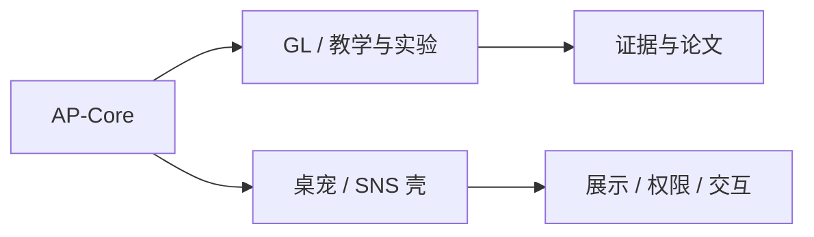
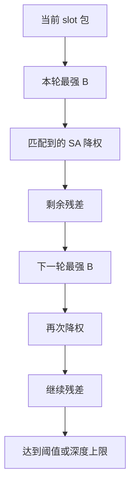

# APV2.1 底层设计完善稿与补强方案（2026-06-10）

本文是当前 AP 底层的补强设计稿，目标不是重写架构，而是把已经成立的机制继续钉牢。

## 1. 路线分层



- `AP-Core` 负责闭环认知、召回、行动、反馈和记忆。
- `GL` 负责教学、课程、退坡、证据组织和实验编排。
- 桌宠 / SNS 负责用户可见界面、权限壳、演示入口和持久化接入。

## 2. 当前底层机制

AP 的核心对象仍是：

- `SA`：状态原子。
- `state pool`：当前 tick 的认知场。
- `B / Bn`：历史近邻召回。
- `C / Cn / C*`：后继预测与虚量审计。
- `cognitive feelings`：低把握、违和、证据缺口、步骤闭合、计算压力、清晰感等。
- `emotion channels`：慢变量调制层。
- `action feedback`：行动后果写回。

这套结构的意义是：外界输入只是一类普通 SA，真正驱动泛化的是内部过程变量被显式化之后形成的竞争。

## 3. 当前实现的真实边界

### 3.1 状态池

当前状态池是双能量场：

- `real_energy`：当前真的在场。
- `virtual_energy`：当前值得继续期待。
- `cognitive_pressure = real_energy - virtual_energy`：张力。
- `attention_gain`：继续看下去的价值。
- `fatigue`：重复疲劳。

当前读视图：

- `read_r_state()`：fast-system 正门，5 个头。
- `snapshot()`：白箱观测，当前上限 24。
- `snapshot_for_memory_write()`：长期写回，当前上限 1024。

当前 `read_r_state()` 五头：

1. `head_recent`
2. `head_anchor`
3. `head_prediction`
4. `head_residual`
5. `head_global`

### 3.2 当前注意力

当前注意力是软竞赛，默认值是：

- `focus_limit = 8`
- family cap: `text 4 / vision 3 / audio 3 / cognitive_feeling 2 / emotion 2 / action 2 / time 1 / rhythm 1 / expectation_pressure 2 / other 2`

这说明当前实现已经有焦点宽度控制，但还没有完全把“一个 tick 的完整叙事包”显式做成独立对象。

### 3.3 当前短时系统

当前短时系统的四个层次是：

- `ShortTermEchoBuffer`
- `FocusBuffer`
- `ShortTermMemoryWindow`
- `FocusSuccessorBias`

它们分别承担：

- 回声残留。
- 最近在想什么。
- 可主动回看的工作记忆。
- 连续后继偏置。

### 3.4 当前记忆召回

当前召回通道是：

- `posting`
- `vector`
- `numeric`
- `relation`
- `online embedding`
- `temporal applicability`

当前总分是多证据合流，而不是单一关键词命中。

## 4. 这次要补强什么

### 4.1 短期记忆槽

目标不是“又加一个缓存”，而是把 tick 级短期记忆做成显式叙事单元。

推荐定义：

- 一个 slot = 一个 tick 的完整注意焦点包。
- slot 内可以保留 32 个多通道 SA 作为目标容量。
- slot 内顺序只给软偏置。
- slot 与 slot 之间的相对顺序更强，但仍然只是偏置。

建议 slot 组成：

- 当前焦点 SA。
- 回声 SA。
- 预测 SA。
- 残差 SA。
- 关键行动草稿。
- 关键感受 SA。

### 4.2 残差式 B 召回

建议把 B 召回改成逐轮吸收：



规则建议：

1. 每轮只取一个最强 B。
2. 以该 B 的相似度作为本轮吸收强度。
3. 已匹配 SA 在下一轮降低有效权重。
4. 未匹配 SA 在下一轮自然更强。
5. 可设置最大深度与总能量阈值提前结束。

这样做的好处是：

- 能保留尾部候选的作用。
- 能支持多行动器连续动作。
- 能让后续回合更容易吸到未吸尽的部分。

### 4.3 峰型 C 后继

建议把 C 的时间结构做成“首拍尖峰”：

- `Δt=1`：最高。
- `Δt=2`：明显下跌。
- `Δt=3` 以后：更低尾巴。

节拍场景再叠加 Rhythm：

- 局部后继峰负责“接着说 / 接着做”。
- Rhythm 负责“按周期回来”。

这能把模仿、接话、节奏型行动和连续动作串起来。

### 4.4 数据库存储

建议优先复用现有 PostgreSQL-first schema，而不是先造大表。

优先方案：

- 每个 tick 的短期槽写成 `memory_kind = short_term_slot` 的权威快照。
- slot 的子项落到现有 `memory_snapshot_items` / `memory_state_field_items`。
- 在 `anchor_meta` 中写入 `slot_index`、`slot_rank`、`relative_order`、`slot_mass`、`family_mass`、`continuity_score`。

如果后续审计压力增加，再加专门槽表。

## 5. 当前已有实现怎么接上这版设计

- `FocusBuffer` 已经能记录最近焦点序列与 episode 断续。
- `ShortTermEchoBuffer` 已经能保留回声残留。
- `ShortTermMemoryWindow` 已经能保存可主动回看的工作记忆。
- `FocusSuccessorBias` 已经能学习局部后继，但还需要更尖的下一拍峰。
- `MemoryStore` 已经把 posting / vector / numeric / relation / online / temporal 做成多证据召回。

所以这次不是重起炉灶，而是把边界写死：

- 哪些是回声。
- 哪些是槽。
- 哪些是残差。
- 哪些是后继峰。

## 6. 相关模块的当前数值

- `read_r_state`：5 头，单头 256 项。
- `focus_limit`：8。
- `FocusBuffer`：历史 12，`max_replay_items = 8`。
- `ShortTermEchoBuffer`：历史 128，`echo_max_age_ticks = 8`。
- `ShortTermMemoryWindow`：历史 64，`max_age_ticks = 48`，`memory_window_recall_limit = 8`。
- `FocusSuccessorBias`：`context_limit = 2048`，`max_successors_per_context = 64`，`max_context_labels = 8`，`max_order = 3`，`top_k = 12`，`per_tick_update_limit = 16`，`gain = 0.42`，`max_bias = 0.48`，`entropy_floor = 0.28`。
- 在线嵌入：`dim = 32`，`token_limit = 2048`，`min_support_to_promote = 2`，`per_tick_update_limit = 8`。

## 7. 认知感受、情绪和行动的角色

### 7.1 认知感受

当前直接通道：

- `surprise`
- `coherence`
- `dissonance`
- `correctness`
- `grasp`
- `expectation`
- `pressure`

派生通道：

- `uncertainty`
- `evidence_gap`
- `quantity_grasp`
- `step_closure`
- `computation_pressure`
- `sensory_clarity`

它们的角色不是判答案，而是给状态池增加过程材料。

### 7.2 情绪慢量

8 通道基线仍是：

- `DA 0.12`
- `ADR 0.05`
- `OXY 0.12`
- `SER 0.18`
- `END 0.10`
- `COR 0.06`
- `NOV 0.08`
- `FOC 0.10`

它们的作用是调制注意力、学习率、行动阈值和探索倾向。

### 7.3 行动

当前已注册：

- 14 个 actuator
- 39 个 action node

SafetyGate 只审外部动作，内部认知动作不在 veto 范围内。

### 7.4 短期叙事槽作为内感受器

这个版本里，短期记忆槽要再往前走一步：它不只是记住“刚刚看过什么”，而是每个 tick 都把当前完整注意焦点包作为一类内源 SA 注入状态池。

建议理解为：

- 输入层给出普通 SA；
- 短期槽把这些 SA 重新汇聚成一个叙事性内感受包；
- 这个包以虚能量为主注入状态池；
- 顺序通道也作为 SA 进入池中，表示相对顺序与槽位位置；
- 最终它和文本、图像、音频感受一起在同一个竞争场里争权重。

更稳的实现思路不是把每个对象都等量注入，而是：

- 对象权重
- 槽位系数
- 槽内相对顺序系数
- 槽间连续性系数
- 总槽质量系数

共同决定本 tick 注入的虚能量。

这件事像人类的地方在于：人不是直接把外界刺激原样吐出来，而是先在短时工作槽里形成一个“我现在在想什么”的显性包，再由这个包去影响后续判断、接话、模仿和行动。

它也有明显边界：

- 不能让短期槽变成更强的外部真相；
- 不能让它压过现实输入；
- 不能让它变成答案表式的内部宏。

更适合的目标是“维持思维连续性”，不是“无限加强记忆”。

### 7.5 推荐的能量图景

建议把每个 tick 的短期槽注入看作一个内源 SA packet，内部包含：

- slot summary：当前槽总体态势；
- slot item：槽内对象；
- slot order：相对顺序 SA；
- slot continuity：连续性 SA；
- slot rhythm / phase：若当前是节奏场景，可附加周期感 SA。

其中：

- `slot_item.virtual_energy` 主要由对象权重决定；
- `slot_order.virtual_energy` 主要由相对顺序决定；
- `slot_summary.virtual_energy` 主要由整槽总质量决定；
- `slot_summary.real_energy` 应谨慎，只保留很弱的当前可感知亮度。

这样做后，短期槽会更像“一个正在维持的内在显性认知场”，而不是“单纯的记忆仓库”。

### 7.6 对流程的影响

如果这个机制落稳，流程会更像：

感知 -> 外源/教学 -> echo -> fast recall -> attention -> short-term narrative packet -> slow recall -> feelings -> action

而不是：

感知 -> 外源 -> 查表 -> 输出

它会让：

- 后继偏置更容易形成；
- 连续动作更顺；
- 模仿更像“在同一个想法槽里接着说”；
- 语言学习更容易从 echo imitation 走向 successor prediction 和 multi-reply aggregation。

### 7.7 候选注入公式

如果要先做一个保守版，建议把每个 tick 的短期槽虚能量写成：

```text
slot_virtual_budget = clamp(base_slot_budget * continuity * continuity_quality * load_gate, min, max)
item_virtual_energy_i = slot_virtual_budget * normalized_weight_i * slot_rank_coeff_i * slot_order_coeff_i * modality_coeff_i
slot_summary_virtual_energy = sum(item_virtual_energy_i) * summary_ratio
```

其中：

- `normalized_weight_i`：对象权重归一化结果；
- `slot_rank_coeff_i`：槽内排名系数；
- `slot_order_coeff_i`：相对顺序系数；
- `modality_coeff_i`：多通道一致性系数；
- `continuity`：与上一 tick 的连续性；
- `continuity_quality`：槽内对象是否足够统一；
- `load_gate`：任务负载、外界冲击、疲劳等门控；
- `summary_ratio`：汇总成槽总结 SA 的比例。

这个版本的要点是：

- 不是让所有对象都变强；
- 而是把同一 tick 的显性认知包稳定地撑住；
- 让最强对象、顺序对象、汇总对象各自有位置，但都受同一个总预算约束。

## 8. 已完成证据现在说明了什么

| 项目 | 读数 | 现在能证明什么 |
|---|---:|---|
| DPP controlled | `300/300` | 过程协议跑通 |
| Skill37 strict30 live | `30/30` | 小样本 strict live 可过 |
| Live Fresh300 | `286/300` | 近失，不是毕业 |
| Provider boundary | `blocked_no_provider` | 无 provider 时不会伪造 pass |
| ParamSensitivity-1 | `0.9407` core basin | 过程锚有稳定盆地 |
| Representation-Ablation-1 | `R1 1.000 / R2 0.5926 / R3 1.000 / R4 1.000 / R5 0.5222` | 过程事件桥比表层 token 更稳 |

最稳的解释是：

- AP 已经不是答案表路线。
- 过程锚点已经有效。
- 但语言学习仍更像幼儿阶段的在线接话与模仿，需要继续补强峰型后继、身份峰和直接经验边界。

## 9. 下一步要做的补强

### 理论硬化

- 后继波峰门控
- 主体身份峰
- 直接经验边界
- 关系印象衰减
- 低唤醒陪伴 vs 任务压力竞争
- 幼儿阶段验收

### 实验硬化

- `FeedbackOverride-1`
- `PersistenceReload-1`
- `NegativeFeedback-Ablation-1`
- `DPP-1 v0.3`

### 论文硬化

- `ParamSensitivity-1`
- `Representation-Ablation-1`
- 保留旧版优点并增强说服力

## 10. 验收方式

下一轮验证建议走：

1. 设计。
2. 审查完善。
3. 通过落地。
4. 严谨验收测试。
5. 最终汇总报告。

对应测试重点是：

- slot 是否真的是 tick 级叙事包。
- B 是否真的是逐轮残差式吸收。
- C 是否真的是下一拍尖峰。
- slot 历史是否能稳定重载。
- 现有 DPP / Skill37 证据是否能被新机制解释，而不是被覆盖掉。
