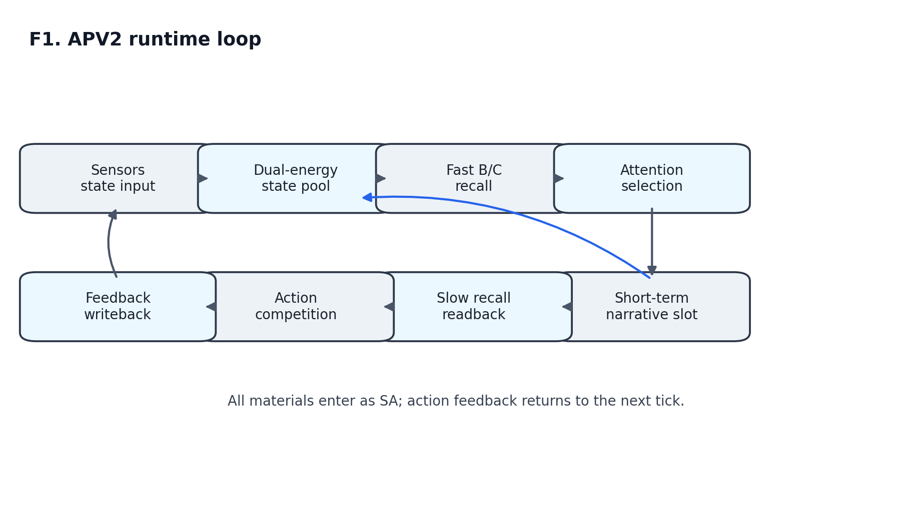
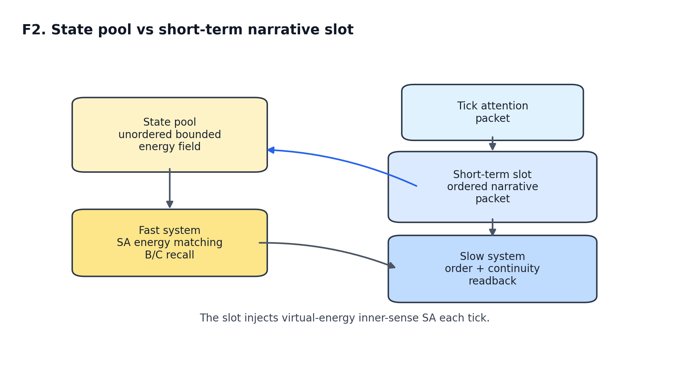
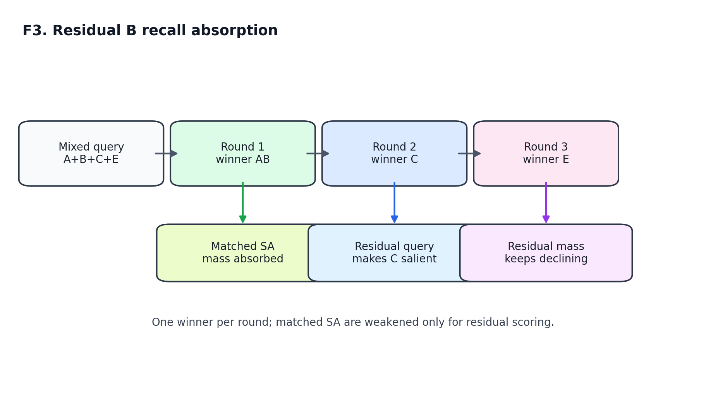
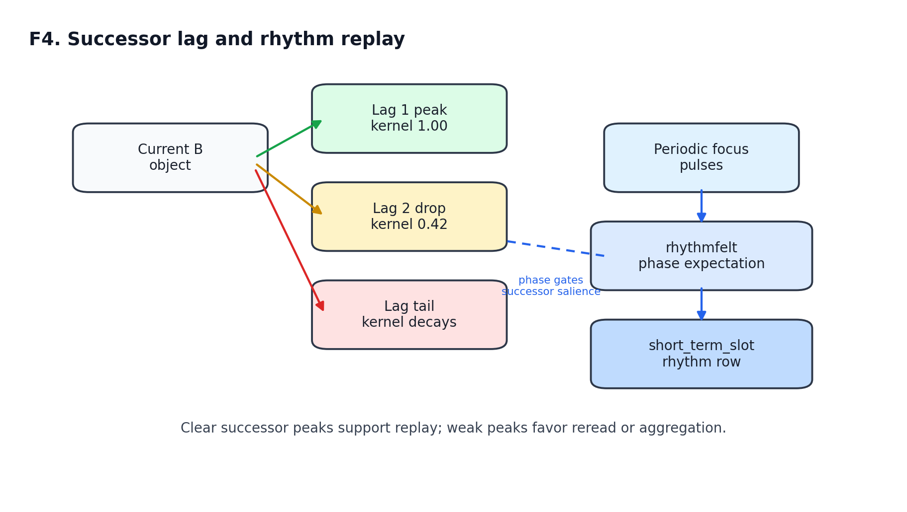
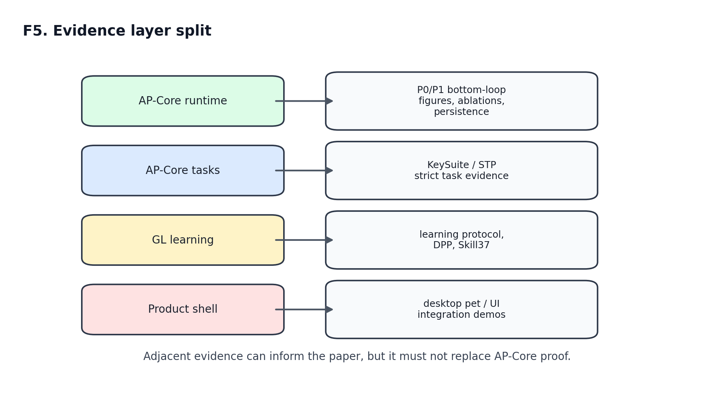

# APV2: 面向持续认知的白箱预测-行动闭环 Runtime

日期: 2026-06-11  
稿件定位: 架构与 runtime 主文草稿  
长稿关系: 现有长稿保留为 master technical report; 本稿抽取其中与 APV2 当前架构、底层循环和 P0/P1/P2 机制证据直接相关的主线。

English title: APV2: A White-Box Predictive-Action Runtime for Continuous Cognition

## 摘要

让机器拥有持续的心智, 不等于把提示词写得更长, 也不等于在大模型后面挂一个数据库。一个真正持续运行的认知系统, 需要一个属于它自己的“当前状态场”: 现实输入、刚才的念头、过往经验、预测压力、认知感受、行动倾向和行动后果, 都要能留在这个场里, 并在后续每一刻继续影响它的注意、回忆、预测和行动。本文介绍 APV2, 一个面向持续认知的白箱预测-行动闭环 runtime。它的与众不同之处在于全程可解释、可审计、可消融: 每一个内部对象都看得见, 每一步动力学都留有 trace。

APV2 用统一的状态原子 SA 承载输入、行动、反馈、感受、控制与记忆回读; 用双能量状态池表达“当前真实在场”(实能量)、“当前值得期待”(虚能量)与二者的张力(认知压); 用 B/C/C* 组织相似经验召回与后继预测; 用短期叙事槽保留最近的注意焦点并作为内感受回读入池, 维持思维连续性; 再用过程性认知感受与情绪慢量调制行动, 用行动反馈和持久化记忆闭合下一轮经验。一个关键设计是: 外界输入只是普通 SA, 认知感受只能由内部过程量生成, 系统因此把不确定、错配、压力、闭合、疲劳这些“感觉”变成可入池、可记忆、可召回、可消融的认知材料, 而不是表达风格。

本文的主张积极而有边界: APV2 的底层认知循环不是答案表、整句宏或外部求解器, 而是一套可运行、可观测、可消融的白箱动力学。P0/P1/P2 机制证据逐项支撑这一点——参数敏感性 16/16、短期槽顺序消融、打断恢复、后继波峰与节奏回放、持久化重载、残差深度压力、短期槽网格 108/108; 本地在线 learned 向量进一步通过三项消融显示它能改善经验邻域召回、在负压下清除错误残留、增强后继而不污染概念相似, 且全程有界可审计。一组受控 pilot 用真实大模型作对照(真实 Claude 无记忆约 0.22-0.30, 真实 GPT 加记忆/工具 0.83-0.85, AP-style 在 0 token 下达 1.00), 说明这是机制、成本与可审计性的差异, 而非稻草人比较。第三方作者用 Rust 独立复现了 AP-style 的 teacher-off/cold-retest、反馈学习、技能包 reload、数学泛化、关系词几何学习与 no-leakage/control probes(8/8 命令、84/84 库测试), 显示这套结构可以跨语言、跨工程路线被重建。综合来看, APV2 已经把持续认知所需的一组内部对象, 组织成了可运行、可观测、可消融、可复用的白箱预测-行动闭环底座。

关键词: APV2; 持续认知; 状态池; 短期叙事槽; 残差式召回; 后继预测; 认知感受; 在线 learned 向量; 行动反馈; 白箱认知架构

## Abstract

Large language models and LLM-based agents have made high-quality language generation, tool use, and planning widely available, but continuous cognition is not the same problem as extending a prompt window or attaching an external memory database. A continuously running cognitive system needs a state field in which perception, recent thought, memory, prediction pressure, cognitive feelings, action tendencies, and action consequences can affect later attention, recall, prediction, and action. This paper presents APV2, a white-box predictive-action runtime for continuous cognition. APV2 represents inputs, actions, feedback, feelings, control states, short-term readback, and memory traces as state atoms (SA). These atoms enter a dual-energy state pool, where real energy, virtual energy, and cognitive pressure support fast B/C recall, C* successor prediction, attention selection, short-term narrative slots, process-grounded cognitive feelings, slow emotion-like modulation, action competition, and feedback writeback.

The paper focuses on AP-Core runtime mechanisms rather than open-world dialogue mastery or product-shell integration. P0/P1/P2 evidence packages are summarized. `APV2-BottomLoop-ParamSensitivity-1` passed 16/16 conservative perturbation checks, and `ShortTermSlot-OrderAblation-1` showed that short-term-slot order works as a soft bias rather than a hard gate. P1 hardening further passed long-run interruption recovery, rhythm successor replay, JSONL persistence reload, and local artifact freeze checks. P2 stress evidence adds deeper residual recall, longer interruption/resumption stability, and a 108-case short-term-slot parameter grid. A local online learned-vector layer is further validated by three ablations: it improves experience-neighborhood recall in a bounded, monotonic way without dominating exact evidence, prunes wrong predictive residue under negative pressure without harming correct associations, and strengthens directed succession without contaminating concept similarity. A controlled pilot against real large models (real Claude without memory at about 0.22-0.30, real GPT with memory/tools at 0.83-0.85, AP-style at 1.00 with zero token cost) frames this as a difference in mechanism, cost, and auditability rather than a strawman comparison. An independently authored Rust implementation, `ACG-j/artificial_psyarch`, was also locally rerun and reproduced AP-style teacher-off/cold-retest evaluation, feedback learning, skill reload, bounded arithmetic generalization, relation-word geometry learning, and no-leakage/control probes outside the original codebase. These results support a bounded claim: APV2 currently provides a runnable, inspectable, and ablatable runtime substrate in which short-term narrative readback, residual B recall, successor peaks, cognitive feelings, action feedback, and persistence are organized as continuous white-box dynamics.

## Keywords

APV2; continuous cognition; white-box cognitive architecture; state pool; short-term narrative slot; residual recall; successor prediction; cognitive feelings; action feedback

## 1. 引言

大规模语言模型已经证明了大规模参数学习的强大能力: 它们擅长语言理解、生成、问答、代码、工具规划和多模态组织, 也能通过 agent 框架接入浏览器、数据库、任务队列和外部工具。但有一个问题它们并没有正面回答——一个系统如何在连续的时间里, 持续地成为同一个“它自己”。今天大多数做法是让模型每次重新读一遍很长的上下文, 或在模型后面挂一个外部记忆库再检索回来。这更像每次开机都重新装载记忆, 而不是始终在场地活着。APV2 研究的正是这个更底层的问题: 一个系统如何在持续时间中形成属于自己的状态场, 让输入、预测、行动、反馈和感受都成为它后续认知的一部分。这条路线不与大模型对立, 而是补上它较少触及的一层。

一个普通 agent 可以把过往对话写进日志, 也可以把工具调用结果写进数据库。但这些记录未必成为主体当前状态的一部分。它们可能被检索, 却不一定以注意增益、预测虚能量、认知压力、行动 drive 或反馈后果的形式参与下一轮竞争。一个系统也可以说“我不确定”或“我应该重试”, 但如果不确定、证据缺口、错配、压力和闭合感不能被写成可入池、可记忆、可召回、可消融的状态对象, 它们更像表达风格, 而不是认知材料。

APV2 的核心目标是把这些过程量放回 runtime 内部。它把外界输入、行动、反馈、认知感受、情绪慢量、教师信号、控制状态和技能入口统一表示为状态原子 SA, 再用持续 tick 循环组织:

```text
sensors / feedback / memory echo
  -> SA
  -> dual-energy state pool
  -> fast B/C recall
  -> attention selection
  -> short-term narrative slot
  -> slow readback and prediction
  -> cognitive feelings / emotion modulation
  -> action competition
  -> action feedback writeback
  -> memory persistence
  -> next tick
```

这条链使 APV2 的能力不被定义为一次输出, 而被定义为相似状态下可召回、可预测、可行动、可修正、可复用的过程结构。本文聚焦这条 runtime 主链, 并把完整学习协议、开放对话、产品壳展示和长技术细节留给技术报告或后续 companion paper。

本文的贡献可概括为四点:

1. 给出 APV2 的主文级 runtime 定义, 把 SA、状态池、短期叙事槽、B/C/C*、认知感受、情绪慢量、行动反馈和持久化记忆组织成一条可读闭环。
2. 把快系统和慢系统的边界写清: 快系统面向状态池无序能量场, 慢系统面向短期叙事槽和有序回读。
3. 把最新底层循环机制纳入论文主线: 短期槽每 tick 虚能量回读、残差式 B 召回、successor lag/rhythm、奖惩派生修正态与持久化重载。
4. 把 P0/P1/P2 证据压缩为主文可用的机制证据表, 明确它们支持的是 AP-Core runtime, 而不是 GL 学习协议或产品壳展示。

图 1 给出本文使用的 APV2 runtime 入口图。SVG 矢量源位于 `../outputs/apv2_publication_figures_supplement_20260611_002510/figures/f1_apv2_runtime_loop.svg`, PNG 预览如下。



Figure 1. APV2 runtime loop. All external and internal materials enter as SA, compete in the dual-energy state pool, and return through action feedback and memory persistence to the next tick.

## 2. APV2 的最小对象

APV2 的最小对象不是 token、prompt 或外部函数调用, 而是 SA。SA 可以来自文本、图像/音频的低层特征、行动节点、行动反馈、认知感受、情绪慢量、控制状态、短期槽回读或教师协议入口。APV2 采用“全 SA 一等公民”原则: 只要某个对象是当前系统可感知、可记录、可参与状态竞争的材料, 它就可以在适当条件下进入状态池和记忆视图。

这个选择有两个直接后果。

第一, 行动和反馈不是旁路日志。一次点击、一次输入、一次等待、一次说话、一次奖励、一次惩罚、一次失败都可以成为未来相似状态召回的材料。APV2 因此可以把“我曾在类似状态下这么做过, 后果如何”写成可审计经验。

第二, 认知感受不是外界字段的改名。APV2 只把由过程量生成的内部状态写成认知感受, 例如预测错配、低把握、证据缺口、重复、疲劳、步骤闭合、期待落差、行动后果压力等。外界输入文本本身只是普通 SA; 它不能绕过状态池直接变成 AP-native feeling。

在这个最小对象层上, APV2 组织如下模块:

| 对象 | 工程含义 | 在闭环中的作用 |
|---|---|---|
| SA | 状态原子, 统一承载输入、行动、反馈、感受、控制与记忆回读 | 让不同来源材料进入同一状态场 |
| 状态池 | 有界双能量认知场 | 维护 real energy、virtual energy、pressure、attention gain、fatigue |
| B | 当前状态的相似历史对象 | 支持“当前像什么”的快召回 |
| C/C* | 相似历史对象的后继预测与叠加预测包 | 支持“接下来可能是什么”的虚能量回灌 |
| 短期叙事槽 | 最近若干 tick 的注意焦点包序列 | 支持慢系统、叙事连续性和回读入池 |
| 认知感受 | 由过程量生成的内源性状态材料 | 把不确定、错配、压力、闭合等变量显式化 |
| 情绪慢量 | 由感受、反馈、期待、疲劳等累积生成的慢调制 | 影响注意和行动倾向, 但不直接替代决策 |
| 行动器 | 低粒度可执行或可模拟行动节点 | 把状态竞争转化为动作 |
| 行动反馈 | 行动后果、奖惩、正确性、压力变化 | 写回状态池和记忆, 改变后续 drive |
| 教师/技能入口 | 外部课程和已验证过程技能的接入点 | 帮助训练和复用, 但必须受边界审计 |

APV2 的理论主张可以压缩为一句话: 能力不是外界答案的静态存放, 而是 SA 在状态池、记忆、预测、感受、行动和反馈之间形成的可复现动力学。

为了减少术语负担, 本文把 APV2 runtime 的最小形式写成:

```text
APV2_runtime = <SA, R, M, S, B, C, E, A, F, P>
```

| 符号 | 含义 | 在本文中的具体承载 |
|---|---|---|
| `SA` | state atoms | 输入、行动、反馈、感受、控制、短期槽回读和记忆项 |
| `R` | state field readout | 双能量状态池与 `R_state` |
| `M` | memory store | snapshot、transition、slot memory、persistence |
| `S` | short-term narrative slot | 最近 tick 的注意焦点包序列 |
| `B` | similar-state recall | 当前状态或短期槽 query 的历史相似对象 |
| `C` | successor prediction | Cn/C* 后继预测、lag kernel 和 prediction payload |
| `E` | endogenous feelings/modulation | 过程性认知感受、expectation pressure、情绪慢量 |
| `A` | action competition | 低粒度行动器、行动节点和 planner drive |
| `F` | feedback writeback | 奖惩、正确性、行动后果和修正态 |
| `P` | provenance and audit | trace、tests、manifest、supplement index |

这个形式化不是最终数学公理化, 而是本文的工程读图方式: 后文每个机制和每项证据都应能落回这些对象之一。

## 3. Runtime 架构

### 3.1 状态池: 无序但有能量的当前场

状态池负责承载当前认知场。每个状态对象可简写为:

```text
entry_i(t) =
  <real_energy_i, virtual_energy_i, cognitive_pressure_i,
   attention_gain_i, fatigue_i, meta_i>
```

`real_energy` 表示当前被观察、行动、反馈或内源回读确认的信息强度。`virtual_energy` 表示由记忆、后继预测、短期槽回读和期待形成的预测强度。`cognitive_pressure` 表示现实与预测之间的错配或张力材料。`attention_gain` 和 `fatigue` 分别负责局部放大与近期疲劳抑制。

状态池是快系统的基础, 但它不保存严格顺序。它像一个当前场: 哪些对象现在强, 哪些对象被预测, 哪些对象带压力, 哪些对象疲劳, 哪些对象被行动控制拉高。快系统从这个场里读出 R_state, 再进行 B 召回和 C 预测。

### 3.2 短期叙事槽: 有序且可回读的当前想法

状态池无序, 但思维需要短期顺序。APV2 因此把最近 tick 的注意焦点包写入短期叙事槽。这里的“槽”不是单个 SA, 而是一个 tick 内的一整包注意焦点对象。当前默认每个 tick 可合并最多 32 个焦点对象, 形成一个注意包; 多个注意包按槽位顺序保存。

短期槽有三层顺序语义:

1. 同一个 tick 的注意包内部对象顺序只提供弱偏置。
2. 不同槽位之间的相对顺序提供更强的软偏置。
3. 顺序不匹配不会导致硬失败; 如果没有更符合顺序的历史对象, 仍可召回重叠度高但顺序不完全一致的对象。

每个 tick, 短期槽都会作为“叙事性内感受槽”回读自身内容, 生成 `short_term_slot::*` SA, 以虚能量注入状态池。它的作用类似“脑中刚才还亮着的一段印象”: 外界新刺激可以打断它, 但只要槽内对象还有足够权重, 它就会继续影响下一轮召回、预测、注意和行动。

这个设计把 APV2 的快慢系统边界分清楚了:

| 系统 | 主要输入 | 主要优势 | 主要限制 |
|---|---|---|---|
| 快系统 | 状态池 R_state, 无序能量场 | 快速并行、能从大量 SA 中形成粗召回 | 顺序和组合精度较弱 |
| 慢系统 | 短期叙事槽, 注意焦点包, 回读对象 | 保留近期叙事、顺序、连续性和回看能力 | 容量有限, 易被强新刺激打断 |

这也是它们被称为“快”和“慢”的原因。快系统像当前状态场的稀疏共振, 先快速找出相似经验和后继压力; 慢系统像把最近显性想法重新读一遍, 用顺序、连续性和回看来做更精细的判断。熟练动作通常更多走快系统和行动反馈偏置, 例如想到“快走”时不需要每次慢推理左腿、右腿、重心转移; 未完成想法、语言续接、检查草稿和插话恢复则更多依赖短期槽。

图 2 显示状态池与短期叙事槽的分工。SVG 矢量源位于 `../outputs/apv2_publication_figures_supplement_20260611_002510/figures/f2_state_pool_vs_short-term_narrative_slot.svg`, PNG 预览如下。



Figure 2. State pool and short-term narrative slot. The state pool supports fast unordered energy matching, while the slot preserves recent ordered attention packets and injects virtual-energy inner-sense SA.

### 3.3 记忆: 状态快照、B 召回与 C 后继

APV2 的 MemoryStore 写入的不只是原始文本。一个 tick 快照可以包含:

| 字段 | 作用 |
|---|---|
| `state_field_items` | 主认知场视图, 包含外界输入、行动、反馈、感受、控制等一等 SA |
| `prediction_payload_items` | 后继预测可回灌的载荷 |
| `action_feedback_items` | 行动后果证据 |
| `relation_features` | 关系结构 |
| `sequence_features` | 顺序结构 |
| `numeric_features` | 多模态数值特征 |
| short-term slot memory | 当前短期叙事槽内容、槽位、权重、顺序和连续性 |

B 召回回答“当前像哪些历史状态”。C 后继回答“这些历史状态之后出现过什么”。C* 是多个 C 后继在当前预算下形成的叠加预测包。APV2 规定 C* 的高虚能量表示预测强度和期待压力, 不是发生次数。

### 3.4 行动与反馈: 从输出变成经验

行动器是低粒度行动节点, 可以是文本动作、等待、读取、编辑、提交、桌面 shell 行动或其他注册行动。APV2 的行动 planner 不应把整句宏或外部答案作为最终能力本体; 它要在当前状态、B/C 召回、短期槽、认知感受、情绪慢量、教师退火信号和行动反馈估计之间竞争。

行动反馈会写回状态池和记忆。奖励、惩罚、正确性、压力下降、失败、修订机会都可以改变相似状态下后续行动的 drive。文本修正态就是这一链路的一个例子: 当某个文本行动受到惩罚时, 原始文本 payload 不继续作为正向候选, 而派生为修正机会 SA, 推动回看和重写。这不是第二套独立反馈系统, 而是奖惩与行动后果在文本行动层的 AP-native 表达。

## 4. 核心机制

### 4.1 双能量图景

APV2 的能量图景可以理解为三类输入在状态池中汇合:

1. 实能量: 当前感知、行动、反馈、教师入口和内源回读确认的对象。
2. 虚能量: 记忆召回、C/C* 后继、短期槽回读和期待带来的预测对象。
3. 调制量: 认知压力、注意增益、疲劳、情绪慢量和行动 drive。

系统每个 tick 都在有限预算下分配能量。历史经验可以改变当前预测倾向, 但不能凭空无限放大当前状态。这个预算观保护了两个语义: B 召回是当前状态对历史对象的抓取, C* 是当前预算下的预测强度, 二者都不是答案表查找。

### 4.2 残差式 B 召回

普通 top-k 召回会用同一个 query 一次性排出多个候选。APV2 的残差式 B 召回更接近逐轮共振吸收:

```text
residual_query_0 = current state or short-term slot query
for round in 1..max_depth:
  winner_B = best_match(residual_query)
  energy_B = residual_mass * similarity(winner_B)
  weaken matched SA in residual_query
  stop if residual_mass is too low
```

第一轮只拿一个最强 B。与它成功匹配的 SA 在下一轮中被打薄, 未解释对象的相对权重自然上升。第二轮因此更容易召回另一个能解释剩余成分的 B。这个过程让多个历史对象共同解释复杂当前状态, 也让多行动偏置、连续动作、叙事恢复和组合想法更自然地出现。

图 3 是残差式 B 召回的最小示意。SVG 矢量源位于 `../outputs/apv2_publication_figures_supplement_20260611_002510/figures/f3_residual_b_recall_absorption.svg`, PNG 预览如下。



Figure 3. Residual B recall absorption. Each round selects one winner, absorbs the matched SA mass for residual scoring, and makes previously unexplained components more salient in later rounds.

当前默认策略为:

| 参数 | 默认值 |
|---|---|
| 轮次策略 | one B winner per round |
| 最大轮数 | `min(top_k * 2, 12)` |
| matched label scale | `max(0.08, 1 - match_efficiency * 0.82)` |
| unmatched label scale | `max(0.48, 1 - match_efficiency * 0.20)` |

该机制的可审计点是每一轮 winner、匹配 SA、吸收前后 residual mass 和 winner energy。它支持“召回的轮次感”, 而不是把全部候选压成一个黑箱相似度列表。

### 4.3 Successor Lag 与节奏回放

后继预测要有时间结构。APV2 的 successor lag kernel 把下一 tick 做成主要波峰, 把更远后继做成急降后的尾巴:

| lag | kernel |
|---|---|
| 1 | `1.0` |
| 2 | `0.42` |
| >= 3 | `max(0.08, 0.42 * (0.64 ** (lag - 2)))` |

这使“接着说”不是字符串宏, 而是短期槽、B 召回、C 后继和注意竞争共同形成的时间波峰。比如短期槽中连续出现“关关雎鸠”, 如果历史后继足够清晰, 下一 tick 的候选会更集中到“在”; 输出或内部回放后, 短期槽更新为“关关雎鸠, 在”, 后续再推动“河”。若后继峰不清晰, 系统就应更多回看、模仿、聚合或等待, 而不是强行续写。

节奏型材料还会引入 rhythm/phase。周期性 focus pulse 可以产生 `rhythmfelt::phase_expectation`, 并以 `short_term_slot::rhythm` 形式进入短期槽, 让后继 lag 不只适用于文字顺序, 也可适用于诗句、儿歌、固定节拍动作或连续行动的内在时间感。

图 4 展示 successor lag 与 rhythm/phase 的关系。SVG 矢量源位于 `../outputs/apv2_publication_figures_supplement_20260611_002510/figures/f4_successor_lag_and_rhythm_replay.svg`, PNG 预览如下。



Figure 4. Successor lag and rhythm replay. Lag-1 successors form the strongest next-tick peak, later lags decay, and rhythm/phase evidence modulates successor salience through timing rather than stored sentence actions.

### 4.4 过程性认知感受

APV2 的认知感受是由过程量生成的状态对象。典型通道包括不确定、证据缺口、数量把握、步骤闭合、计算压力、感官清晰、期待压力、违和、任务未完成、满足、疲劳等。它们的作用不是给答案, 而是改变后续注意、回看、分解、等待、修订和行动竞争。

例如, 在草稿修订任务中, 预测错配、低把握、负反馈和文本动作结果可以共同推高修正机会与低把握感。接下来注意更容易回到相关草稿片段, 文本行动器更容易执行擦除、重读或替换。这里的能力来自状态池、短期槽、行动反馈和过程感受的组合, 而不是外界输入字段触发一个固定回复。

### 4.5 情绪慢量与行动反馈

情绪慢量是比单 tick 感受更慢的调制层。它可以从奖励、惩罚、期待落差、压力、疲劳、重复、闭合和行动反馈中累积, 影响注意选择和行动 drive。例如高压力可能提高谨慎和回看倾向, 低唤醒陪伴态可能降低主动任务推进, 连续奖励可能提高保持当前策略的倾向。

它的边界同样重要: 情绪慢量不直接命令最终答案, 不绕过安全门, 不替代行动器竞争。它是一种内部调制, 使 APV2 能表达“状态变化会影响行为风格和行动倾向”, 但仍保留白箱 trace。

### 4.6 持久化与重载

持续认知要求经验能跨运行边界保留。APV2 当前的 P1 材料使用 JSONL persistence adapter 验证了真实本地文件边界: MemoryStore 写入后, 新 store 可以 warm-load 并恢复状态 B 召回、C 后继预测和短期槽召回。这不是生产级数据库部署证明, 但它把“持久化重载”从内存假象推进到可哈希、可重载、可审计的本地边界。

### 4.7 本地在线 learned 向量: 经验自己长出来的邻域

APV2 还有一个轻量的本地在线 learned 向量层。它不是外部 embedding 模型, 也不是隐藏 solver: 它是一张很小的、本地的、可审计的 token 关联表, 只由 AP 自身的过程证据更新——共现、共同注意、认知压、纠错、后继和反馈。它的作用是让“哪些经验属于同一邻域、同一类对象”可以从经验里慢慢长出来, 而不必预先注册成硬标签。

这一层的三个机制各由一个消融实验单独验证, 共同说明它“有用、有界、能自我纠错、结构干净”。

第一, 它能改善经验邻域召回, 且不喧宾夺主。`OnlineVector-WeightAblation-1` 在三档权重下观察一个“与查询无表层重叠、但经验上相关”的邻居: 关闭该分支时它得不到 learned 增益, 默认权重时它的 audit 召回分从 `0.6848` 升到 `1.0460` 并排到无关项之上; 即使把权重调到高档, 一个精确 label/能量匹配的对象仍稳居第一(分数约 `15`)。也就是说 learned 向量提供的是有界的邻域偏置, 不是压过现实主证据的捷径。

第二, 它能在负认知压下清除错误残留, 且不误伤有用经验。`OnlineVector-NegativePressure-1` 让一个错误 subject 在某 context 下被反复过预测、每次错配产生负压, 结果该错误残留与真实 context 的 learned 相似度从正的 `0.3598` 被推到负的 `-0.5937`, 而正确关联只下降 `0.0286`; 在 audit 召回里正确对象贡献 `0.8136`, 错误残留为 `0`。这支持 AP 的一个核心主张: 错误的预测残留会被主动清除, 而不是变成长期“思想钢印”。

第三, 它能增强后继而不污染概念相似。`TransitionIsolation-1` 大量训练 A->B 后继后, 有向后继分从 `0.0` 升到 `0.9412`, 但 A、B 的对称概念相似度完全不动(`0.1840 -> 0.1840`), 反向后继仍是 `0.0`。这说明“B 常接在 A 之后”和“A 与 B 是同类”是两条分开的通道: 模仿与序列学习被加强, 却不会把两个对象误当成同义。

这三条与 6A.4 已验证的 learned 向量坐标派生与持久化一起, 把这一层定位清楚: 它是 Bn/Cn 主召回之外的一条辅助经验邻域分支, 在当前实现里主要通过 audit 召回路径进入排名; 是否把它接入主召回与注意通带, 是后续 `AttentionBand` 工作的一个明确决策点。

## 5. P0/P1/P2 机制证据

本节只讨论 AP-Core runtime 底层循环证据。学习协议、开放对话、DPP、Skill37 和产品壳展示属于其他证据层, 不在这里充当 AP-Core runtime 证明。

### 5.1 P0: 参数敏感性与短期槽顺序消融

P0 材料包含两个实验, 总结果为 2 pass / 0 partial / 0 fail。

| 实验 | 结果 | 支持的结论 |
|---|---|---|
| `APV2-BottomLoop-ParamSensitivity-1` | 16/16 pass | 底层循环在保守参数扰动下保持定性机制 trace, 不是单点参数偶然 |
| `ShortTermSlot-OrderAblation-1` | pass | 短期槽顺序提供软优势, 但非匹配顺序仍可被召回 |

`ShortTermSlot-OrderAblation-1` 的关键数值为:

| 条件 | `slot_ABC` | `slot_CBA` | margin |
|---|---:|---:|---:|
| full order | 36.1733 | 17.9267 | 18.2466 |
| without order rows | 21.0494 | 11.9955 | 9.0539 |

这个结果支持两个判断。第一, 顺序确实起作用: 去掉 order rows 后 margin 明显下降。第二, 顺序不是硬门: `slot_CBA` 在 full order 条件下仍有分数, 说明系统仍能基于对象重叠召回错序但相关的历史对象。这个性质正好对应短期槽设计: 槽位相对顺序给偏置, 但 APV2 不把叙事理解退化成精确字符串匹配。

### 5.2 P1: 长跑、节奏、持久化和 artifact freeze

P1 材料包含四个实验, 总结果为 4 pass / 0 partial / 0 fail。

| 实验 | 关键结果 | 支持的结论 |
|---|---|---|
| `LongRun-InterruptionRecovery-1` | interruptions 2, resumptions 2, final slot virtual mass 1.3715 | 短期叙事槽可以在受控打断和恢复中保留可回读痕迹 |
| `RhythmSuccessor-Replay-1` | lag 1 = 1.0, lag 2 = 0.42, lag 4 = 0.172; rhythm slot row 出现 | 后继预测存在下一拍峰、急降尾巴和节奏相位通道 |
| `PersistenceBackend-Reload-1` | JSONL 文件 SHA-256 = `19a0d88ba4ce8eacb01fe488ae72207a427c50f85bd8cc7bf4a30f74a50e60d7`; warm-load loaded 3 | MemoryStore 可跨真实本地文件边界恢复召回与后继 |
| `ArtifactFreeze-1` | local pre-public manifest 12 entries | 论文材料具备本地文件、大小和哈希追踪 |

在 P1/P2 材料之外, 本文还完成了论文材料级 freeze/rerun 验收: `APV2-PublicFreezeCandidate-1` 生成 163-file AP-Core runtime paper package, secret-like finding count 为 0, 具体 zip SHA-256 记录在 freeze manifest 与最终报告中; `APV2-CleanRoomRerun-1` 在同机 staging copy 中复跑主文检查和 P0/P1/P2/图包/freeze 测试, 2/2 command pass。这两项提升的是作者本地 AP-Core 论文材料的可追踪性与同机可复跑性; 第三方跨实现证据则在 5.4 节由 ACG-j Rust 复跑单独给出。

`LongRun-InterruptionRecovery-1` 的 state recall winners 为 `river_story`, `river_successor`, `alarm_distractor`。这说明打断并不会魔法般删除干扰; 干扰对象也进入状态竞争。但在 resumption trace 和短期槽虚能量仍存在的情况下, 早先叙事可以被重新召回。这个结果比“永不被打断”更接近真实持续认知: APV2 的目标是可打断、可恢复、可审计。

`RhythmSuccessor-Replay-1` 显示 phase expectation 在 tick 15 和 tick 16 出现, 并生成 `short_term_slot::rhythm`。successor shaped rows 分别预测 `text::next_beat`, `text::second_tail`, `text::period_tail`, 与 lag kernel 一致。对照的 flat ablation 会把 kernel 变成 `[1.0, 1.0, 1.0]`, 因而失去下一拍峰的时间形状。

### 5.3 P2: AP-Core 机制压力证据

P2 材料包含三个实验, 总结果为 3 pass / 0 partial / 0 fail。

| 实验 | 关键结果 | 支持的结论 |
|---|---|---|
| `ResidualDepth-Stress-1` | 8 个 winner, 7 轮 residual trace, residual mass 从 14.3126 逐轮降至 0.7448 | 残差式 B 召回在更大混合 query 下仍表现出一轮一个 winner 与匹配 SA 吸收 |
| `LongRun-Stability-1` | 12 tick, interruptions 4, resumptions 5, final slot virtual mass 0.4791 | 更长打断/恢复序列下, 短期叙事槽仍保留可回读的主线痕迹 |
| `ShortTermSlot-Grid-1` | 108/108 pass, virtual mass 0.8706-4.1611, capacity clipped cases 81 | 短期槽容量、虚能量预算、order decay 和 continuity gain 网格内保持有界、单调、可解释 |
| `DoubleEnergyBalance-PressureDynamics-1` | `text_commit` stress 近零, `text_replace` 与 `replay_episode` 上升; 去掉 pressure anchor 或 mismatch 后效果减弱 | 高压力会重排 action competition, 让系统更偏向回看 / 替换 / 回放 |
| `DoubleEnergyBalance-PressureDynamics-Sweep-1` | clean sweep 中 `text_commit` 保持正值并随压力单调下降; stress sweep 中 `text_commit` 被压到 `0`, `text_replace` / `replay_episode` 随压力上升 | 压力动力学是可扫参、可复现的曲线, 不是单点偶然 |

P2 运行中发现了一个真实实现缺陷: 低容量短期槽会先塞满 summary + item, 使 order/continuity 这类叙事元通道被挤掉。当前实现已改为保留关键叙事通道的有界组合策略, 使低容量压力下仍保留 summary、部分 item/order 与 continuity。这个修正加强了短期槽作为 tick 级叙事包的定义: 它不是普通列表截断, 而是一个要在容量压力下仍保留最小结构骨架的内源性叙事刺激包。

`DoubleEnergyBalance-PressureDynamics-1` 把动作层的压力调制也写成了可观测动力学。该实验显示, 当认知压力升高时, 文本竞争不再继续把 `text_commit` 维持在主导位置, 而是转向 `text_reread`, `text_replace` 和 `replay_episode` 这类更保守的行动出口; 当 pressure anchor 或 mismatch evidence 被去掉时, 这种转向明显减弱。这一结果说明 APV2 的压力不是标签化的情绪描述, 而是会改变行动分配的 runtime 变量。

`DoubleEnergyBalance-PressureDynamics-Sweep-1` 把同一机制从单点推进到曲线层面。clean sweep 中, `text_commit` 随压力上升保持正值但连续下降; stress sweep 中, `text_commit` 被稳定压到 `0`, 而 `text_replace` / `replay_episode` 随压力增强而抬升。两组 sweep 合起来表明, 压力动力学不是偶然的局部跳点, 而是一条可扫参、可复现、可解释的动作竞争曲线。

### 5.4 第三方 Rust 复跑: AP-style 机制的跨实现验证

除作者本地 AP-Core runtime 材料外, 本文还纳入一条第三方跨实现证据: `ACG-j/artificial_psyarch` 是独立作者基于 AP 论文原理和公开架构描述实现的 Rust 工程复现。该仓库已获授权引用, 本地按 commit `ccb68aea6291c7e9ed507d5f576803bd99f65f5d` 复跑; 对应 `.ap.zip` SHA-256 为 `051589554123405652740729A02D5BD5A2B00EADDFA425AE2007BAC1EEAE7679`。复跑环境中 `cargo check`、`cargo fmt --check`、`cargo clippy --all-targets --all-features -- -D warnings`、`cargo test --lib` 均通过, 其中 library tests 为 84/84 PASS; `generated_math_report`、`relation_word_report`、`paper_key_suite` 和 `ap_status_report` 四个核心报告命令通过。

这条证据的论文意义是跨实现可迁移性: AP-style 的学习/审计结构不是作者本地 Python 工程的单点偶然, 而可以被第三方在 Rust 生态中重建。复跑观察到的核心机制包括 teacher-fade scaffolding、teacher-off/cold-retest、反馈记忆、技能包 reload、受控算术泛化、由几何特征支持的关系词学习, 以及把几何使用和标签/路径泄漏分开的 control probes。

| probe | 本地复跑结果 | 论文使用 |
|---|---|---|
| Rust 工程完整性 | `cargo check` PASS; `cargo fmt --check` PASS; `cargo clippy ... -D warnings` PASS; `cargo test --lib` 84/84 PASS | 说明第三方实现具备可构建、可格式化、可 lint、可测试的工程基线 |
| generated math | train/holdout/generalization/reload accuracy 均为 `1.00`; untrained operator accuracy `0.00`; taint audit PASS | 支持反馈学习、teacher-off 泛化、技能 reload 与未训练操作符边界可以一起被审计 |
| relation word | 24 steps, 24 image refs, teacher-off/cold-retest/reload/holdout accuracy 均为 `1.0` | 支持关系词学习可以锚定几何特征并在 cold retest 中保持 |
| control probes | `geometry_only=1.0`, `no_geometry=0.0`, `shuffled_expected=0.0` | 支持能力来自几何信息与学习过程, 而不是标签路径或期望答案泄漏 |

完整本地复跑记录见 `docs/ThirdParty_ACGj_LocalRustRerun_Report_20260611.md`, artifact 审计见 `docs/ThirdParty_ACGj_ArtificialPsyArch_ArtifactAudit_20260611.md`, 机器可读摘要见 `outputs/thirdparty_acgj_rerun_20260611/rerun_summary.json`。在此基础上, 本文还生成了本地 public-freeze-ready bundle: `outputs/thirdparty_acgj_public_freeze_20260611/acgj_public_freeze_ready_report.md`。该 bundle 用 `git archive` 固定 reviewed source snapshot, source archive SHA-256 为 `F2C229584EB80F55B0C8791F741816129593A1D7F2235658F5807AD378481EC5`, 并复制绑定 `.ap.zip` artifact hash; clean-copy rerun 中 8/8 核心命令通过。全量 `cargo test` 记录中保留了一个 Windows 路径分隔符断言差异, 该差异已作为跨平台 packaging 待修项记录; 上表所列机制报告与 library tests 均已通过。

### 5.5 Claim-To-Evidence 映射

P0/P1/P2 与第三方 Rust 复跑结果的论文作用是支撑 AP-Core runtime 机制和 AP-style 学习/审计结构的可迁移性, 而不是替代完整任务学习论文。表 5.5 将每项证据对应到主文 claim:

| claim | supporting evidence | supports | evidence scope |
|---|---|---|---|
| 底层循环不是单点参数偶然 | `APV2-BottomLoop-ParamSensitivity-1` | 保守参数扰动下机制 trace 保持 | 当前覆盖底层循环的保守参数盆地 |
| 短期槽顺序是软偏置 | `ShortTermSlot-OrderAblation-1` | 顺序提高正确相对顺序优势, 错序仍可召回 | 当前覆盖短期槽相对顺序的受控消融 |
| 叙事槽能在打断后恢复 | `LongRun-InterruptionRecovery-1` | 受控打断/恢复下仍有 slot virtual mass 和相关 recall | 当前覆盖短程打断恢复动力学 |
| 后继预测具有时间形状 | `RhythmSuccessor-Replay-1` | lag 1 波峰、lag 2 急降、远端尾巴和 rhythm row | 当前覆盖诗句/节拍式后继回放机制 |
| 记忆能跨本地文件边界重载 | `PersistenceBackend-Reload-1` | JSONL warm-load 后恢复 B/C/slot recall | 当前覆盖本地 JSONL persistence backend |
| 残差召回能承受更大混合 query | `ResidualDepth-Stress-1` | 多轮 winner、吸收 trace 和 residual mass 下降 | 当前覆盖多组件 query 的残差分解 |
| 短期叙事能承受更长打断恢复 | `LongRun-Stability-1` | 12 tick 压力序列中仍有主线 readback 和 slot recall | 当前覆盖更长受控打断/恢复序列 |
| 短期槽参数网格保持有界 | `ShortTermSlot-Grid-1` | 108/108 pass, 低容量剪裁被显式记录 | 当前覆盖 capacity、budget、order decay 与 continuity gain 网格 |
| 压力会重排行动竞争 | `DoubleEnergyBalance-PressureDynamics-1`; `DoubleEnergyBalance-PressureDynamics-Sweep-1` | stress 下 `text_commit` 近零, `text_replace` / `replay_episode` 上升; 去掉 pressure anchor 或 mismatch 后效果减弱; clean sweep 里 `text_commit` 正值单调下降, stress sweep 里 `text_commit` 稳定压到 `0` | 当前覆盖压力、错配、修正锚点与压力扫参对动作出口的因果贡献 |
| 材料可本地追踪 | `ArtifactFreeze-1` | 本地 manifest 记录文件、大小、哈希 | 当前覆盖 pre-public 本地材料追踪 |
| 论文包可同机复跑 | `APV2-PublicFreezeCandidate-1` + `APV2-CleanRoomRerun-1` | 163-file freeze package, zip hash, 2/2 rerun command pass | 当前覆盖同机 staging copy 复跑 |
| AP-style 机制可跨实现重建 | `ThirdParty-Replication-ACGj-1` | Rust clean-room implementation, 84/84 lib tests, core reports PASS | 当前覆盖 bounded mechanism reproduction: teacher-off/cold-retest、feedback learning、skill reload、math/generalization、relation-word geometry controls |
| 在线 learned vector 是有界邻域分支 | `OnlineVector-WeightAblation-1` | experience-neighborhood recall rises monotonically with bounded weight while exact SA/energy evidence still stays rank 0 | 当前覆盖辅助邻域信号, 不改主证据定义 |
| 错误残留会被定向清除 | `OnlineVector-NegativePressure-1` | wrong residue similarity is driven negative under negative pressure while correct association stays near intact | 当前覆盖 directed pruning of wrong predictive residue |
| 后继分支与概念相似分离 | `TransitionIsolation-1` | learned transition rises to 0.9412 while symmetric concept similarity stays unchanged | 当前覆盖 directed successor support without semantic contamination |

这类机制探针的价值在于隔离 runtime 部件。它们不是开放世界智能排行榜, 而是像单元生理实验一样检查“某个动力学部件是否按设计发生、能否被消融、能否被追溯”。若这些部件不可测, 后续 GL 学习实验即使表现好也难以说明能力来自 AP 底座; 若这些部件可测且边界清楚, 后续学习证据就有更稳的解释基础。

### 5.6 默认参数与代表性 tick trace

P0 材料中的短期槽默认参数如下:

| 参数 | 默认值 |
|---|---:|
| capacity | 32 |
| base_virtual_budget | 0.72 |
| item_real_fraction | 0.06 |
| item_min_virtual | 0.02 |
| item_max_virtual | 0.14 |
| item_rank_decay | 0.86 |
| item_order_decay | 0.92 |
| summary_ratio | 0.18 |
| order_ratio | 0.16 |
| continuity_ratio | 0.14 |
| rhythm_ratio | 0.10 |
| load_floor | 0.25 |
| continuity_gain | 0.35 |
| order_gain | 0.28 |
| rhythm_gain | 0.22 |
| working_memory_fill_limit | 8 |
| focus_merge_limit | 32 |

Memory and bottom-loop policy defaults:

| 参数 | 默认值 |
|---|---:|
| recall_top_k | 5 |
| predict_top_k | 5 |
| prediction_energy_scale | 0.55 |
| max_snapshots_per_kind | 256 |
| candidate_limit | 256 |
| core_item_limit | 1024 |
| query_feature_limit | 1024 |
| scoring_candidate_limit | 96 |
| temporal_applicability_enabled | true |
| temporal_floor | 0.18 |

代表性 tick trace 来自 `sun_moon_star_teacher_off_probe`, tick index 为 9。短期槽虚能量质量为 1.8859, 注意选择对象包括 `text::sun`, `text::moon`, `feeling::dissonance`, `expectation_pressure::pressure`, `feeling::surprise`, `text_revision_opportunity::start_empty_draft`, `text_action::draft_state`, `runtimefelt::simplicity`。同一 tick 中, 短期槽生成了 `short_term_slot::summary`, `short_term_slot::item::*` 和 `short_term_slot::order::*` 行, 显示它确实以叙事性内感受槽形式回读入池。

残差召回 probe 的三轮吸收为:

| round | winner | matched labels | residual before | residual after |
|---:|---|---|---:|---:|
| 1 | AB | `text::A`, `text::B` | 4.9220 | 2.3188 |
| 2 | CD | `text::C` | 2.3188 | 1.5182 |
| 3 | E | `text::E` | 1.5182 | 0.9479 |

这个 trace 展示了 APV2 当前最重要的底层图景: 短期槽持续提供内源性虚能量, 快系统从状态池和短期槽 query 中逐轮召回 B, C 后继把下一拍预测回灌, 注意再选择下一组对象, 行动和反馈再写回记忆。

### 5.7 受控 pilot 对照: AP-style 内生闭环与真实 LLM/agent baseline

机制证据回答“底层循环是否按设计运行”, 但 reviewer 通常还会问一个对照问题: 在同一受控任务下, AP-style 内生反馈闭环和真实 LLM/agent 路线各自表现如何, 成本与可审计结构差在哪里。为此本文纳入一组受控 pilot 对照。它的定位是 controlled pilot candidate, 不是最终 benchmark, 也不主张 AP 已经全面超过 LLM/RAG/agent。

对照采用统一的 teacher-off/no-leakage 约束: runner 在提交前不接触 sealed answer、private examiner、隐藏目标动作或后验评分字段; 评分只在提交后进行。代表性任务 `RepeatMap-RealAPI-v0.5-fixed` 测试未知映射规则下的持续反馈学习: 受试者只看到公开状态和动作 A/B/C/D, 训练阶段提交后才收到 reward/punishment, holdout/teacher-off/reload 阶段不给反馈也不写记忆。该结果是真实 API 多 seed 候选结果, 记录的真实 LLM 调用数为 `1424`, 总 token 为 `3930152`, 最终 records SHA-256 为 `0bfc62535a43b8fb4b7c254e5587c529036cc14291c93474335789b9ef40ec7a`。

| 路线 | alpha holdout | beta holdout | API calls | tokens | tools |
|---|---:|---:|---:|---:|---:|
| G1A AP-style | `1.0000±0.0000` | `1.0000±0.0000` | 0 | 0 | 0 |
| G1B strict_core bridge | `1.0000±0.0000` | `1.0000±0.0000` | 0 | 0 | 0 |
| G2 fixed heuristic | `0.2000±0.2400` | `0.2500±0.2191` | 0 | 0 | 0 |
| G3 Claude no-memory | `0.2167±0.0400` | `0.3000±0.0980` | 717 | 2928528 | 0 |
| G4 GPT+memory/tool | `0.8333±0.2066` | `0.8500±0.1819` | 707 | 1001624 | 660 |

这组对照刻意避免稻草人: G3 用真实 `claude-opus-4-6`, G4 用真实 `gpt-5.5-all` 并配公开 memory/tool。G4 达到 `0.85` 量级 holdout, 说明强 LLM-agent 路线确实有效。它支持的结论是机制、成本和审计差异, 而不是简单胜负: AP-style/strict_core 在该受控未知映射任务里以 0 token、0 外部 API 展示了实时反馈学习、经验包重载保持与规则切换再学习; no-memory/no-tool LLM 缺少跨轮学习载体, 难以在该任务中自然提高; LLM+memory/tool agent 是强路线, 但依赖真实 API、token 成本与外部记忆/工具调度。

补充的 `LongRun-UnknownRule-Learning-1-v0.2` no-API 多 seed pilot 进一步在 9 seeds 上观察规则切换后的再适应: AP-style 持续学习路线学习增益 `+0.2332`、重载保持 `0.6379`、切换再适应增益 `+0.2414`, 而固定启发式与无记忆单轮启发式均为 `+0.0000`; 同轮的外部 memory/tool 强基线再适应增益 `+0.2826`, 与 AP-style 处于同一量级, 差异应读作“内生闭环 vs 外部 agent harness”的机制差异。一次首轮 G4 因截断 key 触发 `401 Invalid token`, 该失败已作为 badkey artifact 保留, 最终结果采用 corrected G4 rerun 合并, 不对任何成功路线重评分。保留这条 provenance 是为了让对照避免挑结果或隐藏失败的印象。

这组 pilot 的论文作用是受控可审计对照, 不是开放世界排行榜: 它显示 AP-style 内生反馈记忆与 LLM-agent harness 是不同机制载体, 并在小规模受控任务上给出 token 成本与审计结构的直接对比。完整记录见 `docs/APV21_Paper_BaselinePilotResults_LBF1_LongRun_v0_2_20260606.md` 与对应 `outputs/` artifact。

### 5.8 相邻任务证据: AP-Core KeySuite 与 STP-v2 过程锚点

P0/P1/P2 是底层循环的部件级证据。它们之上还有一层 AP-Core 任务级证据, 用于说明这些部件能组合成可验收的闭环任务能力。本节把两组相邻任务证据按边界纳入主线; 它们支撑 AP-Core 任务能力, 而开放对话和产品壳展示仍属其他证据层。

`Canonical-KeySuite-1` 是 AP-Core 关键任务套件, 当前 `8/8 PASS`, 覆盖 StrictCore 边界、盲动作-反馈闭环、组合特征泛化、对象数量增减习得、原始多模态特征关联、无求解器初等数学、方程应用题链和已学技能注册表。每个 claim 的 allowed/forbidden 表述由 `CLAIM_MATRIX.json` 固定, 套件可由 `scripts/run_paper_key_suite.py` 重跑。它支持的表述是 AP-Core 行动-反馈-记忆闭环与受控泛化可被逐项验收, PASS 不外推为完整小学数学、开放世界视觉或真实桌面控制。

`STP-v2` 过程锚点系列检验一个对论文核心主张更关键的问题: 认知感受是不是有因果贡献的过程变量, 而不是事后标签。跨表面迁移实验 v0.4 只在 D1 文本关系域训练过程锚点 action head, 再在 D2 符号/形状域和 D3 草稿修复域复用同一组 head, 结果如下。

| 组 | 宏准确率 | D1 文本 | D2 符号/形状 | D3 草稿修复 |
|---|---:|---:|---:|---:|
| P0 过程锚点迁移 | `1.000` | `1.000` | `1.000` | `1.000` |
| P1 D1 表层关键词基线 | `0.591` | `0.772` | `0.500` | `0.500` |
| P3 等能量随机 sham feeling | `0.509` | `0.500` | `0.528` | `0.500` |
| P4 等能量置换 sham feeling | `0.482` | `0.722` | `0.556` | `0.167` |

这组结果给出三个相互支撑的判断。第一, 过程锚点可跨表面迁移: P0 只在 D1 训练却在 D2/D3 保持 `1.000`, 而 P1 表层关键词在表面变化后跌到 `0.500`。第二, 效果来自过程来源而非任意高能特征: P3/P4 用了匹配或重排的能量尺度但缺少 case 级过程来源, 宏准确率落在随机水平。第三, 不同认知感受控制不同过程阶段: 去掉 `mismatch` 会把 D3 修复掉到 `0.500` 而关系触发仍高, 去掉 teacher/correction 会把触发掉到 `0.500` 而 D3 修复仍高。该系列学生侧 API 调用为 `0`, 记录数 `3780`, 配套测试 `20 passed`。它支持的表述是有效 AP 认知感受应当过程接地、时间合法、可因果检验; 它不外推为完整开放世界语言理解或对 LLM 的普遍超越。

这两组相邻任务证据与 5.7 的受控 pilot 一起, 把主线从“部件可测”扩展到“部件能组合出可验收任务能力, 且认知感受有可检验因果贡献”。完整材料见 `paper_artifacts/apv21_20260605/KEY_SUITE_REPORT.md` 与 `docs/FinalReport_APV21_STPv2_ProcessAnchorTransfer_v0_4_20260608.md`。

## 6. 与 LLM Agent 和传统认知架构的关系

APV2 与 LLM agent 的关系是互补而非互斥。Transformer 和 LLM 路线已经证明大规模序列建模的通用能力 [Vaswani2017; Brown2020], ReAct、Reflexion、MemGPT、Generative Agents 和 Voyager 等工作展示了 LLM 与工具、反思、记忆和环境交互的强工程潜力 [Yao2023ReAct; Shinn2023Reflexion; Packer2023MemGPT; Park2023GenerativeAgents; Wang2023Voyager]。APV2 关注的是另一类载体: 状态场、行动反馈、认知感受、可审计记忆和持续 tick 循环。

| 维度 | LLM agent 常见载体 | APV2 runtime 载体 |
|---|---|---|
| 当前上下文 | prompt / message window | 双能量状态池 + 短期叙事槽 |
| 长期经验 | 外部记忆库 / 摘要 / 向量检索 | MemoryStore B/C/C* + 行动反馈写回 |
| 不确定与压力 | 文本表达或模型隐状态 | 过程性认知感受 SA + expectation pressure |
| 行动后果 | 工具日志 / planner 记录 | action feedback SA + consequence trace + drive 调制 |
| 可审计性 | prompt、tool log、输出 | 每 tick 状态、能量、召回、后继、感受、行动 trace |
| 学习边界 | 大规模预训练或外部 fine-tune | 本地状态-行动-反馈-记忆闭环与教师退火 |

传统认知架构如 Soar 和 ACT-R, 已经长期研究工作记忆、目标、产生式、chunking 和任务学习 [Laird2012Soar; Anderson2004ACTR]。APV2 的差异不在于首次提出“认知架构”, 而在于它把行动、反馈、认知感受和预测压力也纳入统一 SA 状态场, 并用双能量、短期槽和 B/C/C* 连接快系统、慢系统和后继预测。它不要求每个规则都先天写死, 也不把可解释性只放在符号层; 它追求的是可运行白箱动力学。

预测处理、自由能、PSR、信息瓶颈、慢特征、sensorimotor contingency 等理论为 APV2 提供设计锚点 [Friston2010FEP; Clark2013Predictive; Tishby2000InfoBottleneck; Wiskott2002SFA; ORegan2001Sensorimotor]。本文只把它们作为工程思想来源。APV2 当前证明的是自身 runtime 对象和局部机制证据, 不是对这些理论框架的完整实现或数学等价化。

这一区分可以压缩为下表:

| route | strongest carrier | APV2 relation |
|---|---|---|
| LLM / transformer | 参数化语言与知识模型 | APV2 可使用 LLM 作为教师、语言器或工具翻译器, 但不把其输出写成 AP-Core proof |
| LLM agents | prompt、工具、记忆和外部执行 loop | APV2 把行动后果、感受和控制状态放入自身 SA 状态场 |
| Soar / ACT-R | 工作记忆、产生式、目标和 chunking | APV2 借鉴认知架构问题意识, 但强调双能量场、全 SA 和过程感受入池 |
| predictive processing / FEP | prediction error、行动-感知闭环 | APV2 使用预测和压力图景作为工程锚点, 不声称数学等价 |
| APV2 | 白箱状态-预测-行动-反馈 runtime | 目标是可运行、可观测、可消融的持续认知底座 |

## 7. 证据边界与后续路线

APV2 当前证据应按层理解:

| 证据层 | 当前作用 | 合理使用 |
|---|---|---|
| AP-Core runtime | 本文主线, P0/P1/P2 机制证据 | 证明底层循环可运行、可观测、可消融 |
| AP-Core 受控 pilot 对照 | 5.7 RepeatMap/LBF1/LongRun 受控对照 | 作为 controlled pilot candidate 比较机制、成本与审计结构, 不作最终 benchmark |
| AP-Core task evidence | 5.8 KeySuite 与 STP-v2 过程锚点 | 支持行动-反馈-记忆、受控泛化与认知感受的因果可检验性 |
| GL learning protocol | 学习协议、开放对话、技能包训练 | 等 GL 侧 teacher-off/cold retest 和消融稳定后单独成文 |
| product shell | 桌面/桌宠/应用展示 | 展示工程迁移和用户体验, 不替代 AP-Core 证明 |

这种分层不是削弱主张, 而是增强可信度。APV2 已经能积极主张: 当前 runtime 底层循环有可观测动力学, P0/P1/P2 实验显示短期槽、残差召回、后继 lag、节奏相位、持久化重载、机制压力与 artifact freeze 均具备可验收证据; ACG-j 第三方 Rust 复跑进一步显示 AP-style 学习/审计结构可以在原始代码库之外被重建。接下来的证据扩展应继续分层推进: 完整开放世界语言学习、真实桌面长期自主行动、大规模课程泛化、公开 release 级 artifact 和更多独立环境复跑分别建立自己的实验记录。

图 5 将这条证据分层画成投稿用边界图。SVG 矢量源位于 `../outputs/apv2_publication_figures_supplement_20260611_002510/figures/f5_evidence_layer_split.svg`, PNG 预览如下。



Figure 5. Evidence layer split. AP-Core runtime evidence supports the mechanisms claimed in this paper, while AP-Core task evidence, GL learning, and product-shell demonstrations remain adjacent but distinct evidence layers.

后续最值得补强的材料包括:

1. 在独立 clean machine / VM 中复跑当前 163-file freeze package。
2. 请 ACG-j 仓库 owner 基于已完成的本地 public-freeze-ready bundle 创建稳定公开引用: owner-side tag/release/archive、commit/hash、`.ap` artifact hash、运行日志和环境说明绑定。
3. 做更长 tick 的休眠、唤醒、任务切换和旧技能复健。
4. 等 GL 侧学习协议结果稳定后, 再把语言学习六阶段与开放对话 evidence 写成独立学习论文或 companion paper。
5. 把当前 local public-freeze candidate 升级为公开 artifact, 包括 public repo/archive、commit/tag/hash、依赖锁定、数据生成器、验收脚本和复现说明。
6. 针对具体 venue 压缩主文篇幅, 固定 citation style, 并把长 technical report 转为正式 supplement。

当前 reproducibility 状态已经比普通草稿更具体: 主文图表由 `scripts/build_apv2_publication_figures_supplement.py` 生成, 图表 manifest 位于 `../outputs/apv2_publication_figures_supplement_20260611_002510/figure_manifest.json`; P0/P1/P2 机制证据由对应 report 和 targeted tests 验收; supplement index 位于 `APV2_MainPaper_Supplement_Index_20260611.md`; 论文材料级 freeze candidate 和 same-machine clean-room rerun 由 `scripts/build_apv2_public_freeze_candidate.py` 与 `scripts/run_apv2_clean_room_rerun.py` 生成, 最新 freeze package 为 163 files, clean-room rerun 为 2/2 command pass; ACG-j 第三方 Rust 实现已完成本地授权复跑, 并进一步生成 source archive + `.ap` artifact + manifest + logs 的 public-freeze-ready bundle, clean-copy rerun 为 8/8 command pass。正式公开前仍需要 repository commit/tag/hash、环境锁定、公开 artifact host, 以及 ACG-j evidence 的 owner-side public release/tag 引用。

正式 submission 前的 public-freeze checklist 是:

| item | current status | required before submission |
|---|---|---|
| source snapshot | local working tree, not a git repository in this checkout | public repo or archive with commit/tag/hash |
| figures | reproducible SVG/PNG package with manifest | venue-sized figures and stable figure numbers |
| P0/P1/P2 evidence | local reports, passing tests, and 163-file freeze candidate | public frozen artifact bundle with run instructions |
| supplement | index exists | appendix with stable anchors and artifact paths |
| environment | local Python environment validated by tests and same-machine staging rerun | pinned dependencies or reproduction container |
| external validation | same-machine clean-room rerun passed; ACG-j third-party Rust bounded-mechanism rerun completed; local public-freeze-ready ACG-j bundle passed 8/8 commands | independent clean-machine rerun plus owner-side public ACG-j tag/release/archive |

## 8. 结论

APV2 给出了一条与“更长 prompt”不同的持续认知工程路线。它把当前状态场、短期叙事、历史召回、后继预测、过程感受、情绪慢量、行动反馈和持久化记忆放入同一条 tick 循环, 并用白箱 trace 记录每一步动力学。P0/P1/P2 机制材料已经支持一个明确而稳健的主张: APV2 的底层 runtime 不只是能运行, 而是能被参数扰动、顺序消融、打断恢复、节奏回放、持久化重载、残差深度压力、短期槽网格和 artifact freeze 逐项检查。ACG-j 第三方 Rust 复跑进一步支持一个重要的工程主张: AP-style 的学习/审计结构可以跨语言、跨工程路线重建, 并保持 teacher-off/cold-retest、反馈记忆、技能 reload、泛化与 control probes 的可审计形态。

这个主张适合作为一篇系统论文的核心: APV2 已经把持续认知所需的一组内部对象组织成可运行、可观测、可消融、可复用的白箱预测-行动闭环底座。后续学习协议、开放对话、产品壳和长期自主运行都可以在这个底座上继续严谨推进。

## References

[Anderson2004ACTR] Anderson, J. R., Bothell, D., Byrne, M. D., Douglass, S., Lebiere, C., & Qin, Y. (2004). An integrated theory of the mind. Psychological Review, 111(4), 1036-1060.

[Brown2020] Brown, T. B., Mann, B., Ryder, N., Subbiah, M., Kaplan, J., Dhariwal, P., et al. (2020). Language models are few-shot learners. Advances in Neural Information Processing Systems.

[Clark2013Predictive] Clark, A. (2013). Whatever next? Predictive brains, situated agents, and the future of cognitive science. Behavioral and Brain Sciences, 36, 181-204.

[Friston2010FEP] Friston, K. (2010). The free-energy principle: a unified brain theory? Nature Reviews Neuroscience, 11, 127-138.

[Laird2012Soar] Laird, J. E. (2012). The Soar Cognitive Architecture. MIT Press.

[ORegan2001Sensorimotor] O'Regan, J. K., & Noe, A. (2001). A sensorimotor account of vision and visual consciousness. Behavioral and Brain Sciences, 24(5), 939-973.

[Packer2023MemGPT] Packer, C., Fang, V., Patil, S. G., Lin, K., Wooders, S., & Gonzalez, J. E. (2023). MemGPT: Towards LLMs as Operating Systems. arXiv:2310.08560.

[Park2023GenerativeAgents] Park, J. S., O'Brien, J. C., Cai, C. J., Morris, M. R., Liang, P., & Bernstein, M. S. (2023). Generative Agents: Interactive Simulacra of Human Behavior. UIST.

[Shinn2023Reflexion] Shinn, N., Cassano, F., Gopinath, A., Narasimhan, K., & Yao, S. (2023). Reflexion: Language Agents with Verbal Reinforcement Learning. arXiv:2303.11366.

[Tishby2000InfoBottleneck] Tishby, N., Pereira, F. C., & Bialek, W. (2000). The information bottleneck method. arXiv:physics/0004057.

[Vaswani2017] Vaswani, A., Shazeer, N., Parmar, N., Uszkoreit, J., Jones, L., Gomez, A. N., Kaiser, L., & Polosukhin, I. (2017). Attention is All You Need. Advances in Neural Information Processing Systems.

[Wang2023Voyager] Wang, G., Xie, Y., Jiang, Y., Mandlekar, A., Xiao, C., Zhu, Y., Fan, L., & Anandkumar, A. (2023). Voyager: An Open-Ended Embodied Agent with Large Language Models. arXiv:2305.16291.

[Wiskott2002SFA] Wiskott, L., & Sejnowski, T. J. (2002). Slow feature analysis: Unsupervised learning of invariances. Neural Computation, 14(4), 715-770.

[Yao2023ReAct] Yao, S., Zhao, J., Yu, D., Du, N., Shafran, I., Narasimhan, K., & Cao, Y. (2023). ReAct: Synergizing Reasoning and Acting in Language Models. ICLR.
