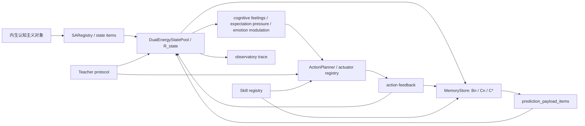
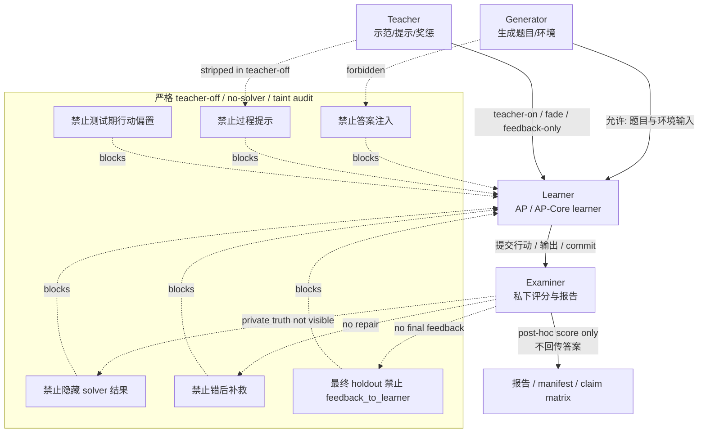

# APV2 长篇技术报告: 白箱预测-行动闭环的完整论证与实验附录

日期: 2026-06-14
文档类型: 发布版长篇技术报告 / 完整论证与实验附录
短主文: `APV2_论文_白箱预测行动闭环架构_20260614.docx` / `.pdf`
发布 tag: `apv2-release-20260614-final-longreport`
AP-Core 仓库: `https://github.com/ginsonko/Artificial-PsyArch-V2`
GL 开放中文对话仓库: `https://github.com/ginsonko/APV2-GL-OpenWorld-Chinese`
复现实验与冻结锚定仓库: `https://github.com/ginsonko/APV2-Reproduction-Artifacts`
第三方独立复现参考: `https://github.com/ACG-j/artificial_psyarch`

## 摘要

APV2 是一个面向持续认知的白箱预测-行动闭环架构。它不把智能只理解为一次性输出, 而是把外界输入、短期叙事、历史召回、后继预测、认知压力、过程性感受、情绪慢量、行动竞争、行动反馈和持久化记忆组织为同一条可审计的 tick 循环。本文档是 APV2 发布版的长篇技术报告, 用来承接短主文无法展开的完整定义、算法、白箱 trace、实验矩阵、边界讨论、第三方复现和审稿疑问回应。

当前发布包形成三条互相区分又互相支撑的证据线。AP-Core 证据证明底层 runtime 机制可以被直接测试、消融和复现; GL 证据证明 AP-style 学习协议可以在 teacher-off/no-leakage 条件下组织稳定的基础中文开放对话能力; 第三方 Rust 复现证明核心思想可以跨语言、跨工程路线重建。三条证据共同说明 APV2 已经从理论草图推进为可运行、可审计、可教学、可复验的工程研究原型。

## 与短主文的关系

发布版论文采用短主文和长篇技术报告分工:

| 文档 | 读者 | 作用 |
|---|---|---|
| 短主文 | 审稿人、技术读者、仓库首页访问者 | 快速说明问题、架构、关键机制、核心证据和适用边界 |
| 长篇技术报告 | 需要核查细节的审稿人、复现实验者、后续研究者 | 提供完整理论、公式、伪代码、trace、实验附录、术语表和答疑 |

短主文不是删减掉证据后的唯一论文, 而是发布入口。长篇技术报告保留完整论证, 使读者可以从短文中的每个关键主张追溯到具体机制和证据。

## 审稿问题快速索引

| 审稿疑问 | 本报告回应位置 | 回应方式 |
|---|---|---|
| 核心算法是否足够形式化 | 本节“核心过程的形式化摘要”、第 3-4 章 | 给出能量更新、残差召回、C* 后继、短期槽回读和认知感受映射公式 |
| 白箱性是否只是口号 | 本节“白箱 tick trace 示例”、第 4 章、第 6 章 | 用 tick 级状态池、短期槽、B 召回、C* 峰和行动倾向展示内部过程 |
| 与 LLM 的关系是否夸大 | 第 7-8 章 | 把 APV2 定位为可教学、可审计的认知底座, 把 LLM 定位为教师、知识源和工具解释器 |
| 认知感受是否只是标签 | 第 3.5、第 4.8、第 8.6 及 STP-v2 证据 | 说明认知感受来自预测熵、压力、残差、证据缺口和行动反馈等过程量 |
| 是否靠答案表、关键词硬门或隐藏 solver | 第 5 章、第 6 章、GL 协议证据 | 使用 teacher-off、no-leakage、no-solver、taint audit 和低粒度行动 trace |
| 是否可复现 | 第 9 章、附录 C、三个公开仓库 | 通过公开 tag、manifest、SHA-256、Word/PDF、实验输出和第三方 Rust 复跑锚定 |

## 发布版新增的形式化与白箱例子

### 2.7 核心过程的形式化摘要

为避免“白箱”停留在口号层面，APV2 在实现中把每个 tick 表达为可审计的状态变换。设状态原子集合为 `S_t = {s_i}`，每个 `s_i` 带有实能量 `r_i(t)`、虚能量 `v_i(t)` 和来源通道 `channel_i`。状态池更新可写成:

```text
r_i(t+1) = decay_r * r_i(t) + sensory_i(t) + action_feedback_i(t)
v_i(t+1) = decay_v * v_i(t) + successor_i(t) + short_term_readback_i(t) + learned_vector_i(t)
pressure_i(t) = |v_i(t) - r_i(t)| * salience_i(t)
```

残差式 B 召回不是一次性 top-k。给定当前 query 质量 `q_i^0`，第 `k` 轮选择相似度最高的历史对象 `B_k`:

```text
sim(B, q^k) = Σ_i q_i^k * match(s_i, B) / (Σ_i q_i^k + eps)
energy(B_k) = sim(B_k, q^k) * Σ_i (r_i(t) + v_i(t)) * q_i^k
q_i^{k+1} = q_i^k * (1 - absorb_rate * sim(B_k) * match(s_i, B_k))
```

这意味着已被 winner 解释的成分在下一轮自然降权，未被解释的成分相对上升。C/C* 后继预测则把被召回对象的未来片段按 lag kernel 叠加:

```text
C*(x) = Σ_k energy(B_k) * Σ_lag K(lag) * support(B_k, lag, x)
K(1) >> K(2) > K(3) ... > 0
```

短期叙事槽每 tick 把最近若干槽位回读为内源性 `short_term_slot::*` SA:

```text
slot_energy(item) = base_readback * slot_coeff(slot_rank) * item_weight * continuity_gate
order_bias = weak_in_slot_order + stronger_cross_slot_relative_order
```

认知感受来自过程量，而不是外界字段改名。例如，预测熵升高和 C* 峰不清晰会提高低把握/困惑; `Σ pressure_i` 和行动失败压力会提高回看、替换和请求澄清的 drive; 奖励/惩罚只通过行动后果写入后续记忆，不倒灌成当前行动前的证据。

### 2.8 白箱 tick trace 示例

下面是一个压缩示例，完整 trace schema 和更多样例放在长技术报告与 artifact 仓库中。假设用户输入“关关雎鸠”，系统历史中存在诗句后继经验:

| tick | 状态池主峰 | 短期叙事槽 | B 召回/残差 | C* 后继峰 | 行动倾向 |
|---|---|---|---|---|---|
| t0 | `text::关`, `text::关`, `text::雎`, `text::鸠` 实能量上升 | 槽 0 保存当前注意包 | 第 1 轮 winner 解释“关关雎鸠”片段，残差质量下降 | `text::在` lag1 峰清晰 | 接着说 drive 上升 |
| t1 | `short_term_slot::关关雎鸠` 虚能量回读 | 槽 0 为“关关雎鸠”，槽间连续性高 | 第 2 轮转向未解释后继成分 | `text::在` 胜出，`text::河` 为下一步候选 | 输出 `在` |
| t2 | 输出反馈把 `text::在` 写回状态池 | 槽 0 更新为“关关雎鸠，在” | 已匹配“在”的 query 成分降权 | `text::河` 成为 lag1 峰 | 输出 `河` 或继续回放 |

如果此时外界打断或 C* 没有清晰唯一峰，注意力会转向新输入、回看或请求澄清，而不是继续按固定 n-gram 输出。这个例子说明 APV2 的“接着说”来自状态池、短期槽、残差召回和 C* 后继峰共同作用，不是答案表或整句动作宏。

## APV2 与 LLM 的互补边界

APV2 不把大语言模型排除在研究体系之外。相反, 它把 LLM 放在更清楚的位置: LLM 可以是成人教师、外部知识源、课程生成器、事后评卷器、工具翻译器或安全审查器; APV2 学生侧则通过状态池、短期叙事槽、召回、预测、行动反馈和本地经验形成自己的可审计能力。这样做的优势是把“谁在测试期真正作答”说清楚: 当 LLM 在测试期直接给学生答案时, 那是 AP+LLM 工具系统; 当 LLM 只在教学期示范、提交后评分或外部补课, 而学生侧 teacher-off 运行时, 才能把形成的能力记为 AP-style 学习证据。

这个互补关系也让能力边界更清楚。APV2 当前最强的是持续状态、反馈学习、白箱审计、过程性修订、短期叙事连续性、低资源技能保持和可复现机制实验。面对海量百科知识、复杂数学竞赛、长篇创造性写作、代码工程、多工具开放规划等任务, LLM 和外部工具仍然有明显优势。APV2 的目标不是在每个静态 benchmark 上替代 LLM, 而是提供一种可以被教、能回看、会修正、可复验、可以长期作为同一个主体运行的认知底座。

## 长篇正文


## 第 1 章 绪论
### 1.0 研究动机

大规模语言模型已经证明了连接主义路线的巨大力量。通过互联网级数据、超大规模参数和强大的生成式训练, LLM 可以在写作、问答、代码、规划、视觉语言和工具调用等任务上表现出惊人的通用性。它们已经成为当代 AI 工程最重要的基础设施之一。

但长期持续认知不是更长 prompt 的同义词。

一个系统可以在上下文窗口里保持一段对话, 可以把记忆外置到数据库, 可以把工具调用结果写进日志, 也可以通过 prompt 表演出人格、情绪或主动性。然而, 这些并不自动等价于一个持续运行的主体在自己的状态场中形成经验: 它是否知道自己处于什么认知状态? 它是否能把行动后果沉淀为下一次行动倾向? 它是否能把“感觉不对”“证据不足”“步骤闭合”“压力升高”这样的过程变量显式纳入学习? 它是否能在教师逐步退火后, 仍然依靠自己的状态、记忆、预测、感受和行动反馈完成任务?

这些问题不是对 LLM 成就的否定, 而是另一类研究对象。本文把它称为 AP 的问题域: 如何构造一个白箱、持续运行、可教育、可审计、可复用的预测-行动闭环, 使认知能力不是只表现为一次输出, 而是在状态场、记忆、认知感受、行动反馈和后继预测中形成过程性稳定结构。APV2 是当前用于验证这一路线的工程原型。

### 1.1 问题定义: 持续认知不等于更长上下文

当前许多 agent 系统以 LLM 为规划器, 外接工具、浏览器、记忆库、任务队列和工作流。这条路线非常实用, 也会继续发展。但在研究“持续认知”时, 它仍留下几个结构性问题。

第一, 长期记忆常被外置化。数据库、向量库和摘要可以保存信息, 但这些信息未必成为主体当前状态的一部分。它们可能被检索, 却不一定以 real energy、virtual energy、cognitive pressure、attention gain 或 action drive 的形式参与下一轮认知竞争。

第二, 工具调用后果常停留在日志层。一次点击成功、一次输入失败、一次修改带来奖励、一次提交带来惩罚, 这些事件如果只被保存为外部记录, 就很难成为“相似状态下我更倾向或更避免某行动”的经验。

第三, 情绪、人格和主动性常停留在表达层。一个系统可以说“我有点不确定”或“我很高兴”, 但如果不确定、期待、压力、违和、正确感和疲劳不能作为可入池、可记忆、可召回、可调制行动的状态对象, 它们就更像输出风格, 而不是认知材料。

第四, 过程审计困难。黑箱模型可以给出强输出, 但研究者很难逐步检查当前注意为什么转移, 哪条记忆为什么被召回, 哪个后继为什么形成预测, 哪个行动为什么胜出, 以及教师信号是否在测试期泄漏。

APV2 选择把这些问题放到系统内部解决。它研究的不是“如何让程序在某些题目上输出正确答案”, 而是一个更窄也更基础的问题:

> 一个白箱系统能否在持续运行的预测-行动闭环中, 把感知、状态场、记忆、认知感受、行动、反馈和后继预测组织成可教育、可退火、可审计、可复用的过程性能力?

### 1.2 AP 的核心命题与 APV2 原型

本文提出人工心智架构(Artificial PsyArch, AP)作为一种白箱预测-行动闭环路线, 并以 APV2 作为当前工程原型。AP 的核心不是一个更大的参数模型, 也不是一组外部规则求解器, 而是一条持续 tick 的白箱预测-行动闭环:

```text
感知 -> 状态池 -> 记忆召回 -> 后继预测 -> 注意/认知感受
  -> 行动 -> 行动反馈 -> 记忆写入 -> 下一 tick
```

在 APV2 中, 外界输入、行动、反馈、认知感受、情绪调制和控制状态都可以被表示为状态原子 `SA`。状态池维护 `real_energy`、`virtual_energy` 和 `cognitive_pressure`。记忆系统以 Bn/Cn/C* 组织当前状态的历史近邻召回与后继预测。认知感受把不确定、证据缺口、数量把握、步骤闭合、计算压力和感官清晰等过程变量显式化。行动系统把相似状态下的后果反馈转化为 drive 调制。教师模块可以示范、提示和奖惩, 但必须逐步退火到 feedback-only 和 teacher-off。

本文把这种理论立场称为“内生认知主义”(Endogenous Cognitivism)。所谓“内生”, 不是材料来源封闭, 也不是系统不需要外界输入、教师、规则、接口或工具。相反, AP 明确承认这些外部因素都可以参与学习。内生认知主义强调的是能力的组织方式: 外部材料只有进入系统自身的状态-预测-行动-反馈-记忆闭环, 并在相似状态下表现为可召回、可预测、可行动、可纠错的过程性稳定结构, 才能称为 AP 意义上的技能或认知能力。

因此, AP 路线的目标不是替代 LLM, 而是补上一类 LLM/agent 系统不天然提供的工程对象: 可持续状态场、显式认知感受、行动后果沉淀、teacher-off 审计和技能包复用。LLM 可以成为 AP/GL 系统中的教师、语言组织器、工具翻译器或安全审查器; AP 则承担长期状态、行动反馈、认知感受和白箱经验闭环。

### 1.3 与连接主义、符号主义和 LLM agent 的关系

APV2 并不否定连接主义。大规模参数模型已经证明, 统计学习可以从海量数据中形成极强的隐式表征。AP 对连接主义的主要补充在于: AP 希望把一部分在黑箱模型中隐式存在的过程变量显式化, 让预测错配、把握感、证据缺口、行动反馈和期待压力进入白箱状态场。

APV2 也不否定符号主义。符号系统、规则、课程、检查器和工具在工程上非常重要。AP 的区别在于, 它不把外部规则直接求解视为最终能力本体。规则可以提供入口、约束和教学脚手架, 但技能必须在 AP 自己的状态场、记忆、行动和反馈中形成过程性吸引子。

APV2 同样不排斥 LLM agent。LLM agent 擅长自然语言理解、规划、工具封装和知识迁移, 是极强的工程组件。AP 的问题是另一个层级: 当工具执行了、反馈发生了、系统感到不确定或压力升高时, 这些事件是否成为主体状态本身的一部分, 并在未来相似状态中改变召回、预测、注意和行动?

因此, APV2 不是“神经网络 vs 规则”的简单第三选项, 也不是给 LLM 套一个人格设定。它试图重新规定一个白箱认知系统的内部对象: 行动、反馈、认知感受和控制状态本身也应成为可进入状态场、记忆、召回、预测和行动竞争的对象。

### 1.4 本文方法路线

本文采用“理论-架构-机制-方法-结果”五层论证。

第一, 第 2 章提出内生认知主义, 并把 AP 式系统形式化为:

```text
EC = <SA, R, M, A, F, E, C, T, L>
```

其中 `SA` 是状态原子, `R` 是状态池与读出, `M` 是记忆与召回, `A` 是行动器, `F` 是行动反馈, `E` 是认知感受与情绪调制, `C` 是后继预测, `T` 是教师与课程协议, `L` 是学习与技能固化。

第二, 第 3 章把这些对象落到 APV2 工程模块: `APV2Runtime`、`DualEnergyStatePool`、`MemoryStore`、感受器、认知感受通道、行动系统、教育协议、技能注册和 observatory。

第三, 第 4 章进一步解释关键机制: 状态池能量更新、R_state 读出、Bn 召回、Cn/C* 固定预算预测、temporal applicability、cognitive feelings、action consequence、teacher protocol 和 `action::skill.*` 技能固化。

第四, 第 5 章给出方法论: teacher-on / fade / feedback-only / teacher-off、no-answer feedback、no-solver、generator/learner/examiner 隔离、taint audit 和证据路线分层。它用于回答“是否教师代答”“是否隐藏求解器”“是否答案表”“是否把 GL/产品壳结果冒充 AP-Core”的质疑。

第五, 第 6 章给出 AP-Core 结果。本文使用 `Canonical-KeySuite-1` 作为关键证据包。该套件于 2026-06-05 本地运行, 8 个 AP-Core 套件全部 PASS, 覆盖最小行动-反馈-记忆闭环、行动后果学习、组合特征泛化、小范围数量/add-remove、多模态 raw sensor 联想、NoSolver 数学过程切片、Math-FullChain 应用题链路和 AP learned skill registry。

### 1.5 主要贡献

本文的主要贡献如下。

1. 提出“内生认知主义”作为 AP 的理论基础和工作定义。它强调能力不是只由外部数据灌入、外部规则求解或外部教师代答产生, 而是在持续运行的信息流闭环中形成过程性稳定结构。

2. 给出 APV2 白箱预测-行动闭环架构。该架构以 `SA`、双能量状态池、Bn/Cn/C*、认知感受、行动反馈、教师协议和技能注册为核心对象, 将感知、预测、行动、反馈和记忆组织为持续 tick 的工程主链。

3. 给出可审计的关键机制。本文说明 APV2 如何用 energy transfer、C* budget、`state_field_items`、`prediction_payload_items`、`CognitiveFeelingFactory`、`ActionConsequenceEvaluator`、teacher protocol 和 skill registry 实现状态场更新、后继预测、认知感受、行动后果和技能固化。

4. 给出统一实验方法论。本文把 teacher-off、no-solver、no-answer feedback、taint audit、generator/learner/examiner 隔离和 AP-Core/GL/Product route split 作为论文证据可信度的基础。

5. 给出 Canonical-KeySuite-1 AP-Core 证据。该套件 8/8 PASS, 支持 AP 在受控条件下形成行动-反馈-记忆闭环、组合泛化、数量关系习得、多模态 raw sensor 联想、若干 no-solver 数学过程切片和技能注册复用。

6. 给出 AP 与 LLM、GL 和产品壳的互补路线。本文不把 AP 写成 LLM 的简单替代品, 而是把 LLM 视为可用教师/语言器/工具翻译器, 把 GL 视为工程组织层, 把产品壳视为应用展示层, 并明确不把这些扩展结果混写为 AP-Core 本体证明。

### 1.6 证据分层与边界

为了避免把不同性质的结果混在一起, 本文采用如下证据路线分层:

| 路线 | 含义 | 在本文中的用途 |
|---|---|---|
| AP-Core | 严格 AP 本体证明, 要求 teacher-off/no-solver/no-leakage/对照或审计 | 第 6 章主结果, 最硬证据 |
| APV2 Core Runtime | 当前 APV2 主程序结构和模块实现 | 第 3/4 章架构与机制 |
| Controlled AP/GL | 受控 AP 风格或 GL 过程实验, 可使用工程脚手架 | 第 7 章扩展证据 |
| GL Engineering | 技能包、行动注册、dry-run、沙盘和应用接口 | 工程迁移价值 |
| Product Shell | 最强养成系统桌宠产品壳 | 应用展示, 不能当 AP-Core 实证 |
| Future Work | 画板、几何、真实桌面、麦克风、摄像头等后续方向 | 后续实验和开发路线 |

这个分层是本文可信度的核心。AP-Core 负责证明 AP 本体机制在受控条件下成立; APV2 Core Runtime 负责说明架构与机制已落地为可运行原型; Controlled AP/GL 和 GL Engineering 负责展示路线的工程迁移潜力; Product Shell 负责应用体验和公众理解; Future Work 则明确尚未完成但值得推进的方向。

因此, 本文不会把 GL 扩展和产品壳结果冒充 AP-Core 本体证明。相反, 本文认为清晰分层能让 AP 路线更强: 底层证据提供硬度, 工程扩展展示生命力, 产品壳让更多人理解其价值。

### 1.7 本文主张范围

为了让后续论证保持清晰, 本文把主张范围放在可复核证据上:

> AP 路线已经由 APV2 给出当前可运行工程原型与核心证据; 这条路线不同于纯连接主义和纯符号主义, 具有可定义的理论对象、可运行的工程主链、可审计的关键机制、严格的 teacher-off/no-solver 方法论, 以及一组受控 AP-Core 证据。

这一主张已经足以使 AP 成为一条值得被认真研究、复现、质疑、扩展和改进的新路线。它也自然限定了本文的证据覆盖: 第 6 章回答 AP-Core 的底层机制是否成立; 第 8.5 节回答 AP 与 LLM/agent 在受控机制探针中的成本、载体和审计结构差异; 第 8.6 节回答认知感受/过程锚点是否具有因果贡献与跨表面迁移潜力; 第 9 章集中列出发布版 artifact 锚定、参数敏感性、OOD/长跑和应用证据路线。

### 1.8 章节安排

本文采用“理论对象 -> 工程架构 -> 机制实现 -> 方法审计 -> 核心证据 -> 相关工作 -> 综合讨论 -> artifact 与后续路线”的顺序展开。

| 章节 | 作用 |
|---|---|
| 第 2 章 | 给出内生认知主义的形式化定义, 说明 AP 为什么不是连接主义或符号主义的简单变体。 |
| 第 3 章 | 把 EC 理论对象映射到 APV2 工程模块, 给出持续 tick 闭环的架构地图。 |
| 第 4 章 | 深入说明状态池、MemoryStore、Bn/Cn/C*、认知感受、行动后果、教师协议和技能注册机制。 |
| 第 5 章 | 给出 teacher-off、no-answer、no-solver、三方隔离和 taint audit 的方法论。 |
| 第 6 章 | 汇总 Canonical-KeySuite-1 的 AP-Core 严格证据。 |
| 第 7 章 | 用紧凑比较矩阵说明 AP 与连接主义、符号主义、FEP/预测加工、PSR/world model、RL 和 LLM agent 的关系。 |
| 第 8 章 | 综合讨论规模训练、窄域现场学习、AP/LLM 互补、GL/Product Shell 迁移与常见质疑。 |
| 第 9 章 | 说明 artifact、发布版质量状态与后续证据路线。 |

附录提供统一术语表、图表范围说明和 Canonical-KeySuite-1 artifact 摘要。

## 第 2 章 内生认知主义
### 2.0 本章目的

本章提出并形式化定义“内生认知主义”(Endogenous Cognitivism)。它是本文用于描述 APV2 的最高理论标签, 也是连接后续工程实现和实验结果的理论脊柱。

APV2 研究的问题不是“如何让一个程序在某些题目上输出正确答案”, 而是更底层的问题:

> 一个白箱系统能否在持续运行的预测-行动闭环中, 把感知、状态场、记忆、认知感受、行动、反馈和后继预测组织成可教育、可退火、可审计、可复用的过程性能力?

本文把这个问题归入内生认知主义。这里的“内生”不是指系统拒绝外部输入, 也不是指系统从绝对空白中自然长出一切能力。相反, AP 明确承认外界刺激、先天接口、教师课程、奖励惩罚、规则约束和工具系统都可以参与学习过程。内生认知主义强调的是能力的组织方式: 外部材料必须进入系统自身的状态-预测-行动-反馈-记忆闭环, 并在类似状态下表现为可召回、可预测、可行动、可纠错的过程性稳定结构, 才能被称为 AP 意义上的技能或认知能力。

因此, 本章的作用是把 AP 的哲学立场转化为可实现对象。第 5 章将给出 teacher-off、no-solver、no-answer feedback 和 taint audit 的方法论; 第 6 章将给出 Canonical-KeySuite-1 的 AP-Core 证据。本章位于二者之前, 用来说明这些方法和证据为什么属于同一条理论路线。

### 2.1 为什么需要第三种表述

现代 AI 的主流解释通常可以粗略分为两种方向。

第一种是连接主义。它把能力主要归结为大量数据和参数学习形成的隐式表征。大模型路线已经证明这种方法极其有效: 当模型吸收足够多的文本、图像、代码和交互数据后, 可以在非常广泛的任务上形成强大的生成能力。但连接主义系统的关键变量常常隐藏在参数空间中。它可以表现出“好像理解了”“好像感到不对”“好像有偏好”的行为, 但这些现象多数时候不是以可读的认知过程变量进入学习闭环, 而是作为海量统计拟合后的输出倾向表现出来。

第二种是符号主义。它把能力主要归结为符号、规则、逻辑和外部求解程序。符号系统的优势是清晰、可解释、可验证, 但如果规则直接给出求解过程, 系统的行为就容易停留在外部规则执行层。它可以做对任务, 却未必形成“自己曾经行动、遭遇反馈、产生错配、再次修订”的主体经验闭环。

AP 并不否定这两条路线的价值。统计学习、符号结构、教师示范、工具调用和先天规则都可以成为 AP 的一部分。但 AP 不把它们当成最终能力本体。对 AP 来说, 能力的关键不是“外部是否给过数据或规则”, 而是这些数据、规则和反馈是否被系统内部的信息流吸收, 变成状态场中的预测、感受、行动后果和记忆结构。

这就是内生认知主义试图补上的第三种表述:

> 能力不是只从外部数据灌入, 也不是只由外部规则直接求解, 而是在持续更新的内部信息流闭环中形成。

这条路线与常见 LLM agent 也不同。许多 agent 系统以 LLM 为规划器, 外接工具、记忆、浏览器和工作流。它们可以非常有用, 但主体状态往往仍然等同于上下文窗口、外部数据库和 prompt 控制。AP 的目标是把行动、反馈、认知感受和控制状态本身也变成可进入状态场的对象, 让系统能够学习“自己处于什么认知状态”“自己的行动造成了什么后果”“类似状态下什么行动更可能带来闭合或惩罚”。这不是给 LLM 套一个角色设定, 而是重新规定一个白箱认知系统的内部对象和闭环结构。

### 2.2 内生认知主义的定义

本文采用以下工作定义:

> 内生认知主义认为, 认知能力不是只由外部数据、外部规则或外部教师代答产生; 认知能力是在一个可持续运行的内部信息流闭环中, 由感知、状态场、预测、行动、反馈、记忆、认知感受和调制信号共同形成的过程性稳定结构。

这里的“过程性稳定结构”也可称为过程性吸引子。它不是一个静态答案表, 而是一种在相似状态下反复出现的倾向: 系统更容易召回某些历史经验, 更容易产生某些预测和感受, 更容易选择某些行动, 并在行动反馈中继续加固、削弱或修正这一倾向。

例如, 如果一个系统在多次训练中学到“某类草稿中出现局部冲突时, 回读并修改比直接提交更容易得到奖励”, 那么它学到的不是某个题号对应某个答案, 而是在相似状态下形成了“违和感 -> 注意回到冲突处 -> 触发回读行动 -> 修改 -> 再提交”的过程性吸引子。这样的技能可以被审计, 因为每一步都可以追踪到状态、感受、行动和反馈。

为了把该定义落成工程对象, 本文把一个 AP 式内生认知系统表示为:

```text
EC = <SA, R, M, A, F, E, C, T, L>
```

其中:

| 符号 | 含义 | APV2 对应对象 |
|---|---|---|
| `SA` | 状态原子集合 | 外源输入、行动、反馈、感受、情绪、控制等统一状态对象 |
| `R` | 状态池与状态读出 | `state pool`, `R_state`, real/virtual/pressure 多头读出 |
| `M` | 记忆与召回系统 | `MemoryStore`, posting/bigram/hash vector/FAISS/TransitionStore |
| `A` | 行动器与行动节点 | `action::*`, actuator, `action::skill.*` |
| `F` | 行动反馈 | `action_feedback::*`, reward, punishment, correctness |
| `E` | 认知感受与情绪调制 | cognitive feelings, 8-channel emotion/NT prototypes |
| `C` | 后继预测 | `Bn`, `Cn`, `C*` |
| `T` | 教师与课程协议 | teacher-on, fade, feedback-only, teacher-off |
| `L` | 学习与技能固化 | process package, learned skill registry |

这个表示不是完整数学公理系统, 而是本文使用的工作形式化。它的目的在于统一论文的模块、变量和实验证据, 让读者知道 AP 的能力主张必须落到哪些对象上。

### 2.3 AP 的基本对象: SA 与全 SA 一等公民

SA(state atom, 状态原子)是 AP 中可进入统一状态场、可被赋能、可被记忆、可被召回、可参与预测和行动竞争的最小状态对象。

SA 的范围不只包括外部输入。APV2 的理论基线是“全 SA 一等公民”: 外源输入、行动、反馈、认知感受、情绪调制和控制状态都可以成为状态场对象。更具体地说, SA 至少包括以下类别:

| 类别 | 示例 | 进入闭环后的意义 |
|---|---|---|
| 外源输入 | 文本字符、视觉数值特征、听觉数值特征、时间、空间位置 | 构成当前环境与任务材料 |
| 行动节点 | `action::move_focus`, `action::write_text`, `action::skill.*` | 行动本身可被记忆、召回和预测 |
| 行动反馈 | 成功、失败、奖励、惩罚、代价、执行状态 | 后果沉淀为下一次行动倾向 |
| 认知感受 | surprise, coherence, dissonance, correctness, grasp, expectation, pressure | 系统对自身认知过程的显式状态信号 |
| 情绪/慢量调制 | DA/ADR/OXY/SER/END/COR/NOV/FOC 等原型通道 | 改变注意、阈值、奖惩增益和行动风格 |
| 控制状态 | fatigue, attention budget, hold, submit, sleep | 让运行状态本身成为可被调制的对象 |

“全 SA 一等公民”容易被误解为所有 SA 在任何场景都拥有相同权重。本文不采用这个含义。更准确的定义是:

> 所有类型的 SA 都有资格进入状态场、记忆、召回、预测和行动链路; 但具体权重由通道类型、能量分布、注意力、疲劳、任务目标、教师协议、安全边界和学习历史共同决定。

这一区分非常重要。AP 并不是把所有对象混成无差别噪声, 而是让原本被传统系统放在“外部日志”“元信息”“控制变量”里的内容进入同一认知场, 再通过通道权重和闭环反馈决定它们的实际影响。

因此, 在 AP 中, “执行过某个行动”“该行动失败了”“我感觉不对”“我有压力”“这个状态让我期待奖励”并不是旁路标签, 而是可以进入下一轮召回和预测的认知材料。

### 2.4 状态池动力学: 实能量、虚能量与认知压

AP 的状态池(state pool)是当前认知场。它记录每个 SA 在当前时刻的能量分布、预测压力和相关元信息。可以简写为:

```text
Pool_t : SA_i -> (real_energy_i, virtual_energy_i, cognitive_pressure_i, meta_i)
```

其中:

- `real_energy` 表示当前确实发生、被感知、被行动或被反馈写入的信息强度。
- `virtual_energy` 表示由记忆召回、后继预测、期待、注意焦点和 C* 回灌产生的预测强度。
- `cognitive_pressure` 表示实能量与虚能量之间的错配张力, 可驱动惊、违和、注意抢占、回读、修订和调参。

状态池的关键不是把外界输入原样保存下来, 而是同时保存“现实已发生什么”和“系统预测应当发生什么”。当二者吻合时, 系统产生更高的 coherence、grasp 或 correctness; 当现实超出预测时, surprise 增强; 当预测对象没有按预期出现, 或现实与预测局部冲突时, dissonance 和 cognitive_pressure 增强。

这使 AP 的学习不只是“输入 -> 输出”映射, 而是“现实-预测错配”本身进入认知过程。一个人觉得“这个字看起来不对”“这一步好像算错了”“这里应该再看一眼”, 其关键并不只是最终输出, 而是预测与现实之间的偏差被主体感知到了。AP 把这一点工程化: 错配不是隐藏变量, 而是状态池和认知感受通道中的显式变量。

本文必须特别强调 `virtual_energy` 的语义。C* 中某个对象的虚能量表示当前预测强度、把握和期待压力, 不表示历史发生次数。多个历史经验共同支持同一后继对象时, 高虚能量可以是合理的预测合流, 不能简单解释为“次数多所以机械复读”。这也是后续审计 C* 和预测预算时必须遵守的语义边界。

状态池按 tick 连续更新。APV2 的拟人时间尺度采用约 `1 tick ~= 0.1s` 的基线。工程信号可以在 1-2 tick 内验证, 但许多拟人行为需要观察 5-10 tick 的趋势, 例如注意力是否逐步回到冲突处、错配是否下降、把握感是否上升、行动倾向是否改变。单 tick 没有立刻反应, 不应被自动判定为认知失败。

### 2.5 Bn/Cn/C* 与快慢系统

状态池本身只是当前认知场。AP 还需要从当前状态召回历史经验, 并预测接下来可能发生什么。本文使用 `Bn/Cn/C*` 描述这一过程。

| 对象 | 定义 | 直观含义 |
|---|---|---|
| `Bn` | 当前状态场或状态采样在历史经验中的相似认知对象 | “我把当前局面认知成什么” |
| `Cn` | 从 `Bn` 经时空邻近/后继关系召回的后继预测 | “类似局面之后通常发生什么” |
| `Bn'` | 注意焦点在焦点记忆中的相似认知对象 | “我把当前注意到的局部认知成什么” |
| `Cn'` | 从 `Bn'` 产生的焦点后继预测 | “这个思路接下来会发展到哪里” |
| `C*` | 多个 `Cn/Cn'` 在预算约束下叠加形成的唯一预测包 | “当前 tick 的综合后继预测” |

AP 的快系统偏向整个状态场。它处理的是大量 SA 共同构成的背景状态, 更接近习惯、场景识别、并行动作倾向和低成本快速反应。慢系统偏向注意焦点。它处理的是少量高能量、低噪声、可连续后继的焦点对象, 更接近内心短句、回读、修订、证明步骤和逐步思考。

两者不是互相替代, 而是在每个 tick 中共同影响状态池。快系统给出背景预测, 慢系统给出焦点发展, 二者叠加为 C*。C* 回灌后, 下一轮状态池的虚能量分布、认知压、注意竞争和行动 drive 都会改变。

这也是 AP 与传统短上下文 N-gram 的关键差异。AP 的焦点后继确实可以像短上下文续写一样逐步推进, 但它不是孤立后继偏置。状态池中还有大量背景对象、行动反馈、认知感受、奖惩预测和疲劳调制同时参与竞争。一个后继候选能否成为下一 tick 的焦点, 取决于它与整个认知场的合流, 而不只是局部序列频率。

### 2.6 认知感受: 把隐变量变成状态场事实

认知感受是 AP 与普通输入输出系统最重要的分水岭之一。本文将认知感受定义为:

> 系统对自身认知过程状态的可感知信号。它们不是事后日志标签, 而是可入池、可记忆、可召回、可调制注意和行动的 SA。

在许多系统中, “不确定”“觉得不对”“有把握”“期待奖励”只体现在最终输出概率或外部日志上。AP 要求这些过程变量显式进入状态场。这样系统不仅能处理外界是什么, 还能处理“我现在如何认知外界”。

常见认知感受包括:

| 感受 | 来源 | 作用 |
|---|---|---|
| surprise | 输入超过预测或新对象突然进入 | 提高注意分配, 促进探索和记忆写入 |
| coherence | 当前输入与预测/记忆吻合 | 增强稳定性和继续执行倾向 |
| dissonance | 预测与现实错配或局部冲突 | 触发回读、局部修订、注意抢占 |
| correctness | 行动结果闭合或通过反馈验证 | 促进提交、固化和满意感 |
| grasp | Bn 匹配强度和证据一致性 | 表示对当前状态的把握程度 |
| expectation | 奖励后继预测 | 增强趋向行动和持续关注 |
| pressure | 惩罚后继预测 | 增强回避、谨慎、修订或中止倾向 |

在 AP 中, “感觉不对”不是一句输出文本的风格, 而是一个能改变下一轮注意、回读和修订的状态场事实。一个错字、一个不一致的计算步骤、一个不符合预测的视觉对象, 都可以通过 cognitive_pressure 和 dissonance 改变后续 tick 的焦点选择。随后系统可能回读、重算、擦除、改写或暂缓提交。

这也是 AP 试图区分自己和纯黑箱统计输出的地方。连接主义模型可以隐式拟合“某些上下文下应该改字”, 但 AP 试图把“为什么要改”中的一部分因变量显式化: 预测与现实冲突、正确感不足、把握感不够、压力升高、回读行动 drive 增加。只要这些变量能进入状态场, 系统就能学习自己处于什么认知状态, 以及哪些行动能降低错配、提高闭合。

#### 2.6.1 合法认知感受的操作性标准

为了避免把“认知感受”写成装饰性术语, 本文采用一个可审计的合法性标准。一个信号只有满足以下条件, 才能被写成 AP 意义上的认知感受:

| 标准 | 含义 | 反例 |
|---|---|---|
| 过程来源 | 必须来自 AP 内部认知过程, 如 real/virtual energy 差异、prediction mismatch、Bn/Cn 召回冲突、low grasp、evidence gap、reread trace、action feedback、奖惩期待变化 | 固定关键词、正则分支、题目私有标签 |
| 一等 SA 成员 | 生成后可以作为 `feeling::*` 或等价 SA 入池、入记忆、参与 Bn/Cn/C* 召回与后继偏置 | 只存在于外部日志或自然语言解释 |
| 时间合法 | 只能在它实际生成之后影响行动; 提交后的奖惩变化只能作为后续学习证据, 不能倒灌为同次决策依据 | 用 post-action reward 提前触发当前答案 |
| 非答案语义 | 可以影响注意、回读、犹豫、修订、提交倾向, 但不能直接编码最终答案、目标输出或 examiner key | `correct_answer_is_B` |
| 因果可测 | 可以通过消融、钳制、延迟、噪声注入、sham feeling 或跨表面迁移测试其行为贡献 | 关闭后永远不改变行为的解释标签 |
| 跨表面潜力 | 不绑定单个外界表面形式; 同一类错配、低把握或反馈变化可在文本、符号、图形、缓冲区或行动后果中出现 | 只在 `A 是 B` 字符串出现时触发 |

这个标准直接服务于内生认知主义。外界文本、图形、声音和 UI 事件当然可以进入 AP, 但它们在理论上首先是普通外源 SA; 真正承担范式锚点的, 应当是系统在处理这些外源材料时产生的内部过程变量。换言之, AP 不应学习“看到某个关键词就执行某个范式”, 而应学习“当我的预测、证据、把握、回读和行动反馈呈现某种过程结构时, 某个范式通常有用”。这使范式更可能跨外界表面迁移, 也使错误训练中的关键词陷阱、宏动作伪能力和答案表污染更容易被审计发现。

STP-v2 v0.3/v0.4 正是对这套标准的第一组受控检验。v0.3 证明 selected process anchors 的关闭会改变触发、回读和修订行为; v0.4 证明 D1 训练得到的 process-anchor action heads 可以迁移到符号/图形和文本框修订表面, 而能量相似但缺少过程来源的 sham feelings 不能复现效果。这使“认知感受是可操作机制, 不是事后解释标签”这个论点更硬; 后续 OOD/长跑实验则继续检验它在更开放环境中的稳定性。

“一切可量化通道都可被感受”在本文中作为 AP 的理想设计原则。当前 APV2 已实现并验证了一组核心认知感受和部分调制通道; 后续工程章节会继续区分已落地通道、发布证据和更完整的理论扩展路线。

### 2.7 主观能动性与自我认知的操作性定义

AP 的拟人价值不能只靠角色设定或生成文本来表达。本文采用操作性定义, 把主观能动性和自我认知限制在可审计机制范围内。

#### 2.7.1 主观能动性

本文中的主观能动性指:

> 系统能够把奖励/惩罚后继预测、期待/压力、行动反馈记忆、当前认知感受和行动 drive 结合起来, 使某些行动在相似状态下更容易或更不容易被选择。

可简写为:

```text
drive(action, t) =
  base_drive
  + recall_bias(action | R_t, M)
  + expected_reward(action | C*_t)
  - expected_punishment(action | C*_t)
  + feeling_modulation(E_t)
  + teacher_or_skill_bias_when_allowed
  - fatigue_or_safety_cost
```

这个公式不是为了声称 AP 已经拥有不可还原的哲学主体, 而是为了给出可实验的主体性雏形。若某个行动在相似状态下曾经带来奖励、闭合或压力下降, 它的 drive 应当上升; 若某个行动带来惩罚、失败或压力上升, 它的 drive 应当下降。行动倾向由经验改变, 这就是 AP 操作性主观能动性的基础。

第 6 章的 LoopLearn-1 和 learned skill registry 正是这一点的硬证据支点: 行动后果可以写入记忆并改变后续选择; 已学技能可以固化为 `action::skill.*` 并被高层任务声明依赖。

#### 2.7.2 自我认知

本文中的自我认知指:

> 系统状态本身被 feeling/control/action_feedback 等 SA 表示, 并能在后续 tick 中被召回、预测、注意和行动调制。

例如, 系统不仅能看到“这道题错了”, 还可以形成 `feeling::dissonance`、`feeling::pressure` 或 `feeling::correctness`。系统不仅执行过某个行动, 还可以把该行动的反馈作为 `action_feedback::*` 写入记忆。系统不仅拥有期待或压力, 还可以在类似状态中召回“我在期待什么”“压力来自哪里”。

这使 AP 的自我状态不只是外部监控面板, 而是认知材料的一部分。它仍然是操作性自我认知, 不是人类等价主观体验的证明。但在工程上, 这已经足以支撑一类重要能力: 系统能学习自己的认知状态和行动后果, 而不只是学习外界标签。


#### 2.7.3 哲学强命题与本文操作性命题

为了避免把 AP 的拟人术语误读成超出证据的意识宣称, 本文把若干高风险表述拆成三层: 容易误读的哲学强命题、本文实际采用的操作性命题、当前证据位置。

| 容易误读的强命题 | 本文操作性命题 | 当前证据与边界 |
|---|---|---|
| AP 已经证明人类等价意识 | AP 可以把自身状态、认知感受、行动反馈和控制状态表示为可入池、可召回、可调制行动的对象 | `cognitive feelings`, `action_feedback`, `state_field_items`; 不证明 phenomenal consciousness |
| AP 拥有哲学意义完整自由意志 | AP 的行动倾向可被过往奖惩、期待压力、行动后果和当前状态竞争调制 | action drive 与 consequence evaluator; 不证明不可还原自由意志 |
| AP 永不遗忘 | AP 的旧记忆不是简单删除, temporal applicability 会改变当前适用性, 合适条件下可被重新激活 | memory age / temporal applicability; 不等于无限容量或无成本记忆 |
| AP 的情绪等同人类情绪 | AP 有可审计的情绪/认知调制原型, 可影响注意和行动选择 | emotion modulation / cognitive feelings; 不等于完整人类情绪模型 |
| AP 的自我认知等于人类自我意识 | AP 可把“我正在不确定/压力升高/行动失败/获得奖励”等状态作为内部材料继续参与闭环 | 操作性自我状态; 不证明完整主观体验 |

这张表不是为了削弱 AP 的拟人研究价值, 而是为了把拟人术语固定到可审计机制上。AP 的强点不在于宣称神秘意识, 而在于把通常隐藏在黑箱或语言表演中的认知状态转成可进入状态场、记忆和行动竞争的白箱对象。

### 2.8 教师、规则、数据和先天接口的位置

内生认知主义并不反对教师、规则、数据或先天接口。AP 从来不是“无起点”的系统。它需要感受器, 需要行动器, 需要状态池, 需要认知感受通道, 需要先天触发, 也可以需要教师安排课程。

关键在于这些外部因素的位置。

#### 2.8.1 教师不是求解器

教师模块的合理角色类似外部老师。它可以示范、提示、安排练习、提供奖惩, 使 AP 更快接触到正确做法。但在严格测试中, 教师必须退火。teacher-off 时, 当前题输入不能包含答案或过程提示, 测试期反馈不能把结果回传给 AP, examiner 只能私下评分。

因此, 教师的价值不是替 AP 做题, 而是压缩自然学习所需的试错时间。一个技能只有在 teacher-off 或 no-answer 条件下仍能被召回、修订或执行, 才能作为 AP 自身能力的证据。

#### 2.8.2 规则不是最终能力本体

先天规则和固定接口对 AP 很重要。没有感受器, 外界刺激无法进入; 没有行动器, 行动无法发生; 没有认知感受触发, 系统很难学习自身状态; 没有奖惩接口, 行动后果难以塑形。

但 AP 不把这些规则直接等同于技能。规则提供入口和约束, 技能要在状态场、行动反馈和记忆闭环中沉淀。一个“求知欲”触发规则可以增加探索倾向, 但具体学会怎样读题、怎样回读、怎样做竖式、怎样避免错误, 仍要依赖经验和反馈。

#### 2.8.3 数据是材料, 闭环是组织方式

外界数据提供学习材料, 但 AP 的主张不是“数据越大越好”的单一路线。AP 关心的是数据进入系统后是否能转化为可用经验: 它是否改变了 Bn 召回、Cn 后继预测、认知感受、行动 drive 和技能包依赖。

同一个外界输入, 如果只是被短期处理后丢弃, 它不会成为 AP 的长期经验。只有当它被写入记忆, 并在后续类似状态中影响预测、感受和行动, 它才真正进入 AP 的内生认知闭环。

#### 2.8.4 LLM 与 AP 是互补关系

LLM 可以成为 AP/GL 系统中的教师、语言组织器、工具翻译器、安全审查器或解释器。它非常适合把复杂任务转化为课程、把 AP 的行动意图组织成自然语言、把外部工具封装成可调用 adapter。

但 AP 的本体目标不是复制 LLM 的参数化语言能力, 而是提供一个白箱长期状态和行动后果层。AP 负责把状态、预测、感受、行动反馈和技能记忆组织成可审计闭环; LLM 可以在合适边界内帮助表达、教学和工程编排。二者不是简单替代关系。

### 2.9 理论对象如何解释 Canonical-KeySuite-1

第 6 章将详细报告 Canonical-KeySuite-1 的 8 组 AP-Core 结果。本章只说明这些结果分别支撑哪些理论对象。

| 理论对象 | 对应 KeySuite | 解释 |
|---|---|---|
| 最小行动-反馈-记忆闭环 | CORE-001 StrictCore-0 | 验证 AP runtime/core interface 能承载真实动作事件、反馈写入、记忆和 teacher-off 行动改变 |
| 行动后果改变后续倾向 | CORE-002 LoopLearn-1 | 支撑 action_feedback 进入记忆并改变相似状态行动选择 |
| 局部特征贡献组合 | CORE-003 LoopLearn-2 | 支撑 AP 不只是整态查表, 可在受控 numeric feature 中组合未见状态 |
| 小范围数量关系习得 | CORE-004 CountLoop-0 | 支撑数量标签和 add/remove 关系可通过反馈形成后天经验 |
| 多模态 raw sensor 联想 | CORE-005 Multimodal NoInject0 | 支撑 raw image/audio bytes 经 native numeric sensor 后与同场标签建立 teacher-off 召回 |
| 过程性数学技能与 no-answer 修订 | CORE-006 NoSolver Math 0-4 | 支撑反馈不是答案时, 错配可触发重算、修订和过程技能固化 |
| 高层技能链路组合 | CORE-007 Math-FullChain0/1 | 支撑已学基础过程技能可在受控模板内组合成应用题链路并 teacher-off 保持 |
| 技能注册与依赖声明 | CORE-008 Learned Skill Registry | 支撑技能不是一次性输出, 而是可审计、可依赖、可复用的 `action::skill.*` |

这 8 组结果不证明 AP 已经拥有开放世界通用能力, 但它们共同支撑了内生认知主义的核心命题: 在受控、可审计、排除教师代答和隐藏求解器的条件下, AP 风格的状态-行动-反馈-记忆闭环可以形成过程性技能。

这也是第 5 章方法论的必要性所在。如果不隔离 teacher、answer、solver、examiner 和 skill package taint, 这些结果可能被解释为脚本代答或答案表。只有当审计条件成立时, 第 6 章的结果才真正回到第 2 章的理论主张。

### 2.10 本章小结与适用范围

> AP 提供了一条白箱预测-行动闭环路线, APV2 是当前工程原型。它把外界输入、行动、反馈、记忆、认知感受和后继预测组织进统一状态场, 使技能可以作为过程性吸引子在相似状态下被召回、修订和复用。Canonical-KeySuite-1 的 AP-Core 结果支持这一路线已经具备严肃工程研究价值, 但开放世界、多模态 live 接入、完整长期自主运行、桌面控制和更复杂具身智能仍属于后续阶段。

本章的核心贡献是把“内生认知主义”从口号整理为可检查的对象系统: `SA`、状态池、双能量、Bn/Cn/C*、认知感受、行动反馈、教师退火和技能注册。接下来的工程章节会说明这些对象如何落地; 方法论章节会说明如何避免教师代答、答案表和隐藏求解器; 证据章节会说明这套定义目前已经覆盖哪些受控能力切片。读者若关心完整限制, 可以集中阅读第 9.5 节, 正文不再在每章重复展开。


### 2.11 EC 最小判别条件

为了让“内生认知主义”不是一个松散口号, 本文给出 AP-style EC 系统的最小判别条件。一个系统不需要在所有开放任务上完成智能, 也不需要排斥外部数据、教师、规则或工具; 但若要被称为 AP 意义上的内生认知系统, 至少应满足以下条件。

| 条件 | 判别问题 | APV2 对应对象 |
|---|---|---|
| 全 SA 一等公民 | 输入、行动、反馈、感受、控制是否都有资格进入状态场 | `SA`, `state_field_items`, action/feeling/feedback/control items |
| 预测回灌 | 预测是否只是输出答案, 还是能以虚能量和期待压力回到下一 tick | Bn/Cn/C*, `virtual_energy`, `prediction_payload_items` |
| 认知感受显式化 | 不确定、违和、把握、证据缺口是否成为可记忆状态材料 | `CognitiveFeelingFactory`, cognitive feeling channel |
| 行动后果回写 | 行动成功/失败/奖惩是否改变后续行动倾向 | `ActionConsequenceEvaluator`, action feedback, drive modulation |
| 技能过程化 | 技能是否保存过程 trace、依赖、边界和反馈, 而不是最终答案表 | learned skill registry, process package, dependency declaration |
| 教师可退火 | 教师是否能从示范退到 feedback-only / teacher-off, 严格测试期是否无答案注入 | teacher protocol, teacher-off/no-answer/no-solver/taint audit |
| 证据分层 | AP-Core、GL、Product Shell、Future Work 是否分层, 不互相冒充 | route split, claim matrix, forbidden wording |

这些条件使 EC 成为可审查的架构标准。一个系统可以借用 AP 的 UI、术语或产品外壳, 但如果缺少上述闭环条件, 它就不能被论文当作 AP-Core 证据。反过来, 一个系统即使还没有开放世界能力, 只要在受控范围内满足这些条件并通过 teacher-off/no-solver/no-leakage 审计, 就可以为 AP 路线提供严肃的工程证据。


## 第 3 章 APV2 架构与工程实现

本章把第 2 章的内生认知主义对象落到 APV2 的工程模块上。第 3 章只回答“模块如何连成持续认知闭环”; 第 4 章再回答“关键机制如何计算、审计和调制”。这样的分工用于减少重复: 本章是架构地图, 不是机制深描, 也不是结果章节。

APV2 的工程主张可以概括为: 感知、行动、反馈、记忆、认知感受、后继预测、教师信号和技能包都通过可追踪的 SA 与状态场进入同一条 tick 闭环。能力不是外部答案表, 而是在相似状态下可召回、可预测、可行动、可纠错的过程性稳定结构。

### Figure 2: EC 理论对象到 APV2 工程模块映射

图示位置: 第 3 章开头。  
作用: 说明第 2 章的 `SA / R / M / A / F / E / C / T / L` 如何对应到 APV2 当前工程模块。



### 3.0 本章目的

本章说明 APV2 当前如何组织以下对象:

| 理论对象 | 工程承载 | 章节职责 |
|---|---|---|
| SA | `SARegistry`, sensors, state items | 说明所有可认知材料如何统一入池 |
| R | `DualEnergyStatePool`, `read_r_state()` | 说明当前状态场如何读出 |
| M | `MemoryStore`, snapshots, Bn/Cn | 说明经验如何保存与召回 |
| C | C* prediction, `prediction_payload_items` | 说明后继预测如何回灌 |
| E | cognitive feelings, task feeling, expectation pressure, emotion modulation | 说明认知感受如何成为显式状态材料 |
| A | action planner, actuator registry | 说明行动如何参与闭环 |
| F | action feedback, consequence trace | 说明行动后果如何写回经验 |
| T | education intervention, skill protocol | 说明教师如何作为外部课程压缩器接入 |
| L | learned skill registry | 说明已学过程如何注册为可复用入口 |
| O | observatory | 说明白箱 trace 如何服务审计与复现 |

本章的边界也很明确: 它证明的是 APV2 已经形成一条可运行、可读、可测、可审计的工程主链; 它不单独证明完整 AGI、完整意识、开放世界 OCR/ASR、真实桌面控制或完整小学课程掌握。严格结果由第 6 章给出, 统一边界由第 1.7、第 6.11、第 9 章和附录 B 集中说明。

### 3.1 架构总览: 一条持续 tick 闭环

APV2 不把“感知、记忆、行动、情绪、教师、技能”做成互不相干的外设。它们共享一套状态场与记忆写入路径, 并在每个 tick 中互相塑形。

一个简化 tick 可写成:

```text
input / memory echo / teacher / feedback
  -> state pool
  -> R_state
  -> fast Bn/Cn
  -> attention and slow focus recall
  -> cognitive feelings / expectation pressure / emotion modulation
  -> action consequence evaluation
  -> action planning and safety gate
  -> action feedback observation
  -> memory snapshot write
  -> observatory trace
```

这条链有三点重要含义。

第一, tick 不是输入到答案的函数调用。外界输入、短期残响、教师信号、延迟反馈、记忆召回、预测错配、注意焦点、认知感受和行动倾向都会在同一轮更新中竞争。

第二, tick 是时间连续的。APV2 采用约 `1 tick ~= 0.1s` 的拟人时间基线。工程信号可以在 1-2 tick 内验证, 但回读、犹豫、修订、注意转移和逐步稳定通常应观察 5-10 tick 的趋势。

第三, 中间状态会影响后续 tick。cognitive feelings 会入池, action feedback 会写回状态场和记忆, C* 预测会形成 virtual_energy 与期待压力, 技能包也会以可声明依赖的方式被高层复用。

APV2 对这条 tick 链做了一个底层循环结构化处理: 它把“当前场”和“叙事槽”分开。状态池仍然是无序的当前认知场, 负责承载当前 SA、实能量、虚能量和认知压力; 短期叙事槽则保存最近若干 tick 的注意焦点包, 负责有序、可衰减、可回读的思维连续性。每个槽位不是一个单独 SA, 而是某个 tick 内的一整包注意焦点对象。槽内对象之间只提供弱顺序偏置; 槽位之间的相对顺序提供更强但仍然是软性的时间偏置。这样一来, AP 既不会把短期记忆退化成无序关键词集合, 也不会把顺序写成硬匹配门。

短期叙事槽每个 tick 都作为“叙事性内感受槽”回读自身内容, 把槽内对象转成 `short_term_slot::*` SA, 以虚能量注入状态池。这种注入不是把外界输入伪装成内在感受, 而是把 AP 自己刚刚注意过、仍在显性短期图景中的对象作为内源性刺激包重新入池。它的作用类似人类短时间内靠“脑中还亮着的印象”维持一句话、一段动作或一个未完成想法: 新刺激可以打断它, 但只要槽内对象仍有足够权重, 它们就会继续参与下一轮召回、后继预测、注意竞争和行动选择。

### 3.2 模块地图

APV2 当前主链可按以下模块理解:

| 模块 | 当前职责 | 需要放到第 4 章展开的机制 |
|---|---|---|
| `sensors/` | 把文本、native numeric vision/audio 等外界材料转成 SA | 低层特征、reconstruction payload、受控多模态边界 |
| `core/state_pool/` | 维护 real_energy、virtual_energy、cognitive_pressure、attention_gain、fatigue 等状态场变量 | 能量更新、C* 回灌、prediction validation |
| `memory/store/` | 写入 snapshot, 召回 Bn, 生成 Cn/C* 后继预测 | `state_field_items`, `prediction_payload_items`, energy transfer, temporal applicability |
| short-term narrative slot | 保存每 tick 注意焦点包, 并以 `short_term_slot::*` SA 回读入池 | 叙事性内感受槽、槽内/槽间软顺序偏置、虚能量连续注入 |
| attention / focus | 从 R_state 与预测压力中选择快慢系统焦点 | 焦点延续、successor bias、fatigue、action attention control |
| cognitive feelings | 把不确定、证据缺口、数量把握、步骤闭合等过程变量显式化 | feeling 生成公式、positive/negative components、soft state policy |
| expectation / emotion | 把认知感受、反馈与预测错配转成期待压力和短期调制 | task feeling 顺序、anchor verifier、emotion modulation |
| `core/action/` | 维护行动器注册、行动节点、行动竞争与安全门 | consequence evaluator、drive 调制、受控执行边界 |
| `education/` | 通过统一 doorway 接入教师 state_items、action_biases 和 feedback | teacher-on/fade/feedback-only/teacher-off 剥离协议 |
| `skill_registry/` | 把通过验证的过程技能注册为 `action::skill.*` | 依赖声明、证据报告、复用不等于从零证明 |
| `observatory/` | 输出 trace、重构、回放和只读审计视图 | trace schema、artifact、审计展示边界 |

其中最关键的工程约束是“全 SA 一等公民”。外界输入、行动、行动反馈、认知感受、情绪/NT 调制、控制状态和教师材料都可以在适当条件下进入 `state_field_items`, 成为 Bn 召回与 C* 后继预测的材料。APV2 由此避免把行动、感受和反馈降级成旁路日志。

APV2 在模块地图中新增的不是另一个外部记忆库, 而是状态池与 MemoryStore 之间的一层短期叙事读回机制。它让当前注意焦点从“单 tick 快照”扩展为“近期叙事包”, 并把这个包同时用于慢系统召回、C/Cn 后继预测和每 tick 虚能量维持。GL 发布仓库利用这层底座组织语言学习和开放对话验证, 并用自己的 teacher-off、cold retest、ablation 和 no-leakage 审计记录学习证据。

### 3.3 教师、技能与外部工具的位置

教师模块在 APV2 中不是隐藏求解器。它位于 AP core 外部, 通过 `education/intervention.py` 和 `skill_protocol_v2.py` 进入统一干预通道。teacher-on 阶段可以给示范、提示、行动偏置和反馈; fade 阶段逐步退火; feedback-only 阶段只保留奖惩或正确性反馈; teacher-off / cold-retest 阶段必须剥离 state_items、action_biases 和 feedback。

但协议层 teacher-off 只是严格证据审计的必要条件, 不是全部条件。第 5 章还会要求 no-answer、no-solver、三方隔离和 taint audit, 用来防止答案、过程提示、隐藏求解器或 post-hoc verifier 回传进入 AP-Core 结果。

技能注册也遵循同一边界。`skill_registry/ap_learned_skill_registry.json` 中已验证技能可以注册为 `action::skill.*`, 供高层任务复用; 但技能不能证明自己。任何高层复用都必须声明依赖, 不能把调用已学技能伪装成从零学习。

外部工具、LLM adapter、桌面行动器、computer pointer/keyboard、tool api 等在当前论文中应写成接口位置和安全边界。它们可以服务 GL 和产品迁移, 但不能替代第 6 章的 AP-Core 证据。

### 3.4 实现成熟度

为了避免把不同成熟度混在一起, 本文采用三层写法:

| 层级 | 可写内容 | 不可写成 |
|---|---|---|
| 已结构性落地 | tick 主链、状态池、R_state、MemoryStore、Bn/Cn/C*、认知感受、行动后果、教师协议、技能注册、observatory | 完整 AGI 或完整人类心智 |
| 受控证据或接口原型 | raw image/audio bytes 多模态联想、NoSolver 数学过程切片、skill registry、DesktopText dry-run、LLM teacher adapter | 开放世界 OCR/ASR、真实桌面控制、live LLM 作为 AP core |
| 后续增强 | 画板几何、坐标系绘制、写字/画字、真实屏幕控制、麦克风/摄像头、低频休眠/唤醒、长期多任务评测 | 已完成结果 |

这个分层不是削弱 AP 的价值, 而是保护论文主张的清晰性。AP-Core 结果必须来自 AP-Core 证据; GL 与产品壳提供工程迁移和展示路线, 但不能反写为核心证明。

### 3.5 最小闭环 walkthrough

一个受控任务中的最小 APV2 闭环可以这样读:

| step | 发生了什么 | 对应对象 |
|---:|---|---|
| 1 | 文本、图像 bytes、音频 bytes 或环境事件进入感受器 | sensors |
| 2 | 感受器生成若干 SA | SA |
| 3 | SA 进入状态池并获得 real/virtual/pressure 等字段 | R |
| 4 | `read_r_state()` 读出当前认知场 | R_state |
| 5 | MemoryStore 召回相似经验 | Bn |
| 6 | 相似经验生成后继预测并合流为 C* | Cn/C* |
| 7 | 预测回灌状态池, 形成期待压力与 virtual_energy | C -> R |
| 8 | 认知感受把错配、把握和证据缺口显式化 | E |
| 9 | 行动系统在状态、预测、感受、后果和安全门中选择行动 | A |
| 10 | 行动反馈写回状态场和记忆, 改变后续相似状态下的倾向 | F / M |

因此, APV2 的能力不应被理解为一次性答案输出。它更像一种可持续更新的信息流结构: 当前状态召回历史, 历史形成预测, 预测产生感受和行动倾向, 行动后果再写回经验。后续章节的机制和证据都围绕这条闭环展开。

## 第 4 章 工程实现细节与关键机制
### 4.0 本章目的

第 3 章说明 APV2 的工程模块如何组成持续 tick 的认知闭环。本章进一步拆开这个闭环内部的关键机制: 状态池能量如何更新, Bn/Cn/C* 如何从记忆中产生, 认知感受如何显式生成, 行动后果如何调制 drive, 教师协议如何退火与剥离信号, 已学技能如何固化为可复用入口。

为了便于读者理解, 本章会使用简化公式和伪代码描述 APV2 当前工程实现。这些表达是“当前实现的可读近似”和审计说明, 不等同于 AP 理论的最终数学公理化。AP 的参数、softcap、匹配效率、时间适用性、行动后果窗口等仍可在后续实验中继续调优。

本章要证明的不是“所有机制都已达到理论终局”, 而是更基础也更关键的一点:

> APV2 已经把状态、预测、记忆、感受、行动、反馈、教师和技能固化组织成一组可运行、可读、可审计的计算机制。

### 4.1 tick 内的信息守恒与预算观

APV2 的机制设计有一个贯穿原则: 经验可以改变预测倾向, 但不应凭空制造认知能量。系统每个 tick 都从当前状态场读出有限预算, 再把这份预算分配给相似记忆、后继预测、感受通道和行动竞争。

这不是物理意义上的严格能量守恒, 而是一种工程约束: 避免熟悉经验被误写成“重复发生很多次”, 避免记忆召回无限放大, 避免 C* 在长循环中失控, 也避免教师或控制信号偷偷把概念能量灌进 AP core。

APV2 用多个 trace 字段让这条原则可审计:

| 机制 | 审计字段 |
|---|---|
| 状态池预测合流 | `cstar_budget_trace`, `energy_budget_semantics`, `source_branches` |
| Bn 能量转移 | `energy_transfer`, `normalized_weight`, `match_efficiency`, `grasp_confidence` |
| Cn 后继转移 | `source_b_energy_mass`, `successor_normalized_weight`, `payload_share` |
| 记忆快照 | `state_field_items`, `anchor_items`, `prediction_payload_items`, `action_feedback_items` |
| 认知感受 | `positive_components`, `negative_components`, `policy`, `feeling_value` |
| 行动后果 | `action_consequence_trace`, `path_policy`, `action_estimates`, `top_supported_actions` |
| 教师协议 | `teacher_off_boundary`, `teacher_signal`, `effective_strength` |

这些字段的作用不是给论文装饰可解释性, 而是让每一次能力展示都能追问: 当前预测从哪里来, 预算如何分配, 哪些感受被激活, 哪个行动为什么胜出, 教师信号是否存在, 技能是否声明依赖。

### 4.2 状态池能量更新机制

APV2 的状态池由 `DualEnergyStatePool` 维护。每个状态对象可简写为:

```text
PoolEntry_i(t) =
  <real_energy_i, virtual_energy_i, cognitive_pressure_i,
   attention_gain_i, fatigue_i, meta_i>
```

其中:

- `real_energy` 表示当前确实发生、被感知、被行动或被反馈写入的信息强度。
- `virtual_energy` 表示由记忆召回、后继预测、期待和 C* 回灌形成的预测强度。
- `cognitive_pressure` 在当前实现中由 `real_energy - virtual_energy` 读出, 表示现实与预测之间的方向性错配材料。
- `attention_gain` 表示注意增益。
- `fatigue` 表示近期反复使用带来的疲劳抑制。

外界输入、教师 state_items、action feedback、cognitive feelings、expectation pressure 等会通过 `apply_external_items()` 写入状态池。C* 后继预测通过 `apply_predictions()` 写入虚能量。状态池采用 lazy decay 与固定维护预算, 避免每个 tick 全量扫描旧对象; 这样长跑时成本不会随着状态池膨胀而线性失控。

当前实现还专门处理 action-control target。若某个输入来源是 `action_control`, 且目标不是 `control::` 标签, 它主要调制该对象的 `attention_gain`, 而不是直接增加概念本身的 real/virtual 能量。这条边界很重要: 行动控制可以影响下一步注意和操作, 但不应伪装成“这个概念被真实观察到了”或“这个概念预测被证明了”。

状态池还执行 prediction validation。当现实输入到来时, 系统会把可比较的 actual items 与 pending prediction items 对照, 生成 matched、missed、unexpected、mismatch_ratio 等 trace。随后 cognitive feelings 和 residual summary 可以使用这些错配材料生成 uncertainty、evidence_gap、step_closure 等感受。

需要强调的是, 当前的 `cognitive_pressure = real - virtual` 是 APV2 的工程读出。它已经足以支撑许多错配、回读和修订机制, 但不等于 AP 理论对全部认知压的最终表达。后续更强版本仍可引入更细分的 anchor mismatch、跨模态冲突、局部证明缺口、行动后果张力等压力项。

### 4.3 R_state 与注意候选形成

状态池不是把所有对象一次性扔给召回系统。APV2 通过 `read_r_state()` 构造快系统读出 `R_state`。它会从当前状态池中按多头方式读取:

- 外源输入和近期感知。
- 高 real/virtual 能量对象。
- 高 cognitive_pressure 对象。
- 当前预测槽中的对象。
- hot anchor 和 recent external cache 中的对象。
- 注意增益高、疲劳低的对象。

`R_state` 的作用是为 fast Bn 召回提供当前认知场的有界采样。它不是 UI debug list, 也不是任意全池排序。`query_view()` 可以用于观察, 但主链的快系统召回应以 `read_r_state()` 为准。

注意选择发生在 fast recall 之后。attention selector 综合能量、压力、attention_gain、fatigue、上一焦点、successor bias、innate attention biases、action attention controls 和 emotion modulation, 选出慢系统焦点。这样 APV2 的注意不是单纯“最大能量胜出”, 而是由现实输入、预测压力、历史延续、行动控制和情绪调制共同竞争。

这一层机制使 AP 既能维持背景场, 又能在局部冲突处形成焦点。例如一个草稿中某个字看起来不对, 该字的 real/virtual 错配、局部 residual、回读行动后果和短期焦点延续会共同提高它再次被看的概率。

### 4.4 MemoryStore snapshot 写入机制

APV2 的记忆不是只保存原始输入文本。`MemoryStore.write_snapshot()` 会把每个 tick 的经验整理成多层结构:

| 字段 | 作用 |
|---|---|
| `items` | 当前 tick 的原始状态项集合 |
| `state_field_items` | Bn 主认知场视图, 承接 all-SA 一等公民 |
| `anchor_items` | 工程候选和外部锚点视图 |
| `core_items` | 兼容旧代码/旧报告的外部 anchor 视图 |
| `relation_features` | 相对关系和局部结构特征 |
| `sequence_features` | 顺序和短程结构特征 |
| `prediction_payload_items` | 未来 C* 可回灌的后继载荷 |
| `action_feedback_items` | 行动后果证据 |
| `numeric_features` | 多模态数值特征索引材料 |

其中 `state_field_items` 是最关键的主认知场视图。它不会默认排除 action、feeling、emotion、control、action_feedback 或外源输入。换言之, “我执行过某动作”“这个动作失败了”“我感到不确定”“我有压力”“当前有控制指令”都可以成为后续 Bn 召回的材料。

`prediction_payload_items` 则是 Cn/C* 预测的后继载荷。它不只是保存外部 token, 也可以保存行动倾向、反馈、感受和控制状态。正因为如此, AP 才能在类似状态下不仅预测“外界接下来是什么”, 也预测“自己可能会怎么行动”“行动可能带来什么反馈”“是否会出现压力或闭合感”。

MemoryStore 还把重型索引维护放到固定预算和 idle maintenance 中。写入主链会立即保存快照、核心载荷和 transition link; posting、ANN、online-learning 等派生索引可以有界延迟。这使 APV2 能在长跑中保持可用性, 而不是每个 tick 都为全部高保真索引付出完整成本。

APV2 进一步把短期叙事槽写入 memory 体系。每个 tick 的注意焦点不再只能被理解为单点 focus buffer 项, 而可以被整理成一个 `short_term_slot` 记忆对象: 槽位保存当前短期窗口中的注意焦点包、槽位相对顺序、槽内对象权重、连续性信息和可回读虚能量。实现验收中, `ShortTermSlotContinuity-1` 要求这些槽行能从状态池读到, 并以 `memory_kind="short_term_slot"` 持久化。这个机制的论文意义在于: AP 的慢系统不只是拿某个当前焦点去召回, 而是能拿“最近正在想什么的有序叙事包”去召回和预测。

短期槽的顺序语义是软性的。槽内对象来自同一个 tick 的注意焦点包, 不强制要求对象之间严格有序, 只在顺序吻合时给更多权重; 不同槽位之间的相对顺序更重要, 但也不是硬门。如果某个历史对象从未以当前相对顺序出现过, 系统仍可召回顺序不完全一致但整体相似的 B 对象; 如果存在相对顺序更吻合的历史对象, 它会在归一化能量竞争中自然更占优势。这个设计使短期叙事槽既能保留“刚才到现在”的时间方向, 又不会退化成脆弱的精确字符串匹配。

### 4.5 Bn 召回: 候选、评分与能量转移

Bn 召回的工程入口是 `MemoryStore.recall()`。它并不是单一 embedding 最近邻, 而是综合多个白箱候选来源:

- posting label/display token。
- bigram 和 sequence bigram。
- hash-vector soft similarity。
- FAISS/HNSW 向量索引。
- numeric feature index。
- relative relation matching。
- online learned similarity。
- temporal applicability。
- recent direct candidate fallback。

这些机制是记忆检索和候选评分的工程实现, 不是隐藏答案求解器。它们的作用是让 AP 找到“当前状态像哪些历史状态”, 也就是第 2 章中的 Bn。

召回结果会通过 `_annotate_recall_energy()` 获得能量转移信息。当前实现可简写为:

```text
Bn_weight_j = score_j / sum(score)
match_efficiency_j = f(score_j, top_score)
B_real_j = query_real_mass * Bn_weight_j * match_efficiency_j
B_virtual_j = query_virtual_mass * Bn_weight_j * match_efficiency_j
```

其中 `match_efficiency` 是一个非线性抓取效率函数, 综合绝对分数和相对 top_score。`grasp_confidence` 当前由 match efficiency 给出, 表示系统对这条 Bn 匹配的把握程度。

这套机制的关键点是: Bn 的能量来自当前 query mass。历史记忆不能凭空创造当前能量, 它只能在当前状态预算下获得不同权重和抓取效率。这样一来, “我想起了某个经验”不是一个无成本的答案跳转, 而是当前状态场与历史经验之间的一次可审计能量分配。

Bn row 的 `energy_transfer`、`normalized_weight`、`match_efficiency`、`grasp_confidence`、`b_real_energy` 和 `b_virtual_energy` 都可以用于后续审计。审稿人可以检查某次 AP 行动到底依赖了哪些历史状态, 这些状态匹配强不强, 当前把握是否足够, 以及是否存在过度依赖弱匹配的情况。

APV2 在 Bn 召回上补入残差式逐轮吸收。直观说, 一次复杂的当前状态像一个混合信号: 第一轮召回只选一个最强 B 对象, 这个 B 与当前 query 中若干 SA 发生“共振”并获得能量; 随后这些已匹配 SA 在下一轮计算中的权重被削弱, 未被解释的 SA 相对变得更突出。第二轮再从残余 query 中选出新的最强 B, 如此直到达到最大深度或剩余总能量低于阈值。

该机制可简写为:

```text
residual_query_0 = current_state_or_short_term_slot_query
for round in 1..max_depth:
  winner_B = argmax similarity(residual_query, memory_B)
  transfer_energy = residual_query_total_mass * similarity(winner_B)
  emit winner_B with round energy
  residual_query = weaken_matched_SA(residual_query, winner_B, similarity)
  stop if residual_query_total_mass < floor
```

它与普通 top-k 的差异在于: top-k 是一次性按同一个 query 排出多个候选; 残差召回则让第一轮 winner “吸收”一部分 query 质量, 后续轮次自然转向还没有被解释的状态成分。APV2 的 `ResidualBRecall-1` 与 `ResidualDepth-1` 分别观察到一轮一个 winner、winner 不重复、matched SA mass 被削弱、residual mass 逐轮下降, 多组件 query 可按 `A/B -> C -> E` 的路径展开。这使 Bn 更接近“多个历史对象共同解释当前复杂状态”的白箱能量分配, 也为多行动后继偏置、并行动作倾向和叙事片段恢复提供更自然的底层机制。

残差式 B 召回仍然不是答案表。它不根据关键词硬门直接路由到结果, 也不把未匹配对象丢弃为无意义噪声。相反, 它把“已解释部分”和“未解释部分”分开, 使系统能审计每一轮到底吸收了哪些 SA、转移了多少实/虚能量、下一轮为什么转向另一个历史对象。这种轮次感正是 AP 与黑箱 embedding top-k 或整句模板路由的重要区别。

### 4.6 Cn/C* 后继预测: 固定预算下的预测强度

Bn 回忆“当前像什么”, Cn 则预测“类似状态之后通常发生什么”。`MemoryStore.successors()` 通过 `TransitionStore` 查找历史后继, 并可叠加 online learned transition score 和 temporal applicability。

当 Cn 要把预测项回灌为 C* 时, APV2 使用固定预算转移。当前实现可简写为:

```text
source_mass = B_effective_real + B_effective_virtual * carry_factor
successor_weight_k =
  normalize(score_k * pre_normalization_gain_k)
C_virtual_item =
  transfer(source_mass * successor_weight_k) * payload_share
```

其中 `pre_normalization_gain_k` 来自 `_successor_energy_calibration()`。它会考虑 repeated successor support、support ratio、learned transition confidence、grasp confidence 和 successor decisiveness。重点在于: repeated support 只改变 successor competition, 也就是某个后继在归一化前更容易赢; 归一化后, Cn/C* 仍然分配固定 B-derived budget。

`_scale_successor_rows_by_b()` 中的审计字段包括:

- `source_b_energy_mass`
- `successor_precalibration_weight`
- `successor_normalized_weight`
- `energy_transfer_multiplier`
- `calibrated_energy_transfer_multiplier`
- `payload_base_virtual_total`
- `payload_share`
- `energy_budget_semantics`

这些字段共同保护 C* 语义: `virtual_energy` 表示预测强度、把握和期待压力, 不表示发生次数。如果许多 Bn 共同预测同一个 C label, 高 C* virtual_energy 表示多个证据源在当前预算下合流为强期待, 而不是同一事件在当前 tick 发生了很多次。

这一区分对 AP 非常关键。若把 C* 写成频次累加, 系统就会退化成“见得多所以机械复读”。而 APV2 的设计意图是: 经验越稳定, 后继越容易在竞争中胜出; 但它仍必须在当前认知预算内表达为预测强度。

APV2 对 Cn/C* 增加后继 lag shaping。后继偏置不被写成固定 n-gram 或整句宏, 而被写成从 source 到 successor 的时间能量分布: `delta_t = 1` 是最强的下一拍波峰, `delta_t = 2` 明显下跌, 更远后继保留逐步衰减的低尾巴。验收中 `SuccessorLag-1` 观察到 kernel `1.0`, `0.42`, `0.2688`; `SuccessorPeakAblation-1` 观察到 shaped kernel `1.0`, `0.42`, `0.1101`, 而禁用 lag shaping 后分布平坦为 `1.0`, `1.0`, `1.0`。

这个设计解释了“接着说”和“模仿回放”的底层时间感。如果当前短期槽中是“关关雎鸠”, 且历史中后继非常清晰, 下一 tick 的“在”会成为最强后继波峰; 输出或内部回放后, 短期槽变成“关关雎鸠, 在”, 下一轮再推动“河”, 以此类推。若没有清晰后继波峰, 系统就不应强行续写, 而会更多依赖模仿、回看、回读、残差召回和行动器竞争。节奏型材料还可以在未来由 rhythm/phase 通道把 lag kernel 拉成周期结构, 支持类似诗句、儿歌或连续动作的内在节拍。

lag shaping 的关键价值在于把后继偏置放回 AP 的能量图景: 它是时间能量分布和注意竞争加权, 不是关键词硬门, 也不是“输入前半句就查表输出后半句”。当后继峰足够清晰时, 虚能量更容易在局部注意竞争中胜出; 当外界新刺激、任务压力或低把握感进入状态池时, 这段内在回放又可能被打断, 形成“连续思考片段 + 片段之间跳跃链接”的叙事图景。

### 4.7 temporal applicability 与长期记忆

APV2 的时间淡化不是删除记忆, 而是改变旧经验对当前 tick 的适用性。MemoryStore 中的 temporal applicability 会根据当前 tick、记忆年龄、近期增益、疲劳窗口、长期半衰和 floor 等因素调整候选分数或后继分数。

这条机制支持三类现象:

1. 旧经验不会因为时间过去而彻底消失。
2. 很久不用的经验对当前行动的直接抓取会变弱。
3. 合适的复习、压力、反馈或相似场景可以让旧经验重新恢复影响力。

因此, AP 的“记忆不会理论性删除”和“当前适用性会变淡”并不冲突。论文中不能写成无限记忆无成本, 也不能写成旧记忆完全丢失。更准确的说法是:

> 旧记忆保持可召回底线, 但其当前抓取效率和行动影响由 temporal applicability 调制。

这为长期学习提供了工程基础: AP 可以冷却旧经验、复健旧经验, 也可以让过时惩罚或旧压力在长期中逐渐降低当前影响。

### 4.8 认知感受生成机制

APV2 的认知感受由 `CognitiveFeelingFactory` 和 `CognitiveFeelingChannel` 生成。它们的原则是: 感受不是答案判断器, 而是由可审计特征生成的 soft state material。

当前机制可简写为:

```text
positive = sum(weight_i * feature_i for positive features)
negative = sum(weight_j * feature_j for negative features)
feeling_value = clamp((positive - negative) * gain, 0, 1)
if feeling_value >= min_activation:
  emit feeling::<key> as SA
```

默认 specs 包括:

| feeling | 直观含义 | 边界 |
|---|---|---|
| `uncertainty` | 不确定感, 增强寻找证据倾向 | 不决定答案 |
| `evidence_gap` | 证据缺口感, 促使重采样/回忆/回读 | 不是失败判决 |
| `quantity_grasp` | 数量把握感 | 不是数值答案 |
| `step_closure` | 步骤闭合感 | 可被后续 dissonance/punishment 推翻 |
| `computation_pressure` | 计算压力 | 倾向分解、重算、等待, 不直接给解 |
| `sensory_clarity` | 感官清晰感 | 不是 truth oracle |

生成出的 feeling item 会带有 `policy = non_answer_judge_soft_state_material` 或类似字段, 并写入 `anchor_meta` 中的 `positive_components`、`negative_components`、`feeling_value` 等审计材料。

这套机制把传统系统中的隐变量显式化。例如“感觉不对”不再只是输出文本风格, 而可以由 mismatch_ratio、low_grasp、conflict_strength、residual_pressure、evidence_gap 等特征共同生成, 然后进入状态池, 影响下一 tick 的注意、回读、修订和行动。

### 4.9 expectation pressure、task feeling 与 emotion modulation

认知感受生成后, APV2 还会在同一 tick 中生成 task feeling、expectation pressure 和 emotion modulation。

`TaskFeelingChannel` 处理 boredom、fulfillment 等任务状态。runtime 中已经明确: task feeling 必须在 expectation pressure、emotion update 和 action planning 之前产生。这样无聊、满足、未完成感不是事后日志, 而是能在当 tick 影响行动倾向的状态材料。

`ExpectationPressureChannel` 根据 cognitive feelings、prediction trace、residual summary、action feedback、rhythm trace 和 time trace 生成 expectation、pressure、satisfaction、expectation_gap 等 decaying field。它还与 anchor verifier 协作, 记录期待锚点是否被创建、验证或落空。

`EmotionModulator` 则把 cognitive feelings、reward、punishment 和 innate deltas 转成中短期调制。当前实现可写成 8 通道情绪/NT 原型层, 用于影响 action planning 以及下一 tick 的 attention selection。它可以支持“压力更高时更谨慎”“奖励后更愿意继续”“疲劳时更容易等待”等操作性调制。

本章必须保持边界: 这些机制是白箱调制层, 不是完整人类情绪模型, 也不是人类等价主观体验证明。它们的论文价值在于: AP 能把自身认知状态转成可入池、可记忆、可调制行动的显式变量。

### 4.10 行动后果评估与 drive 调制

APV2 的 `ActionConsequenceEvaluator` 是行动后果读出器。它不定义 Bn/Cn, 而是消费已经构造好的 fast/slow Bn/Cn, 在有限后继范围内查找 `action_feedback::*` 证据。

机制可简写为:

```text
similar Bn/Cn context
  -> successor snapshots
  -> action_feedback::* evidence
  -> reward / punishment / correctness / pressure estimate
  -> planner drive modulation
```

`evaluate()` 首先从 fast/slow Bn/Cn 构造 direct successor context, 然后在 bounded `max_horizon` 和 `branching` 内扩展后继路径。它在 successor snapshots 中寻找与目标 action id 对应的 feedback items, 提取 observed feedback、causal window、temporal applicability 和 source score, 最后形成每个 action 的 estimate。

输出 `action_consequence_trace` 包含:

- `path_policy`
- `direct_successor_context_count`
- `successor_context_count`
- `supported_action_count`
- `action_estimates`
- `top_supported_actions`

ActionPlanner 会把这份 consequence trace 与当前状态、注意、认知感受、expectation pressure、emotion modulation、teacher bias 和 innate action nodes 一起纳入行动竞争。

这已经足以支撑 AP 的操作性主体性雏形: 相似状态下, 曾经带来奖励、正确性或压力下降的行动更容易获得 drive; 曾经带来惩罚、失败或压力上升的行动更容易被抑制。

但它不是完整通用因果归因系统。当前机制读取的是有限后继路径中的 action feedback 证据, 需要依赖已有 Bn/Cn、反馈写入和时间适用性。论文应写成“行动后果评估链已有框架”, 而不是“AP 已解决所有因果归因问题”。

#### 4.10.1 奖惩派生修正态: 不是第二套正负反馈系统

APV2 的文本修正态位于行动反馈链路之后。它不是独立于 reward/punishment/correctness/action feedback 的第二套“正负反馈文本”系统, 也不是由教师协议直接写入的答案标注。底层反馈材料仍然是奖惩、正确性、行动结果和后果评估; 当某个文本行动或文本候选随后收到惩罚、错误或负后果证据时, runtime 可以把原始文本 payload 从正向候选中移出, 并派生出一个修正上下文 SA, 例如:

```text
text_revision_opportunity::negative_feedback::<token>
```

这个派生项的作用是让系统在下一轮注意、回读、残差召回和文本行动竞争中知道“这里存在一个需要修订的文本行动痕迹”。它不告诉 AP 正确答案是什么, 也不把某个完整回复作为模板塞回系统。一个更贴近日常学习的类比是: 孩子说错一个词后得到“不对”或惩罚, 记住的不是一张答案表, 而是“刚才这样说会出问题, 下次遇到相似内在状态要回看和修正”。在 APV2 中, 这个“要回看和修正”的痕迹以 AP-native SA 的形式进入状态场和记忆, 参与后续召回和行动竞争。

`FeedbackRepair-1` 观察到被惩罚的 `text::bad` 不再作为正向文本 payload 保留, 而是转为 `text_revision_opportunity::negative_feedback::bad`。`FeedbackOverride-1` 进一步显示, 如果同一 token 先前有奖励证据, 后续惩罚证据仍可覆盖其正向 payload 倾向并导向修正态。`NegativeFeedback-Ablation-1` 则给出关键消融: 仅关闭 negative-text detector 时, 被惩罚的 raw text 会重新泄漏进正向 payload。这个结果说明修正态不是报告阶段的解释文字, 而是 AP-Core 底层循环中可消融的行动反馈派生机制。

### 4.11 teacher protocol: 课程退火与信号剥离

APV2 的教师协议由 `education/skill_protocol_v2.py` 和 `education/intervention.py` 承载。教师始终位于 AP core 外部, 通过统一 intervention doorway 提供三类信号:

- `state_items`
- `action_biases`
- `feedback`

默认课程阶段如下:

| phase | state_items | action_biases | feedback | 含义 |
|---|---|---|---|---|
| `demonstrate` | yes | yes | yes | 完整外部教师示范 |
| `strong_scaffold` | yes | yes | yes | 强脚手架, 教师给状态提示、软行动偏置和反馈 |
| `weak_scaffold` | yes | yes | yes | 弱脚手架, 教师退火, AP 自身竞争权重上升 |
| `feedback_only` | no | no | yes | 教师只奖惩结果证据 |
| `teacher_off` | no | no | no | 无教师信号 |
| `cold_retest` | no | no | no | 新鲜或清空上下文后的无教师复测 |

`SkillScaffoldProtocolV2Controller` 会根据 phase 的 `teacher_signal` 决定是否保留 state_items、action_biases 和 feedback。如果处于 `teacher_off`、`cold_retest` 或 state disabled, 则 effective strength 归零, teacher signal 被剥离, trace 中记录 `teacher_off_boundary.active = true`。

这使 AP 能把教师从“强辅助”逐步退火到“只给反馈”, 最后进入无教师测试。教师的价值是压缩自然试错时间, 而不是替 AP 做题。

不过协议级 teacher-off 只是严格 no-leakage 审计的必要条件, 不是全部。第 5 章 Methods 还必须检查答案注入、过程提示、隐藏 solver、bridge-layer direct computation、post-hoc verifier 回传等泄漏路径。换言之, “teacher_off 阶段无 teacher signal”是工程基础, “严格 teacher-off/no-solver/no-answer”是完整方法论。

### 4.12 skill registry: 过程技能固化与复用

APV2 的技能注册机制位于 `skill_registry/ap_learned_skill_registry.json`。它的 policy 明确: 已验证 AP-learned skills 可以注册为高层复用 action, 但不能证明自己。

一个合格 skill registry 条目通常包含:

- `skill_id`
- `title`
- `action_id`
- `input_schema`
- `output_schema`
- `dependencies`
- `source_experiment`
- `source_package`
- `registry_package_copy`
- `evidence_report`
- `pytest`
- `boundaries`

`action::skill.*` 的作用是把已经通过审计的过程性能力暴露为可复用行动入口。例如 `skill.math.count_successor.v1` 可以作为后续十以内加减、小范围乘除、竖式过程和线性方程应用题链路的依赖。高层任务可以复用这些技能, 但必须声明依赖, 不能把复用实验说成从零学习。

技能包不是答案表。它应保存过程经验、行动后果、反馈、掌握边界和复用接口, 不应隐藏当前题答案或调用未声明求解器。它的理论意义是把相似状态下稳定出现的“召回-预测-行动-反馈”过程性吸引子固化成可审计接口。

这也是 AP 与普通脚本库的重要区别。脚本库通常直接执行外部规则; AP skill registry 则要求技能来源、证据报告、依赖关系和边界可追踪。它允许高层系统复用已学能力, 同时保留“这次表现到底是从零学习, 还是调用了已学技能”的审计透明度。

### 4.13 机制边界与实现债务

第 4 章描述的是 APV2 当前机制, 不是 AP 理论终局。当前可以强势写的内容是:

- 双能量状态池和认知压字段已经结构性落地。
- Bn/Cn/C* 已有白箱召回、后继预测和预算转移机制。
- `state_field_items` 保持 all-SA 一等公民基线。
- C* `virtual_energy` 明确表示预测强度/期待压力, 不是发生次数。
- cognitive feelings 可以作为 soft state material 入池。
- action consequence 可以从后继 action_feedback 中估计行动后果并调制 drive。
- teacher protocol 已有课程退火和 teacher signal strip。
- skill registry 已有过程技能固化、依赖声明和 pytest/evidence report 路径。

同时必须保留以下边界:

- 当前公式是工程近似, 不是终局数学公理。
- 当前 `cognitive_pressure` 是核心错配读出, 但不是全部认知压理论的最终表达。
- Bn/Cn 使用白箱索引和启发式评分, 不能说成完全无规则自然涌现。
- cognitive feelings 不是答案判断器或 truth oracle。
- action consequence 不是完整通用因果归因。
- 协议级 teacher-off 不是完整 no-leakage/no-solver 审计全部。
- skill registry 不是答案表, 高层复用必须声明依赖。
- 当前机制不能被写成完整 AGI、真正意识、完整小学数学、开放世界视觉/OCR/ASR 或真实桌面控制。

还需要单独记录的是参数敏感性问题。APV2 的 Bn/Cn 召回评分、C* 预算分配、prediction payload share、feeling threshold、action-drive weight、temporal applicability 和教师退火日程都属于工程参数。当前证据说明一组具体设置能够通过受控 KeySuite/STP-v2 任务, 但还不能证明这些参数在大范围内都稳定、最优或无需调节。发布版已经补入 ParamSensitivity、底层循环参数扫描和压力动力学 sweep; 后续可以继续把更多 runtime 参数纳入同一类 appendix, 报告通过区间、失败边界、误触发率、记忆膨胀、修订率和成本变化。这样可以把“是否过度调参”的质疑从口头辩护转化为可复核的鲁棒性证据。

第 4 章的结论可以概括为:

> APV2 的核心机制已经形成一条可审计的信息流: 当前状态场通过能量预算召回相似经验, 相似经验在固定预算下生成后继预测, 预测错配与证据状态生成认知感受, 感受与后继反馈调制行动, 行动结果再写回记忆和技能系统。能力不是外部答案表, 而是在这条循环中逐步形成的过程性稳定结构。


## 第 5 章 方法论: 教师退火、teacher-off、no-solver 与证据审计
本章前置 Figure 3, 用于把 teacher-off/no-solver/taint audit 的三方隔离和禁止路径图形化。
### Figure 3: teacher-off / no-solver / taint audit 审计流程

图示位置: 第 5 章 `方法论`。  
作用: 说明 teacher-off 不是一个开关, 而是输入、反馈、记忆、求解器和评分路径的联合审计条件。



图注:

teacher-off 在本文中不是简单关闭教师模块, 而是完整 no-leakage/no-solver 审计。训练期教师可以示范、提示、安排练习和提供奖惩; 但在严格测试期, learner 不能接收答案、过程提示、正确动作、隐藏真值、求解器结果或错后补救。Examiner 可以私下知道答案并评分, 但只能在 AP 提交后写报告, 不能把答案或提示回传给 AP。

边界:

如果任何 taint 源进入 learner 可见路径, 该实验不能作为 AP-Core 证据, 只能降级为工程脚手架或演示。

### 5.0 本章目的

APV2 的研究对象不是一次性问答系统, 而是一个可被教育、可持续运行、可通过行动后果形成经验的白箱认知闭环。因此, 评价 AP 不能只看“最后答对了没有”, 而必须回答更深的几个问题:

1. 当前题目的答案、过程提示或求解器结果有没有进入 AP 可见状态。
2. 行动是否由 AP 的状态、记忆、预测和反馈经验驱动, 还是由脚本直接安排。
3. 测试阶段是否仍有教师扶持、错后补救、答案回填或隐式提示。
4. 技能包保存的是过程性经验, 还是仅仅保存题号到答案的查表结构。
5. 结果属于 AP-Core 本体证据, 还是 GL 工程组合/产品展示证据。

本章给出本文所有实验和证据主张使用的统一方法论。它的作用不是削弱 AP 的叙事力度, 而是把 AP 最有价值的地方亮出来: 一个可审计的认知系统不怕被拆开看; 相反, 它必须能把“为什么这样做”的因果链摊开给人检查。

### 5.1 证据路线分层

本文把结果分成四类。所有表格、图注和正文主张都必须标注路线。

| 路线 | 定义 | 可支持的结论 | 不能支持的结论 |
|---|---|---|---|
| AP-Core | 严格证明 AP 本体机制的实验, 要求 teacher-off/no-solver/no-leakage/对照或审计 | AP 在受控条件下具有某个窄域学习闭环、组合泛化或技能固化能力 | 开放世界、完整 AGI、真实桌面控制 |
| APV2 Core Runtime | 当前 APV2 主程序模块和核心接口实现 | 架构已落地为可运行白箱原型 | 所有理论模块均达到终局强版本 |
| Controlled AP/GL | 受控 AP 风格过程证据或 GL 技能训练证据, 可使用工程脚手架 | 说明机制如何迁移到多模态、文字、桌面 dry-run 等复杂任务 | 作为 AP-Core 纯能力证明 |
| GL Engineering / Product Shell | 技能包、行动注册器、权限、桌宠 UI、dry-run adapter 等工程证据 | 说明 AP 能力如何被组织成应用系统 | 证明 AP 本体独立完成该能力 |

这个分层对本文非常关键。AP 的价值不只在 AP-Core; GL 和产品壳同样重要。但如果把 GL 的工程组合能力反写成 AP-Core 纯证明, 论文会失去可信度。相反, 只要边界清楚, GL 证据能展示 AP 路线的工程生命力, AP-Core 证据则提供底层硬度。

### 5.2 教师模块的角色

AP 不是从绝对空白中无中生有地获得技能。它拥有感受器、状态池、行动器、认知感受、奖惩和记忆接口; 在学习具体任务时, 也可以接受外部教师的示范、练习安排和奖惩反馈。

但教师模块不是 AP 的最终大脑, 也不是测试期求解器。教师的合理角色类似人类学习中的外部老师:

- 在早期把正确做法暴露给 AP。
- 安排练习顺序, 提高反馈密度。
- 在 AP 行动后给出奖励、惩罚或质量反馈。
- 逐步减少帮助, 直到 AP 在 teacher-off 条件下独立行动。

教师存在并不削弱 AP 路线。恰恰相反, 可退火的教师协议是 AP “可教育性”的一部分。关键在于: 论文必须证明教师没有在测试阶段替 AP 直接求解。

### 5.3 四阶段教育协议

本文使用四阶段教育协议描述 AP/GL 技能学习。

#### 5.3.1 teacher-on

教师可以提供较强帮助:

- 示范动作。
- 解释任务目标。
- 标记关键状态。
- 暴露可见过程。
- 指出错误类型。

teacher-on 阶段适合形成初始经验, 不适合直接作为能力证明。

#### 5.3.2 fade

教师帮助逐步退火:

- 减少 action bias。
- 减少过程提示。
- 延迟反馈。
- 增加干扰和变体。
- 要求 AP 自己回读、修订或选择行动。

fade 阶段用于观察技能是否开始从外部提示转移到 AP 自身状态场、记忆和行动后果中。

#### 5.3.3 feedback-only

教师不再提供过程提示或正确动作, 只在 AP commit 后给出非答案型反馈:

- correct/wrong。
- reward/punishment。
- quality pass/fail。
- generic tag, 如 mismatch 或 insufficient evidence。

feedback-only 阶段检验 AP 能否用无答案反馈触发错配感、修订、重算或策略更新。

#### 5.3.4 teacher-off

teacher-off 是本文最重要的能力边界。它不是简单地把某个 `teacher_enabled` 开关设为 false, 而是一个输入、反馈、记忆和求解器路径的联合约束。

teacher-off 阶段中:

- 当前题输入不包含答案。
- 当前题输入不包含过程提示。
- AP 可见状态不包含 target、truth、answer、correct action 或 examiner private result。
- 测试期不把错误反馈回 AP。
- 测试期不允许错后补救、重试、回填答案或临时学习。
- examiner 可以私下评分, 但评分结果只进报告, 不进 AP。

因此, teacher-off 的标准定义是:

> 在给定已完成训练或已加载技能包的条件下, AP 面对当前未见或 holdout 输入时, 不再获得答案、过程提示、行动偏置、教师反馈或错后修复机会, 只基于自身状态、记忆、预测、认知感受和行动后果经验提交行动。

### 5.4 no-answer feedback

no-answer feedback 是 teacher-off 之前的重要中间层。它允许 AP 知道“刚才的行动是否好”, 但不允许知道“正确答案是什么”。

允许反馈:

- `wrong`
- `correct`
- `reward=1.0`
- `punishment=1.0`
- `quality_failed`
- `insufficient_evidence`

禁止反馈:

- 标准答案。
- 正确动作。
- 下一步过程。
- 由答案改写出的 action params。
- “你应该把 7 改成 3”这类局部答案提示。

no-answer feedback 的价值在于, 它让 AP 的修订过程必须从内部错配感、回读、已学过程记忆和行动后果经验中生长出来, 而不是由教师把答案塞回来。

### 5.5 no-solver 原则

no-solver 用于数学、推理、视觉、桌面等容易被外部程序直接解决的任务。它要求 AP learner 区域不能调用外部答案求解器, 也不能读取由求解器预先计算出的当前题答案。

在数学实验中, no-solver 的最低要求包括:

- learner 不调用 Python 加减乘除求当前题答案。
- learner 不读取 `SECRET_TRUTH`、target、answer、solution、oracle 等字段。
- examiner 只在 commit 后私下判分。
- 反馈不包含答案。
- 学习曲线不能按轮次、题号或取模规则预排。
- 修订不能由脚本直接把标准答案赋回提交结果。

这并不意味着系统中永远不能有工具。GL 工程路线允许注册 Python、LLM、OCR、桌面 adapter 等工具, 就像人类可以用计算器或搜索引擎。但当实验目标是证明 AP 本体学习能力时, 这些外部求解器必须关闭或隔离, 不能参与 learner 的当前题求解。

### 5.6 三方隔离: generator、learner、examiner

严格实验至少需要区分三类角色。

| 角色 | 可见信息 | 允许做什么 | 禁止做什么 |
|---|---|---|---|
| CurriculumGenerator / Environment | 可以拥有 hidden truth | 生成题目、环境状态、训练/测试 split | 把答案写进 learner observation |
| AP Learner | 只看可见 observation、历史记忆、训练期非答案反馈 | 选择行动、写入记忆、形成技能包 | 读取 hidden truth、调用 solver、按 case_id 作弊 |
| Examiner | 可以私下知道答案 | commit 后评分、写报告 | 在 teacher-off 把分数、答案或提示回传 AP |

这个隔离是 AP 论文可信度的底座。环境或 examiner 知道真值并不是泄漏; 泄漏发生在真值进入 learner 可见通道、action bias、memory package 或测试期反馈时。

### 5.7 taint audit

为了避免“答案被换了个名字藏进输入里”, 本文使用 taint audit 思路标记隐藏真值和敏感字段。

典型 taint 源包括:

- `SECRET_TRUTH`
- `answer`
- `target`
- `correct`
- `oracle`
- `solution`
- `hidden_rule`
- `examiner_private_result`

审计对象包括:

- learner region 源码。
- teacher-off observation。
- action params。
- memory package。
- skill package。
- report 中宣称为 AP 可见的 trace。

如果 taint 源进入 AP 可见路径, 则该实验不能作为 AP-Core 证据。即使最终准确率很高, 也只能作为脚手架或产品演示。

### 5.8 process package 不是 lookup table

AP/GL 的技能包应保存过程性经验, 而不是题号到答案的映射。一个合格的 process package 至少应包含:

- 训练来源和版本。
- teacher-on/fade/feedback-only/teacher-off 阶段信息。
- 行动 trace 或行动 schema。
- action_feedback 及奖惩后果。
- 认知感受 trace, 如 mismatch、uncertainty、grasp、closure。
- 可复用的状态/过程条件。
- 依赖技能和边界。
- allowed claims / forbidden claims。
- package hash。

不合格的 lookup table 包通常表现为:

- key 是题号、完整题干、完整状态图。
- value 是最终答案或完整动作序列。
- 缺少反馈、修订、认知感受和泛化条件。
- 无法解释为什么相似状态会召回该技能。

本文允许高层任务复用已注册技能包, 但必须声明依赖。复用技能包的实验不能再被写成“从零学会该底层技能”。

### 5.9 对照组

AP-Core 实验不应只报告 normal group。根据任务性质, 至少需要若干对照。

常用对照包括:

- no-training: 不训练直接测试。
- no-memory: 训练时不写或测试时不读 memory。
- no-feedback: 动作后不给 reward/punishment。
- randomized-feedback: 奖惩打乱。
- inverted-feedback: 奖惩反置。
- exact-pattern baseline: 只允许整态绑定。
- nearest whole-state baseline: 只取最相近整态。
- tainted-sensor: 故意注入答案, 检查 audit 是否失败。
- OOD abstain split: OOD 奖励 hold, in-domain 不奖励 hold, 防止 always-hold 刷分。

对照的目的不是让 AP “赢得好看”, 而是定位机制贡献。例如 LoopLearn-2 中 exact whole-state 和 nearest whole-state baseline 失败, 才能支持“局部特征贡献组合”而不是“整态查表”。

### 5.10 证据等级判定

为了避免把不同成熟度的材料混在一起, 本文使用五级证据判定。

| 等级 | 名称 | 判定条件 | 可写入位置 |
|---|---|---|---|
| E0 | 构想/规划 | 有理论动机, 但没有落地实验 | 未来工作 |
| E1 | 原型演示 | 有可运行 demo 或 UI, 但缺少严格隔离/对照 | 工程路线或展示附录 |
| E2 | 受控过程证据 | 有受控 teacher-off 或 replay, 但使用 GL 脚手架或合成语义 | 扩展证据章节 |
| E3 | AP-Core 严格证据 | 有 teacher-off/no-solver/no-leakage 审计, 有关键对照, 有报告和测试 | AP-Core 结果章节 |
| E4 | 可复现核心证据包 | E3 基础上进入 Canonical-KeySuite, 有 manifest、hash、claim matrix 和统一复现命令 | 主论文结果和复现包 |

这个等级不是给项目贴标签, 而是给每条论文主张贴标签。一个项目可以同时包含 E1 的产品演示、E2 的 GL 训练证据和 E3 的 AP-Core 证明。只有这样分开, 才能让读者既看到 AP 的创造力, 又相信论文没有把愿景冒充结果。

### 5.11 claim-to-evidence 审计表

每个论文主张都必须能转化为一行 claim-to-evidence 审计记录:

| 字段 | 含义 |
|---|---|
| claim_id | 与主张登记表一致, 如 CORE-001 |
| route | AP-Core / Controlled AP-GL / GL Engineering / Product Shell |
| evidence_level | E0-E4 |
| allowed_wording | 论文允许写法 |
| forbidden_wording | 明确禁止写法 |
| evidence_paths | JSON/MD/HTML/package/test 路径 |
| validation_command | pytest 或复现脚本 |
| teacher_off_boundary | 当前题输入、反馈、错后补救是否关闭 |
| solver_boundary | learner 是否可访问求解器或隐藏答案 |
| taint_audit | hidden truth 是否进入 visible path/package |
| controls | 对照组及结果 |
| representative_snapshot | 代表性 case 的 trace 或快照 |
| paper_section | 放入论文哪一节 |

这个表的意义是让“流派开山之作”的气势建立在可查证的骨架上。AP 最强的地方不是宣称系统有多神秘, 而是可以逐层说明能力怎样从状态、感受、行动、反馈和记忆中长出来。

### 5.12 复现记录格式

每个进入论文的 AP-Core 实验至少记录:

- command。
- exit code。
- Python 版本。
- protocol version。
- seed 列表。
- artifact paths。
- report paths。
- input boundary。
- teacher-off boundary。
- solver boundary。
- taint audit summary。
- controls summary。
- allowed claim。
- forbidden claim。

如果目录不是 git 仓库, 必须写:

```text
repository_status=public_tagged_release
```

如果是 git 仓库, 必须写 commit hash 和 dirty status。

### 5.13 case snapshot schema

对于关键样例, 仅有总分不够。论文应保留逐 case snapshot, 展开行动因果链。

推荐字段:

```json
{
  "schema_id": "apv21_case_snapshot/v1",
  "claim_id": "CORE-001",
  "route": "AP-Core",
  "phase": "teacher_off_holdout",
  "case_id": "holdout_007",
  "visible_observation": [],
  "state_pool_snapshot_ref": "...",
  "memory_recall_rows": [],
  "action_candidates": [],
  "selected_action": "action::...",
  "actuator_event": {"execution_result": "committed"},
  "examiner_private_result": {"stored_for_report_only": true},
  "feedback_to_learner": null,
  "memory_write_after_test_action": 0,
  "teacher_off_signal": {
    "state_items": [],
    "action_biases": [],
    "feedback": {}
  },
  "taint_audit": {
    "visible_payload_has_hidden_truth": false,
    "package_has_hidden_truth": false
  },
  "component_trace": []
}
```

这类 snapshot 能把 AP 的独特价值展示出来: 它不是只给最终答案, 而是能展示从状态、召回、感受、行动到反馈的可审计路径。

### 5.14 AP 与 LLM baseline 的公平性

本文可以做 LLM baseline, 但必须公平。不能把 LLM 绑住手脚后宣称 AP 全面胜利; 也不能因为 LLM+memory/tool 表现强就忽略 AP 的低成本、白箱和内生反馈学习价值。

本文当前已经补入三类受控 baseline 证据:

- LBF1 四路线同题 smoke comparison: AP-Core、公开规则、Claude no-memory route（请求/记录模型为 `claude-opus-4-6`）、真实 `gpt-5.5-all` + memory/tool。
- LongRun-UnknownRule-Learning-1 v0.2: no-API 多 seed 持续学习、重载保持和规则切换再适应 pilot。
- RepeatMap-RealAPI v0.5 fixed: 5 seed、12 state、4 train repeats 的真实 API 多 seed candidate, 比较 AP-style/strict_core、固定启发式、真实 no-memory LLM 和真实 LLM+public memory/tool。

这些结果的作用不是给出终局胜负, 而是把 baseline 问题从“尚未实测”推进到“已有受控结果、manifest 与发布材料”。比较维度也不应只看最终正确率。AP 更适合比较:

- 在线经验是否持久沉淀。
- no-answer feedback 后是否能修订。
- teacher-off 后是否保持过程技能。
- 能否给出白箱因果 trace。
- 技能包是否可低成本复用。
- 相同任务表现下的 token/API/tool 成本。
- 合成/真实环境切换时边界是否可审计。

RepeatMap v0.5 fixed 显示: 在一个受控未知映射任务中, AP-style 与 strict_core bridge 路线以 0 token、0 API call 达到 alpha/beta holdout 1.0000±0.0000; Claude no-memory/no-tool route（请求/记录模型为 `claude-opus-4-6`）接近固定启发式; `gpt-5.5-all` + public memory/tool 明显更强, 但需要真实 API、token 和工具调用。这个结果应被解释为机制、成本和审计结构差异, 而不是 AP 对所有 LLM/agent 的普遍胜出。

如果某个任务 LLM 在给足上下文和工具后表现更好, 论文也应承认。AP 的主张不是“所有任务上替代 LLM”, 而是提供一种 LLM 缺少或较难低成本维持的白箱持续认知核心。

### 5.15 合成环境与 dry-run 的研究价值

合成环境不是为了回避真实世界, 而是为了隔离变量。对于 AP 这种强调闭环因果和泄漏审计的架构, 合成环境有三个价值:

1. 可以精确控制 teacher-off 输入是否含答案。
2. 可以构造 no-memory、bad-feedback、tainted-sensor 等对照。
3. 可以导出完整 trace, 检查每个字段是否越界。

因此, synthetic / screenshot-like / dry-run 结果可以严肃地证明受控机制, 但不能直接证明 live 开放世界能力。论文中必须写清:

- VisualText 不等于完整 OCR。
- DesktopText dry-run 不等于真实 OS 控制。
- 多模态语义积木不等于 raw camera understanding。
- 产品壳 UI 不等于 AP-Core 能力。

### 5.16 失败条件

出现任一情况, 对应实验不得作为 AP-Core 证据:

- teacher-off 阶段收到答案、正确动作或过程提示。
- teacher-off 阶段错后重试、修复或继续学习。
- learner/policy 读取 hidden truth、oracle、solution 或 examiner private result。
- selected_action 由 case_id、round_index、预排曲线决定。
- 当前题答案由 Python/LLM/rule solver 算出后进入 learner。
- action 只是 report trace 字符串, 没有 actuator event。
- 控制组和 normal group 同样通过, 但报告仍宣称学习有效。
- GL dry-run 或产品 UI 被写成 AP-Core 纯证明。
- 报告宣称超过实验边界, 如完整 AGI、真正意识、开放世界视觉或完整数学。

### 5.17 本章小结

APV2 的核心主张不是“我们让一个程序答对了一些题”, 而是:

> 一个白箱预测-行动闭环可以被教育、被退火、被关闭教师后测试; 它的状态、预测、感受、行动和反馈可以被逐层审计; 当它学会某个窄技能时, 我们能指出这个技能来自哪些状态、哪些行动后果、哪些记忆和哪些反馈, 而不是只看到一个黑箱输出。

这正是本文方法论的意义。AP 的独特价值不靠隐藏过程来制造神秘感, 而靠把过程展开后仍然成立来建立可信度。


## 第 6 章 AP-Core 严格证据
本章前置 Figure 4, 用于给出 Canonical-KeySuite-1 的 AP-Core 证据矩阵。
Figure 4 是压缩证据矩阵; 6.1 是完整运行汇总, 二者保留是为了同时服务快速阅读和结果复核。
### Figure 4: Canonical-KeySuite-1 证据矩阵

图示位置: 第 6 章 `AP-Core 严格证据`。  
数据来源: 发布 artifact 中的 KeySuite report、claim matrix 与 claim register。

KeySuite 总状态:

| 字段 | 值 |
|---|---|
| 生成时间 | 2026-06-05T14:51:40+08:00 |
| 状态 | PASS |
| 套件数 | 8 |
| 通过数 | 8 |
| route | AP-Core |
| evidence level | E4 |

证据矩阵:

| suite | claim | 证据主题 | status | 可以支持 | 不支持 |
|---|---|---|---|---|---|
| KS-001 | CORE-001 | StrictCore-0 foundation boundary suite | PASS | 最小行动-反馈-记忆闭环成立 | 开放世界通用学习 |
| KS-002 | CORE-002 | LoopLearn-1 blind action-feedback closed loop | PASS | 行动后果可写入记忆并影响相似状态行动 | 任意任务都能盲学会 |
| KS-003 | CORE-003 | LoopLearn-2 compositional feature generalization | PASS | 局部 numeric feature contribution 可组合到未见状态 | 完整语义表征或任意组合泛化 |
| KS-004 | CORE-004 | CountLoop-0 object quantity and add/remove acquisition | PASS | 小范围数量标签与 add/remove 迁移可后天习得 | 完整自然数概念或无限递推 |
| KS-005 | CORE-005 | Multimodal NoInject0 raw sensor feature association | PASS | raw image/audio bytes 经 native numeric sensor 可形成 teacher-off 联想召回 | 开放世界物体识别、OCR 或 ASR |
| KS-006 | CORE-006 | ElementaryMath NoSolver 0-4 | PASS | 若干小学计算过程切片有 no-solver 证据 | 完整小学数学 |
| KS-007 | CORE-007 | Math-FullChain0/1 equation word problem chain | PASS | 受控模板内基础过程技能可组合成一元一次应用题链路 | 任意自然语言代数应用题 |
| KS-008 | CORE-008 | AP learned skill registry | PASS | 已验证技能可固化、声明依赖并被高层复用 | 技能包是万能求解器或答案表 |

图注:

Canonical-KeySuite-1 是本文当前最硬的 AP-Core 证据包。它不覆盖 GL 扩展和产品壳, 也不证明完整 AGI、真正意识、完整小学数学、开放世界视觉/OCR/ASR 或真实桌面控制。

### 6.0 本章目的

本章只讨论 AP-Core 证据, 即在受控条件下尽量排除教师代答、答案注入、当前题求解器、隐藏真值读取、整态查表和产品工程脚手架之后, APV2 仍然表现出的底层学习闭环能力。

这组结果不是为了证明“AP 已经完成 AGI”, 而是为了证明一个更基础也更关键的命题:

> 在白箱预测-行动闭环中, 行动、反馈、记忆、后继预测、认知感受和技能包可以形成可审计的过程性能力; 这些能力在 teacher-off 或 no-answer 条件下仍能被召回、组合、修订和复用。

本章所有结论来自 `Canonical-KeySuite-1`。该套件在 2026-06-05 本地运行通过, 8 个 AP-Core 关键套件全部 PASS。

### 6.1 Canonical-KeySuite-1 总览

运行命令:

```powershell
python scripts/run_paper_key_suite.py
```

运行摘要:

| 项目 | 数值 |
|---|---:|
| suite_count | 8 |
| passed_count | 8 |
| failed_count | 0 |
| status | PASS |
| Python | 3.11.9 |
| Platform | Windows-10-10.0.19045-SP0 |
| Manifest file_count | 22 |

套件结果:

| id | claim | 主题 | pytest 摘要 | 状态 |
|---|---|---|---|---|
| KS-001 | CORE-001 | StrictCore-0 最小闭环边界 | 8 passed | PASS |
| KS-002 | CORE-002 | LoopLearn-1 行动后果学习 | 10 passed | PASS |
| KS-003 | CORE-003 | LoopLearn-2 组合特征泛化 | 10 passed | PASS |
| KS-004 | CORE-004 | CountLoop-0 数量与 add/remove | 10 passed | PASS |
| KS-005 | CORE-005 | Multimodal NoInject0 raw sensor 联想 | 6 passed | PASS |
| KS-006 | CORE-006 | ElementaryMath NoSolver 0-4 | 34 passed | PASS |
| KS-007 | CORE-007 | Math-FullChain0/1 应用题全链路 | 14 passed | PASS |
| KS-008 | CORE-008 | AP learned skill registry | 4 passed | PASS |

其中 KS-001 和 KS-005 在 Python 3.11.9 下出现 `audioop` deprecation warning, 这是 Python 3.13 兼容性提醒, 不影响当前结果。

### 6.2 CORE-001: 最小行动-反馈-记忆闭环

StrictCore-0 的作用是给后续结果建立底座。它不追求复杂语义, 而是在受控 numeric observation 中检查 AP runtime/core interface 是否真的形成了行动、反馈、记忆、teacher-off 行动改变和技能包重载的最小闭环。

关键结果:

| 子任务 | normal | 关键对照 |
|---|---:|---|
| blind action-feedback holdout_mean | 0.778 | no-training/no-memory/random-feedback/inverted-feedback/exact-pattern 均为 0.000 |
| compositional feature holdout_mean | 1.000 | no-training/no-memory/inverted-feedback/exact-pattern 均为 0.000 |
| package reload | blind 0.889; composition 1.000 | 对照组 package_reload 为 0.000 |
| teacher-off 边界 | PASS | feedback/memory write 禁止项通过 |
| taint audit | PASS | hidden truth 未进入 visible payload |

这说明 AP-Core 的最小论证不是建立在“脚本直接改答案”上, 而是要求行动事件、反馈事件、记忆写入、teacher-off 行动和 package reload 都能被独立检查。它支持的结论是: AP runtime/core interface 已能承载一个最小的行动-反馈-记忆学习闭环。

边界: 该实验不证明开放世界通用学习、完整小学数学、视觉识别或 ASR。

关键证据:

- `AP_Core_Proof/strict_core/reports/strictcore0_foundation_boundary_suite/StrictCore0_FoundationBoundary_Report_20260603.md`
- `tests/strict_core/test_strictcore0_foundation_boundary_suite.py`

### 6.3 CORE-002: 行动后果能沉淀为后续行动偏置

LoopLearn-1 检查一个更直接的问题: 如果 AP 在盲规则任务中只通过行动后果得到奖惩, 它是否能把这种后果写入记忆, 并在相似状态下改变后续行动选择。

关键结果:

| 指标 | 均值 |
|---|---:|
| cold pretest accuracy | 0.3111 |
| posttest accuracy | 1.0000 |
| normal training first half | 0.9471 |
| normal training second half | 1.0000 |
| randomized feedback post accuracy | 0.0111 |
| no-memory post accuracy | 0.0000 |
| no-sensor post accuracy | 0.0000 |
| OOD hold success | 1.0000 |
| reversal initial accuracy | 0.4444 |
| reversal post accuracy | 1.0000 |
| action entropy pretest -> posttest | 1.5850 -> 0.7723 |

这里最重要的不是最终 1.0, 而是对照结构: 随机反馈、无记忆、无感受器都不能复制 normal 的结果; 规则反转后先下降再恢复, 说明它不是只在固定表里读答案, 而是受反馈后的经验更新影响。

边界: 这只能支持“行动后果可写入记忆并影响相似状态下后续行动选择”, 不能推出“任意任务都能盲学会”。

关键证据:

- `experiments/looplearn1_blind_rule_closed_loop/looplearn1_blind_rule_closed_loop_latest.json`
- `tests/test_looplearn1_blind_rule_closed_loop.py`

### 6.4 CORE-003: 局部特征贡献可组合到未见状态

LoopLearn-2 针对一个常见质疑: 系统是否只是记住了整态输入到动作的映射。如果只是整态表绑定, 它应该在未见组合上失败, 且 exact whole-state 或 nearest whole-state baseline 应能解释结果。

关键结果:

| 指标 | 均值 |
|---|---:|
| cold pretest accuracy | 0.0000 |
| training first half accuracy | 0.9043 |
| training second half accuracy | 1.0000 |
| unseen combo accuracy | 1.0000 |
| exact whole-state accuracy | 0.0000 |
| nearest whole-state accuracy | 0.0000 |
| randomized feedback accuracy | 0.0000 |
| no-memory accuracy | 0.0000 |
| no-sensor accuracy | 0.0000 |
| important feature mask accuracy | 0.0000 |
| noise feature mask accuracy | 1.0000 |

该结果说明, 在这个受控 numeric feature 任务中, AP 学到的不是“某个完整状态对应某个动作”的静态答案表, 而是局部特征贡献可以组合到训练中未出现过的组合状态。important feature mask 后崩溃、noise feature mask 后保持, 进一步说明有效信息来自任务相关特征而非无关噪声。

边界: 这不是完整语义表征, 也不是任意组合泛化证明。

关键证据:

- `experiments/looplearn2_compositional_feature_generalization/looplearn2_compositional_feature_generalization_latest.json`
- `tests/test_looplearn2_compositional_feature_generalization.py`

### 6.5 CORE-004: 小范围数量标签与 add/remove 迁移可后天习得

CountLoop-0 把学习对象从普通 numeric feature 推进到一个 6 槽对象世界, 检查 AP 是否能通过反馈习得小范围数量标签, 并在 add/remove 变化中形成可迁移关系。

关键结果:

| 指标 | 均值 |
|---|---:|
| cold label accuracy | 0.0000 |
| label training first half | 0.6358 |
| label training second half | 0.9013 |
| label holdout accuracy | 1.0000 |
| add move accuracy | 1.0000 |
| remove move accuracy | 1.0000 |
| exact-slot accuracy | 0.0000 |
| inverted-feedback accuracy | 0.0000 |
| no-memory accuracy | 0.0000 |
| no-sensor accuracy | 0.0000 |

这个结果的意义在于: successor-like 或数量迁移关系不是直接把完整 successor/predecessor 表作为 learner 可见真值塞进去, 而是在受控对象槽世界中通过反馈形成。exact-slot、inverted-feedback、no-memory、no-sensor 对照为 0, 支持它不是由显式槽位答案捷径或无状态规则直接产生。

边界: 这证明的是小范围受控对象世界的数量关系与 add/remove 迁移, 不证明完整自然数概念、无限递推或开放世界物体计数。

关键证据:

- `experiments/countloop0_object_quantity_successor_acquisition/countloop0_object_quantity_successor_acquisition_latest.json`
- `tests/test_countloop0_object_quantity_successor_acquisition.py`

### 6.6 CORE-005: raw image/audio bytes 到 learned label 的多模态联想

Multimodal NoInject0 的问题很具体: raw image/audio bytes 经过 native numeric sensor 后, AP 能否在 teacher-off 查询中召回训练期同场出现过的无意义标签。这一切片为后续开放世界视觉和 ASR 提供底层联想证据, 而开放识别能力需要单独的 live sensor 与 OOD 证据路线。

关键结果:

| 指标 | 数值 |
|---|---:|
| normal case count | 48 |
| normal accuracy | 1.0000 |
| vision cases | 24/24 |
| audio cases | 24/24 |
| shuffled control accuracy | 0.0000 |
| no-learning control accuracy | 0.0000 |
| query leak audit | PASS |
| truth taint audit | PASS |
| static lint | PASS |

teacher-off 查询不含名称、`target_text`、`vision_semantic` 或 `audio_semantic`; semantic label 只在训练期作为可见同场标签出现。换句话说, 测试期 AP 面对的是 raw sensor 数值状态, 不是被塞进来的文字答案。

该结果支持一个重要底层能力: AP 的状态池和记忆机制可以跨视觉数值特征、听觉数值特征与文本标签建立可召回关联。这是多模态后续发展的底座, 但不是完整 OCR、ASR 或开放世界物体识别。

关键证据:

- `AP_Core_Proof/experiments/multimodal_noinject0_sensor_feature_association/multimodal_noinject0_sensor_feature_association_latest.json`
- `tests/test_multimodal_noinject0_sensor_feature_association.py`
- `docs/ReviewReply_Multimodal_NoInject0_Evidence_20260603.md`

### 6.7 CORE-006: NoSolver ElementaryMath 0-4 的过程数学切片

ElementaryMath NoSolver 0-4 检查 AP 是否能在 learner 区域没有当前题 Python solver、答案字段、脚本学习曲线和答案回填的条件下, 获得一组基础数学过程技能。

覆盖范围:

| 子实验 | case_count | first_correct_rate | final_correct_rate | first half -> second half | post-feedback repairs |
|---|---:|---:|---:|---|---:|
| NoSolver-0 十以内加减 | 120 | 0.8833 | 1.0000 | 0.7667 -> 1.0000 | 14 |
| NoSolver-1 小范围乘除 | 128 | 0.8672 | 1.0000 | 0.7344 -> 1.0000 | 17 |
| NoSolver-2 竖式加减 | 128 | 0.7734 | 1.0000 | 0.5469 -> 1.0000 | 29 |
| NoSolver-3 竖式乘法 | 128 | 0.8750 | 1.0000 | 0.7500 -> 1.0000 | 16 |
| NoSolver-4 一位除数竖式除法 | 128 | 0.9141 | 1.0000 | 0.8281 -> 1.0000 | 11 |

这里必须区分两个指标:

- `first_correct_rate` 表示第一次提交是否正确, 更接近独立作答能力。
- `final_correct_rate` 表示在只收到 wrong/correct、没有答案 payload 的反馈后, 是否能通过重新运行过程修订到正确。

因此 NoSolver 0-4 的核心价值不是把 final correct 简单写成“考试满分”, 而是展示 AP 在 no-answer feedback 下能把“错了”转化为 mismatch feeling, 再重新执行计数、竖式或过程动作来修订。这种能力贴近 AP 的哲学重点: 反馈不是答案, 而是改变状态、感受、行动倾向和记忆的因果信号。

为了避免读者把这组结果误读成“最后分数正确”, 这里给出一个来自 `docs/ReviewReply_NoSolver_Math_Evidence_and_Semantic_Boundary_20260603.md` 的代表性修订样例。该样例不是新编演示, 而是 KS-006 source reference 中记录的审查答疑材料:

| 阶段 | learner 可见信息 | AP 行为或状态变化 |
|---|---|---|
| 首次过程 | 题目 `10 - 7` 可见; 标准答案不可见 | AP 首次只倒数 4 步, 提交 `6` |
| Examiner 反馈 | 只返回 `wrong`; 不返回答案、差值或下一步 | learner 得到 no-answer feedback |
| 认知感受 | `mismatch / uncertainty / repair_readiness` 增强 | 错配感触发回读和重算倾向 |
| 修订过程 | 仍不能读取标准答案 | AP 从 `10 -> 9 -> 8 -> 7 -> 6 -> 5 -> 4 -> 3` 完整倒数重算 |
| 再提交 | 提交 `3` | Examiner 私下判为 correct |

这个样例说明, NoSolver 证据的关键不是“系统知道 10-7=3”, 而是: 当第一次行动后果与预期不一致时, wrong 反馈被转成可入池的错配/不确定/修订准备状态, 并推动 AP 重新执行已学过程。若关闭记忆、打乱反馈或把反馈曲线脚本化, 这条修订链不会得到同样结果。因此, 这组实验支撑的是“过程变量参与行动修订”的命题, 而不是单纯的最终正确率。

所有子实验均通过:

- design doc exists。
- no-solver lint。
- taint leak check。
- no scripted learning curve。
- no answer payload。
- skill package process policy。
- normal first-correct curve improvement。

边界: 这组结果证明的是十以内加减、小范围乘除、竖式加减、竖式乘法、一位除数竖式除法的受控过程切片, 不证明完整小学数学。

关键证据:

- `experiments/elementary_math_nosolver0_add_sub_acquired/elementary_math_nosolver0_add_sub_acquired_latest.json`
- `experiments/elementary_math_nosolver1_mul_div_acquired/elementary_math_nosolver1_mul_div_acquired_latest.json`
- `experiments/elementary_math_nosolver2_vertical_add_sub_acquired/elementary_math_nosolver2_vertical_add_sub_acquired_latest.json`
- `experiments/elementary_math_nosolver3_vertical_multiply_acquired/elementary_math_nosolver3_vertical_multiply_acquired_latest.json`
- `experiments/elementary_math_nosolver4_vertical_division_acquired/elementary_math_nosolver4_vertical_division_acquired_latest.json`
- `docs/ReviewReply_NoSolver_Math_Evidence_and_Semantic_Boundary_20260603.md`

### 6.8 CORE-007: 从基础过程技能到一元一次应用题链路

Math-FullChain0/1 检查更高层的问题: 已经习得的 successor、基础事实、竖式和重复减法技能, 能否在受控模板内接成一条简单一元一次应用题链路, 并在 teacher-off 阶段保持。

Math-FullChain1 的学习曲线:

| phase | accuracy | abstain_rate | template_confidence |
|---|---:|---:|---:|
| cold_start_pretest | 0.0000 | 1.0000 | 0.0000 |
| after_foundation_only | 0.0000 | 1.0000 | 0.0000 |
| after_one_template_demo | 0.0000 | 1.0000 | 0.4200 |
| after_full_curriculum_teacher_off | 1.0000 | 0.0000 | 0.8400 |

关键验收:

| 指标 | 结果 |
|---|---:|
| teacher_off_accuracy | 1.0000 |
| package_reload_accuracy | 1.0000 |
| cold_start_fails_without_memory | PASS |
| foundation_only_still_abstains | PASS |
| one_template_still_abstains | PASS |
| teacher_off_has_no_feedback_to_learner | PASS |
| teacher_off_trace_has_full_chain | PASS |
| negative_controls_do_not_solve | PASS |
| skill_package_has_no_whole_problem_lookup | PASS |

代表性 teacher-off 样例:

```text
3 boxes have the same number of beads. Add 5 more beads.
Total is 23 beads. How many beads are in each box?
```

AP trace 写出:

```text
3x+5=23
23-5=18
18 repeated subtract 3 -> 6 groups
3*6+5=23
submit 6
```

该样例的 `feedback_to_learner` 为 `None`; examiner 只在私下记录 `match`。这与 NoSolver 0-4 的 no-answer feedback 修订不同: Math-FullChain1 的最终 holdout 是严格 teacher-off, 测试期不把反馈交回 learner。

边界: 该结果证明的是受控模板内的简单一元一次应用题链路, 不证明任意自然语言代数应用题已解决。

关键证据:

- `AP_Core_Proof/experiments/math_fullchain0_foundation_to_equation_word_problem/math_fullchain0_foundation_to_equation_word_problem_latest.json`
- `AP_Core_Proof/experiments/math_fullchain1_pure_ap_equation_word_problem/math_fullchain1_pure_ap_equation_word_problem_latest.json`
- `AP_Core_Proof/docs/ColdSave_MathFullChain1_PureAP_FinalReport_20260603.md`
- `AP_Core_Proof/docs/MathFullChain1_real_output_samples_20260603.md`
- `tests/test_math_fullchain0_foundation_to_equation_word_problem.py`
- `tests/test_math_fullchain1_pure_ap_equation_word_problem.py`

### 6.9 CORE-008: 技能固化与依赖声明

AP learned skill registry 把已经通过 AP-Core 证据的底层技能注册为 `action::skill.*` 行动入口。它的作用不是偷偷引入万能求解器, 而是把已验证能力作为可声明依赖的过程技能, 供更高层任务复用。

当前 registry:

| 指标 | 数值 |
|---|---:|
| validated skill count | 9 |
| dependency edge count | 21 |

已注册技能:

| skill_id | 主要依赖 |
|---|---|
| `skill.math.count_successor.v1` | none |
| `skill.math.ten_within_add_sub.v1` | count successor |
| `skill.math.small_mul_div.v1` | count successor; add/sub |
| `skill.math.vertical_add.v1` | count successor; add/sub |
| `skill.math.vertical_subtract.v1` | count successor; add/sub |
| `skill.math.vertical_multiply.v1` | count successor; add/sub; small mul/div; vertical add |
| `skill.math.vertical_division_one_digit.v1` | count successor; add/sub; vertical subtract; vertical multiply |
| `skill.math.repeated_subtract_division.v1` | count successor; vertical subtract |
| `skill.math.linear_equation_word_problem.v1` | vertical subtract; repeated subtract division; vertical multiply; vertical add |

技能包的论文意义很大。它把 AP 学到的东西从一次性 case 输出变成可复用行动入口, 也让高层任务必须公开说明自己依赖了哪些底层能力。换言之, skill registry 既是能力组合机制, 也是审计机制。

边界: 技能包不能被写成万能求解器, 不能把最终答案表伪装成过程技能。高层任务引用技能包时必须声明依赖, 不能把复用实验说成从零证明。

关键证据:

- `AP_Core_Proof/skill_registry/ap_learned_skill_registry.json`
- `AP_Core_Proof/skill_registry/AP_LearnedSkillRegistry_Report_20260603.md`
- `tests/test_ap_learned_skill_registry.py`

### 6.10 本章综合结论

Canonical-KeySuite-1 支持以下 AP-Core 结论:

1. APV2 已有可运行的最小行动-反馈-记忆闭环。
2. 行动后果可以被写入记忆, 并改变后续相似状态下的行动选择。
3. 在受控 numeric feature 任务中, AP 能表现出局部特征贡献的组合泛化, 不只是整态查表。
4. 小范围数量标签与 add/remove 迁移关系可以通过反馈后天习得。
5. raw image/audio bytes 经 native numeric sensor 后可与训练期同场标签建立 teacher-off 可召回联想。
6. 基础数学过程技能在 no-solver/no-answer 条件下可以形成、修订并固化。
7. 已习得过程技能可在受控模板内组合成一元一次应用题链路, 并在严格 teacher-off 下保持。
8. 已验证技能可以注册为 `action::skill.*`, 供高层任务声明依赖后复用。

这一组结果的共同点是: 它们不是靠一个外部大模型在测试期生成答案, 不是靠当前题求解器把答案塞回 learner, 也不是把每个题号映射到答案。它们把 AP 的核心价值集中呈现出来: 学习过程、行动后果、反馈信号、记忆沉淀、技能复用和审计边界都能被打开检查。

### 6.11 本章结果的适用范围

> APV2 已在一组严格受控、可复现、带对照和泄漏审计的任务中, 展示了白箱预测-行动闭环可形成过程性技能的底层证据。这些证据为内生认知主义提供了工程原型层面的支撑, 也为后续 GL、桌宠、画板、桌面控制和具身智能扩展提供了可审计的能力底座。

第 6 章的结果应被读作 AP-Core 的机制证据矩阵, 而不是应用能力总览。它的强项是因果链条清楚: 行动后果如何写回记忆, 局部特征如何组合到未见状态, no-answer feedback 如何触发修订, learned skill 如何带着依赖和证据被注册。它的下一步扩展方向也很自然: 更长运行、更复杂 OOD、真实感知/桌面接口和 GL/桌宠工程证据。这些内容已在第 9.3/9.4 作为正式稿路线列出。

### 6.12 APV2 底层循环机制验收

Canonical-KeySuite-1 回答的是“AP-Core 能否在严格审计的任务切片中形成过程性技能”。APV2 底层循环机制验收回答的是另一个更底层的问题: 当前 runtime 的短期叙事槽、残差式 B 召回、后继时间峰、奖惩派生修正态、持久化重载和模块消融, 是否真的按理论预期在 tick 循环中工作。

这组证据不替代 KeySuite, 也不替代 GL 的语言学习协议; 它提供的是 AP-Core bottom-loop mechanism evidence。换言之, 它证明“底座上的动力学部件确实可以被观测、消融和回归测试”, 为后续 GL 学习实验提供更稳的 APV2 runtime base。

`APV2 Core Loop Acceptance` 的本地证据如下:

| 实验 | 观测问题 | 结果 |
|---|---|---|
| FeedbackRepair-1 | 被惩罚文本是否退出正向文本 payload, 并转为修正态 | `text::bad` 转为 `text_revision_opportunity::negative_feedback::bad` |
| ShortTermSlotContinuity-1 | 短期叙事槽是否每 tick 以 `short_term_slot::*` SA 回读入池并持久化 | 槽行可从状态池读到, `memory_kind="short_term_slot"` |
| ResidualBRecall-1 | B 召回是否一轮一个 winner, 且后续轮次转向未解释成分 | 第一轮吸收 `text::A`/`text::B`, 第二轮转向 `text::C`, residual mass 下降 |
| SuccessorLag-1 | 后继预测是否形成下一 tick 峰和衰减尾部 | shaped kernel 为 `1.0`, `0.42`, `0.2688`; 禁用后为 `1.0`, `1.0`, `1.0` |
| OpenLoopAblation-1 | 关闭短期槽或残差召回是否移除对应 trace | 对应 traces 被移除, 证明不是报告层假象 |

运行产物:

```text
experiments/apv22_core_loop_acceptance.py
tests/test_apv22_core_loop_acceptance.py
outputs/apv22_core_loop_acceptance_20260610_201740/apv22_core_loop_acceptance_report.md
result: 5 pass / 0 partial / 0 fail
regression: 146 passed, 1 warning
```

`APV2 AP-Core Dynamics` 进一步把底层循环放到更动态的场景中:

| 实验 | 观测问题 | 结果 |
|---|---|---|
| FeedbackOverride-1 | 后续惩罚是否能覆盖此前同 token 的奖励文本 payload | 惩罚覆盖正向 payload 并发出 repair context |
| PersistenceReload-1 | warm-load 后是否恢复 B recall、C successor 和短期槽对象 | state B recall、C successor prediction、short-term-slot memory objects 均可恢复 |
| NegativeFeedback-Ablation-1 | 仅关闭 negative-text detector 是否出现 punished raw text 泄漏 | 被惩罚文本重新进入正向 payload, 消融命中预期 |
| ShortTermInterruptionRecovery-1 | 插话打断后短期槽是否保留可回读的恢复痕迹 | interruption/resumption traces 存在, 槽行持续入池并可读 |
| ResidualDepth-1 | 多组件 query 是否能跨多轮残差召回展开 | query components 按 `A/B -> C -> E` 多轮吸收, residual mass 逐轮降低 |
| SuccessorPeakAblation-1 | 后继峰塑形关闭后是否变平 | shaped kernels 为 `1.0`, `0.42`, `0.1101`; ablation 为 `1.0`, `1.0`, `1.0` |
| DoubleEnergyBalance-PressureDynamics-1 | 高压力是否推动动作竞争转向回看 / 替换 / 回放, 且去掉压力锚点或错配证据会削弱该效应 | `text_commit` 在 stress 下趋近 0, `text_replace` 与 `replay_episode` 上升; 去掉 pressure anchor 或 mismatch 后对应分支明显回落 |

运行产物:

```text
experiments/apv22_apcore_dynamics.py
tests/test_apv22_apcore_dynamics.py
outputs/apv22_apcore_dynamics_20260614_011808/apv22_apcore_dynamics_report.md
result: 7 pass / 0 partial / 0 fail
joint regression: 152 passed, 1 warning
```

这一节的论文意义可以概括为四点。第一, APV2 的状态池与短期叙事槽已经分工清楚: 状态池是无序当前场, 短期叙事槽是有序、可衰减、可回读的叙事性内感受槽。第二, Bn 召回已经不只是一次性 top-k, 而可以按残差质量逐轮吸收, 使多个历史对象共同解释复杂当前状态。第三, Cn/C* 后继偏置已经具备可观测时间结构, 下一 tick 峰、后续急降和低尾巴可被消融验证。第四, 奖惩反馈能派生修正态并影响后续文本行动竞争, 而不是把错误文本继续保存在正向候选里。

第五, 认知压力已经显示出可辨识的动作重排作用: 高压力会把行动竞争从直接 commit 推向 reread / replace / replay, 而去掉压力锚点或错配证据后, 这种重排会明显变弱。也就是说, 压力不是一个附属标签, 而是能改变行动出口的 runtime 变量。

这组证据仍然保持边界: 它证明 APV2 底层循环机制可运行、可观测、可消融, 不直接证明完整开放对话能力、完整语言学习、桌面真实控制或 GL 技能包泛化。语言学习六阶段、DPP-1 v0.3、Skill37 teacher-off/cold retest 和开放世界对话验收属于 GL 线后续证据; AP 线在这里提供的是可被 GL 复用的 runtime base。


## 第 7 章 相关工作与路线比较

### 7.0 本章目的

本章不把 AP 写成孤立冒出的概念, 也不把相邻路线简单当作反面。更准确的定位是: AP 吸收了连接主义、符号主义、预测加工、world model、RL 和 LLM agent 中若干重要问题意识, 但把研究对象落在“白箱、持续、可教育、可审计的预测-行动闭环”上。

本章保留比较矩阵, 不扩成大综述。矩阵的作用是让读者快速看清 AP 的相邻点、新增对象和当前边界; 引用锚点用于说明 AP 正在与哪些已有路线对话, 而不是宣称替代它们。

### 7.1 路线比较矩阵

| 路线 | 相邻点 | AP 的新增对象或重心 | 当前边界 |
|---|---|---|---|
| 连接主义 / 深度学习 / LLM [LeCun2015; Vaswani2017; Brown2020] | 重视从数据中获得泛化能力, LLM 在语言、知识和工具调用上非常强 | AP 不把能力主要压进巨大参数空间, 而是显式维护状态场、行动反馈、认知感受、teacher-off 审计和技能过程包 | AP 与 LLM 更适合互补; 公平横向 baseline 仍需扩展 |
| LLM agent / tool agent [Yao2023ReAct] | 重视工具、记忆、规划、反思和外部执行 | AP 要求工具、教师、行动和反馈通过可审计 doorway 进入自身状态-预测-行动闭环, 而不是只停留在 prompt、日志或外部 orchestrator | 当前 live LLM/真实桌面工具不是 AP-Core 证明 |
| LLM memory/reflection agents [Shinn2023Reflexion; Park2023GenerativeAgents; Packer2023MemGPT; Wang2023Voyager] | 都尝试把记忆、反思、经验摘要和工具学习加入 LLM agent | AP 的差异在于把行动、反馈、认知感受和控制状态作为一等 SA 进入持续 tick 状态场, 并用 teacher-off/no-solver 审计区分 AP-learned 能力与外部语言器/记忆器 | AP 与顶级 LLM agent 的百科知识、长文生成和开放工具规划优势区间不同; baseline 可继续扩展 |
| 符号主义 / production system / 经典认知架构 [Newell1990; Anderson2004] | 强调规则、可解释性、工作记忆、目标和行动选择 | AP 保留白箱性, 但不把外部规则直接求解视为能力本体; 规则和教师必须接受 no-solver / no-leakage 审计 | 当前实现仍有工程 scaffold, 需要通过审计区分 scaffold 与 AP-learned 能力 |
| Soar / ACT-R 等认知架构 [Laird2012Soar; Anderson2004] | 都强调长期符号结构、工作记忆、产生式、目标栈和学习机制 | AP 更强调双能量状态场、全 SA 一等公民、认知感受入池、行动反馈作为记忆材料以及 artifact/teacher-off 审计 | AP 尚未达到这些成熟认知架构在任务覆盖、长期开发和理论积累上的广度 |
| predictive processing / active inference / FEP [Friston2010; Clark2013] | 都重视预测、误差、行动和感知闭环 | AP 将 prediction strength、cognitive pressure、cognitive feelings、action feedback 和 memory recall 具体落成可检查数据结构与 tick trace | 与 FEP/active inference 的数学等价关系仍需独立理论化 |
| intrinsic motivation / curiosity-driven learning [Schmidhuber1991; Oudeyer2007; Pathak2017] | 都把不确定、新奇、预测误差或学习进步用于驱动探索 | AP 的认知感受与这些方向相邻, 但 AP 要求感受作为显式 SA 进入状态场、记忆和后继预测, 并接受消融、sham feeling 和跨表面迁移检验 | AP 当前只验证 selected feelings, 还没有完整开放探索或好奇心学习基准 |
| PSR / world model / 状态表征 [Littman2002; Ha2018WorldModels] | 都关注如何用历史、观察和预测组织未来 | AP 的状态材料扩展为全 SA: 输入、行动、反馈、感受、情绪和控制状态都可进入状态场与后继预测 | 当前多模态仍是 native numeric 与受控联想, 不是开放世界语义视觉 |
| RL / action-feedback learning / skill acquisition [SuttonBarto2018] | 都重视行动、奖励、惩罚、策略和技能习得 | AP 强调行动反馈作为 SA 写回状态场和记忆, 并要求技能包声明依赖、证据和边界 | AP 当前不主张已得到开放世界最优策略 |
| 可复现 artifact / ML reproducibility [Pineau2021; ACMArtifact2020] | 都要求环境、结果、manifest 和可追踪报告 | AP 把 teacher-off、no-solver、taint audit、claim matrix 和 skill dependency 作为证据层的一部分 | 当前发布包已经提供 public tag、manifest 与 release archive hash |

### 7.2 差异归纳

AP 与上述路线的关系不是“替代全部旧路线”, 而是把若干长期分散处理的对象放进同一个可审计闭环: 状态场、后继预测、认知感受、行动反馈、教师退火、技能依赖和 artifact 审计。这些对象在很多系统中也会出现, 但常常分别存在于参数空间、prompt、外部日志、规则表、工具 orchestrator、工作记忆模块、反思摘要或评估脚本里。

AP 的新增重心是让它们成为持续 tick 中可读、可追踪、可反馈、可复用的过程对象。也就是说, AP 并不声称已经解决连接主义、符号主义、FEP、RL 或 LLM agent 的全部问题; 它提出的是一种白箱工程组织方式, 用来研究认知能力如何在内部信息流结构中形成、被教育、被审计并被固化为技能。

对经典认知架构和 LLM-agent 的比较尤其需要谨慎。Soar/ACT-R 等系统已经长期研究工作记忆、产生式规则、目标、chunking 和任务学习, AP 不应把“白箱认知架构”说成首次出现。AP 的差异在于当前工程对象的重新组合: 全 SA 状态场、双能量预测、认知感受作为可入池状态材料、行动反馈写回和 teacher-off/no-solver 证据审计。MemGPT、Reflexion、Voyager 等 LLM-agent 则说明大模型路线也能引入记忆、反思和工具学习; AP 与它们的主要差异不在“是否能记住经验”, 而在经验是否成为持续状态场中的一等认知材料, 以及能力主张是否能在剥离外部代答后被审计。

### 7.3 AP 的路线定位

综合来看, AP 的路线定位不是“又一个大模型”, 也不是“传统规则系统换名”。它提出的是一种工程化的内生认知主义路线: 将感知、行动、反馈、记忆、认知感受和后继预测组织为一个持续 tick 的白箱闭环, 让能力从内部信息流结构中形成。

这一路线的几个核心新增对象是:

1. 全 SA 一等公民: 行动、感受、反馈、控制状态和外界输入都可以成为状态场材料。
2. C* 预测强度: `virtual_energy` 表示预测强度、把握和期待压力, 不表示发生次数。
3. 认知感受入池: “不确定”“证据缺口”“步骤闭合”“数量把握”等过程变量显式影响后续注意和行动。
4. 行动后果写回: 行动反馈不只是日志, 而会改变相似状态下的后续行动 drive。
5. 教师退火与 no-solver 审计: 教师是课程压缩器, 不是隐藏求解器。
6. 技能过程包: 已学技能可以复用, 但必须声明依赖, 不能自证。

因此, AP 与相邻路线的关系最好写成互补与重组, 而不是替代与否定。LLM 可以继续承担知识、语言组织、教师、工具翻译和安全审查; AP 则承担长期状态、行动反馈、认知感受和白箱经验闭环。

## 第 8 章 综合讨论: 规模、互补、工程迁移与反质疑

### 8.0 本章目的

第 6 章给出 AP-Core 严格证据, 第 7 章说明 AP 与相邻路线的关系。本章讨论这些证据意味着什么、不意味着什么, 以及 AP 如何向 GL 和产品壳迁移。

本章的目标不是新增结果, 而是把论文后半部分从“路线清单”收束成一条清楚的讨论链: AP 的核心价值在哪里, 为什么它不依赖 LLM 式规模预训练才能成立, 它又为什么适合继续做长期评测、baseline 扩展和 artifact 锚定。

### 8.1 当前证据支持的整体判断

Canonical-KeySuite-1 支持的强结论是: APV2 在受控 AP-Core 条件下, 已经展示了最小行动-反馈-记忆闭环、行动后果沉淀、组合泛化、小范围数量习得、raw image/audio bytes 多模态联想、NoSolver 小学数学过程切片、一元一次应用题链路和技能注册能力。

第 6.12 节的底层循环验收把这个判断往 runtime 动力学推进了一步。它显示 APV2 当前实现不仅能在任务切片中给出过程性技能证据, 还具备可观测的短期叙事连续性、残差式召回广度、后继时间峰、奖惩派生修正态、持久化重载和模块级消融。也就是说, APV2 的“状态-记忆-预测-行动-反馈”不是只在报告层被描述为闭环, 而是在 tick 级底层机制中形成了可追踪的数据结构和能量分配路径。

最新补入的 `DoubleEnergyBalance-PressureDynamics-1` 进一步把这一链路补完整了: 当认知压力与错配证据共同升高时, 系统会更主动地转向回看、替换和回放, 而不是机械地继续提交当前文本; 当压力锚点或错配证据被拿掉, 这种转向会明显减弱。这个结果把“先修正再前进”写成了可观察的 runtime 形状。

这说明 AP 的基本研究对象已经站住: 能力可以被组织成状态场、记忆、预测、认知感受、行动反馈和技能固化之间的闭环, 而不是只能表现为一次性答案输出。

当前证据覆盖 AP-Core 机制、GL 学习验证、受控 baseline、开放中文对话基座和第三方复现。完整小学课程、开放世界 OCR/ASR/物体识别、真实桌面控制、长期自主运行和产品壳体验属于后续扩展路线。

### 8.2 规模训练、窄域现场学习与 AP/LLM 互补

对传统大模型路线而言, 大规模训练往往是必要条件。一个通用参数模型需要在大量领域和海量语料中吸收隐式统计规律, 才能在未知任务上获得广泛能力。

AP 的目标函数不同。AP 不试图把所有领域能力预先压进一个巨型参数模型, 而是把具体任务中的状态、行动、反馈、认知感受和技能过程组织成可审计闭环。因此, AP 的工程价值不以“先完成互联网级规模预训练”为前提。

这一点需要单独说明, 因为它关系到本文该如何被评价。APV2 原型论文的目标不是证明一个小系统已经拥有与顶级 LLM 相同的开放世界知识和语言泛化, 也不是用个人算力复刻大公司规模训练。本文要证明的是另一类命题: 当任务可以被拆成感知状态、行动集合、反馈信号、过程感受和技能依赖时, 一个小规模白箱闭环能否用少量课程、少量样例和小技能包形成可审计的过程性能力。若答案为真, 那么 AP 的价值并不来自“大而全”, 而来自“可教、可查、可复用、低成本、可现场适应”。

因此, 小数据和窄域任务在本文中不是为了回避难题, 而是为了隔离机制。大规模评测当然重要, 但它主要检验鲁棒性、迁移宽度、长期稳定性和工程成熟度; 它不是 AP 路线成立的唯一入口。对 AP 来说, 一个严格 teacher-off/no-solver 的小技能包如果能在未见 case 中稳定召回、修订、组合和复用, 就已经证明了闭环机制的底层价值。后续 GL、桌宠和技能生态的意义, 正是把大量这样的小技能按依赖、权限、证据和安全边界组织起来, 形成更复杂的应用能力。

这也解释了 AP 与大公司的关系。大型机构可以把 AP/GL 扩展成大规模技能库、长期多任务训练和多模态生产系统; 个人或小团队则可以通过少量定向教学得到自己场景下需要的可靠技能。本文作为开山式原型论文, 重点应放在机制是否成立、证据链是否可审计、第三方是否能按论文描述迁移实现, 而不是用个人项目去完成互联网级规模化训练。

为了避免混淆证据层, 本文把 AP 的窄域现场学习与应用路线分成三层:

| 层级 | 例子 | 论文写法 |
|---|---|---|
| AP-Core 已有切片 | 行动-反馈-记忆闭环、组合泛化、数量习得、NoSolver 数学过程切片、一元一次应用题链路、技能注册 | 可作为第 6 章当前核心证据 |
| Controlled AP/GL 已有或扩展证据 | 语文回读修订、多模态草稿、受控视觉短语、桌面 dry-run、常识短对话、长期记忆复健 | 可作为受控扩展与工程迁移证据, 不反写为 AP-Core |
| Future Work / Product route | 画板辅助线、坐标系、关系词语言、游戏日常、真实软件操作、教育陪伴、桌宠自主聊天 | 可作为后续证据路线或公开视频规划, 不写成已完成结果 |

这种分层并不削弱 AP 的价值, 反而说明它的工程路线更清楚: 窄域技能可以通过现场试错、教师退火、反馈学习和技能包固化形成; 规模化评测主要验证鲁棒性、迁移宽度、长期稳定性和工程成熟度。

因此, AP 与 LLM 最合理的关系不是互相取代。LLM 可以承担知识教师、语言组织器、任务解释器、工具翻译器和安全审查器; AP 承担持续状态、行动后果、主观感受式调制、现场适应和长期技能沉淀。GL 的意义正在这里: 把 AP 的技能包、行动注册、教师协议、工具接口和安全审计组织成通用任务快速学习系统。

对开放对话而言, APV2 底层循环的意义是提供更好的“对话底座”, 而不是直接把底层机制验收写成完整聊天能力证明。短期叙事槽能维持最近说过什么和正在想什么; 残差式 B 召回能让多个历史片段共同参与当前理解; 后继 lag kernel 能在存在清晰后继波峰时支持接着说、模仿和节拍回放; 奖惩派生修正态能让错误文本进入回看和修订链路。这些机制解释了为什么低规模 AP/GL 系统可以用较小技能包形成可审计的对话过程; GL 发布仓库进一步用 teacher-off/cold retest、无泄漏审计、消融和失败边界记录承接开放中文对话基座验证。

### 8.3 GL、Product Shell 与技能可插拔路线

GL 是通用任务学习与工程组织层。它可以把 AP-Core 的底层过程能力组织成更复杂的任务流, 包括教师模式、行动器注册、技能包复用、工具接口、权限控制和未来插件机制。GL 的价值在于让 AP 的能力从受控实验迁移到可复用任务系统。

AP/GL 在这里还有一个区别于单一全能大模型路线的工程优势: 技能可插拔。传统大模型常常追求一个越来越全面的通用模型; AP/GL 则可以让技能按任务学习、按证据固化、按依赖声明复用, 并在未来按需加载、组合和分享。

当前已经可以写的是: APV2 已有 learned skill registry, 已验证 AP-learned skills 可以注册为 `action::skill.*`, 并记录 source experiment、evidence report、pytest、依赖和边界。当前边界是: 成熟技能市场仍未完成; 无审计热插拔属于禁止路线。

正在推进但尚未写入主证据的内容需要单独说明。GL 中文开放对话、关系词教学、画板几何和桌宠真实桌面控制都可能成为正式稿和公开视频的重要增强材料; 但在完成同级别的 records、manifest、评分标准、失败样例和 artifact 绑定之前, 本文只把它们写成工程路线或 candidate evidence。这样处理可以同时保留路线生命力和论文可信度: 有进展, 但不抢跑; 有展示潜力, 但不替代 AP-Core 证据。

这种可插拔技能路线使 AP/GL 具备一种实用形态: 大公司可以组合大量技能提供省心服务; 小团队或个人也可以只加载必要技能, 现场训练自己需要的能力; 好的技能未来还可以在有签名、权限、沙箱和证据审计的条件下分享出去。它与 LLM 的关系仍是互补: LLM 负责广泛知识和语言组织, AP/GL 负责现场学习、行动反馈、技能沉淀和可审计复用。

最强养成系统桌宠是面向普通用户的产品壳。它可以用桌宠、Fairy、技能页、审计页、成长系统、对话框、形象素材和未来桌面控制流程, 把 AP/GL 的能力变成可体验、可演示、可互动的应用。

但迁移边界必须清楚:

| 层级 | 可以说明 | 不能反写为 |
|---|---|---|
| AP-Core | 第 6 章中的受控严格证据 | GL 或产品壳 dry-run 结果 |
| GL | 任务学习、教师、工具、技能包和行动注册组织层 | AP-Core 本体证明 |
| Product Shell | 用户体验、可视化、桌宠互动和未来能力入口 | 未经审计的 live 展示已等同论文级证据 |
| 技能生态 | 当前已有 skill registry; 未来可发展技能分享、签名、权限和沙箱 | 成熟插件市场已经完成 |
| 公开视频 | 节奏化展示与科普传播 | 替代论文 artifact 和审计证据 |

这个分层能保护三个项目同步发布时的说服力: AP 仓库负责底层理论与严格证据, GL 仓库负责通用任务学习与技能迁移, 养成系统负责公众体验和应用入口。

### 8.4 常见质疑与当前回答

| 质疑 | 当前回答 | 后续工作 |
|---|---|---|
| AP 只是规则系统 | KeySuite 使用 no-solver、teacher-off、taint audit 和过程证据区分 AP-learned 能力与外部求解 | 更系统的 rule/answer-table baseline |
| AP 只是教师代答 | 教师被定义为外部课程压缩器, teacher-off/no-answer/no-solver 用于剥离答案和过程提示 | 更多课程退火 trace 展示 |
| AP 只是答案表 | skill package 不能保存当前题答案, 高层复用必须声明依赖 | artifact 中进一步展示技能包 schema 与依赖链 |
| AP 的拟人词是意识宣传 | 本文使用操作性主观能动性和自我认知定义, 聚焦状态场、认知感受、行动反馈和自我模型的可审计机制 | 后续哲学章节或独立论文可展开 |
| 合成任务不能代表开放世界 | 本文承认 synthetic/dry-run 是受控机制证据, 不等同 live 开放世界能力 | live adapter、安全白名单和真实环境评测 |
| 没有大规模预训练所以没价值 | AP 的窄域现场学习价值不以 LLM 式规模预训练为前提; 规模评测用于检验鲁棒性和迁移宽度 | 长期多任务与跨场景评测 |
| LLM baseline 是否公平 | RepeatMap v0.5 fixed 与 LBF1 已给出 controlled candidate: 包含 Claude no-memory route（请求/记录模型为 `claude-opus-4-6`）和真实 `gpt-5.5-all` + memory/tool; G4 高分被保留, 不做稻草人 | 公开 artifact freeze、更深 AP runtime bridge、更大规模 benchmark |
| AP 是否占了任务特化表示的便宜 | 当前 RepeatMap、SPAD 和 STP-v2 都是机制探针, 目的不是做通用智能同一起跑线比赛, 而是隔离状态、反馈、过程锚点和审计成本; 任务结构化表示本身也属于白箱系统可设计对象 | 增加 `Representation-Ablation-1`, 比较结构化关系输入、较原始文本/感知输入和 LLM/agent baseline 的成本、错误类型与可审计性 |
| 技能包是不是脚本库 | AP/GL 技能包必须声明来源、依赖、证据、边界和复用方式; 它不是隐藏答案表 | 技能包签名、权限、沙箱和分享协议 |

### 8.5 AP 与 LLM 在窄域任务上的机制、成本和审计结构对比

本文的 LLM baseline 不应被读成通用智能排行榜, 而应读成机制比较: 在同一类窄域任务中, AP、规则、单轮 LLM、LLM+memory/tool agent 和 prompted upper bound 分别依赖什么信息载体、付出什么外部成本、能否被审计, 以及失败时能否解释原因。这样处理 baseline, 可以避免两种误读: 一种是把 LLM 绑住手脚后宣布 AP 全面胜利; 另一种是看到 LLM+agent 高分后忽略 AP 的低成本白箱闭环价值。

当前最适合进入主文讨论的是两条 controlled candidate 证据。RepeatMap v0.5 fixed 代表“持续反馈学习”: 它在 5 seed、12 state、4 train repeats 下比较 AP-style、strict_core bridge、固定启发式、真实 LLM no-memory 和真实 `gpt-5.5-all` + public memory/tool。SPAD-v0.4/g/f 代表“自发异常注意”: 它不给“找规律/找错/找异常”提示, 只让系统观察陌生符号面板, 测试系统是否会主动注意到破坏隐藏关系的对象并定位对应 slot。

这些任务不适合作为通用智能胜负榜。RepeatMap 和 SPAD 都是窄域、受控、合成的机制探针: 它们刻意压低语言知识、常识知识和开放工具搜索的作用, 放大“持续反馈记忆”“无任务提示下的错配注意”“外部成本与可审计性”这些维度。强 LLM 如果获得针对任务的显式 prompt、长期记忆、策略记录、工具调用或专门优化 agent, 可能在正确率上进一步接近甚至达到满分。因此, 本节的主要问题不是“谁更聪明”, 而是“同一类机制探针下, 各路线分别依靠什么载体形成能力, 成本在哪里, 失败时是否可解释, 过程是否可审计”。

更严格地说, 这里比较的不是两个同质模型。AP-style/strict_core 是为持续状态、行动反馈和过程锚点而设计的白箱机制; LLM route 则是通用语言模型经 prompt、公开记忆或工具外壳进入同一探针。前者在这些探针上有结构性适配优势, 后者在自然语言解释、跨任务常识迁移、开放工具规划和高层归纳上有 AP 当前不能替代的优势。因此, 表格中的正确率必须和 carrier/cost/audit/adaptation 四个维度一起读: 能力由什么载体承载, 需要多少 token/API/tool 成本, 失败时能否追到过程变量, 以及新经验如何改变下一次行动。

RepeatMap v0.5 fixed 的核心结果如下:

| 路线 | alpha holdout | beta holdout | API calls | tokens | tools |
|---|---:|---:|---:|---:|---:|
| G1A AP-style | 1.0000±0.0000 | 1.0000±0.0000 | 0 | 0 | 0 |
| G1B strict_core bridge | 1.0000±0.0000 | 1.0000±0.0000 | 0 | 0 | 0 |
| G2 fixed heuristic | 0.2000±0.2400 | 0.2500±0.2191 | 0 | 0 | 0 |
| G3 Claude-route no-memory | 0.2167±0.0400 | 0.3000±0.0980 | 717 | 2928528 | 0 |
| G4 `gpt-5.5-all` + memory/tool | 0.8333±0.2066 | 0.8500±0.1819 | 707 | 1001624 | 660 |

该结果说明: 在该受控未知映射任务中, AP-style/strict_core bridge 能以极低外部成本形成稳定反馈学习; no-memory LLM 条件缺少跨轮学习载体; LLM+memory/tool agent 是强路线, 但机制和成本结构不同。这里不把 G4 的 0.83-0.85 解释成“失败”, 而是把它作为公平 baseline 的重要部分: 它说明强 LLM 加记忆/工具确实可以显著逼近该任务, 只是依赖百万级 token、外部工具调用和外部记忆载体。G4 首次 full run 因错误/截断 key 出现 `401 Invalid token`, 该失败已保留为 badkey artifact; fixed 结果使用 corrected G4 full rerun, 并写入 provenance。该异常不能被写成模型能力失败。

SPAD-v0.4/g/f 进一步补上了“认知感受是否会表现为过程变量”的证据角度。该实验的 AP 侧使用 `APV2 full-runtime tick trace candidate + public relation-surface candidate`, 仍按 controlled candidate 而非最终开放世界 benchmark 处理; LLM 侧分别跑了 Claude route、`gpt-5.3-all` 和 `gpt-5.5-all` 旗舰复现。每个完整 run 中, 每组有 48 case: 24 个 mutated case 用于计算主动注意率和定位率, 24 个 clean case 用于计算误报率。

| SPAD 条件 | Claude route | GPT-5.3 route | GPT-5.5 flagship route |
|---|---|---|---|
| AP SPAD-v0.3 G1 | 24/24 注意, 24/24 定位, 1/24 误报; 0 API, 0 token | 24/24 注意, 24/24 定位, 1/24 误报; 0 API, 0 token | 24/24 注意, 24/24 定位, 1/24 误报; 0 API, 0 token |
| LLM no-task / no-memory | 0/24 注意, 0/24 定位, 0/24 误报; 47/48 API, 35163 tokens | 0/24 注意, 0/24 定位, 0/24 误报; 48/48 API, 29952 tokens | 0/24 注意, 0/24 定位, 0/24 误报; 48/48 API, 28706 tokens |
| LLM+memory no-task agent | 15/24 注意, 13/24 定位, 2/24 误报; 48/48 API, 12624 tokens | 12/24 注意, 9/24 定位, 7/24 误报; 48/48 API, 257287 tokens | 11/24 注意, 9/24 定位, 9/24 误报; 47/48 API, 251729 tokens |
| Prompted upper bound | 15/24 注意, 14/24 定位, 8/24 误报; 48/48 API, 12610 tokens | 15/24 注意, 11/24 定位, 10/24 误报; 48/48 API, 244886 tokens | 13/24 注意, 13/24 定位, 14/24 误报; 48/48 API, 245115 tokens |

SPAD 的读法同样不是“AP 比 GPT/Claude 更聪明”。更准确的说法是: 在不给任务目标的陌生符号环境中, AP 的关系错配压力可以直接进入行动链路, 因而稳定触发异常注意; 单轮 no-task LLM 通常把输入当作描述任务, 不会自发切换到“发现隐藏关系并找错”的任务框架; 给 LLM 加公开记忆或明确提示以后, 它可以部分补上能力, 但会引入 token/API 成本、外部记忆/工具依赖和误报权衡。

这组结果也提高了 baseline 的可信度: GPT-5.5 flagship route 使用 `gpt-5.5-all`, GPT-5.3 route 使用 `gpt-5.3-all`, 不是弱模型对照。Claude route 需要更细致地报告实际路由: 请求模型为 `claude-opus-4-6`, 但 `actual_model_counts` 显示多数返回为 `claude-sonnet-4-6`, 因此本文只将其称为 Claude route, 不宣传为完整 Opus 结果。GPT-5.5 flagship run 中 C 组有 1 次 SSL EOF 传输错误, 已保留在记录中。统一数据表见 SPAD multi-model evidence summary, GPT-5.5 展示页见对应 public artifact 输出。

因此, 当前发布版技术报告的 baseline 状态已经从“仅有预注册方向”推进为“已有多个真实 API controlled candidate, 仍非最终 benchmark”。主文保留的核心结论是: AP 在可反馈、可重复、可审计的窄域任务中展示了低外部成本、白箱过程和内源认知感受驱动的价值; LLM-agent 路线同样有效, 且在语言、知识、工具泛化、高层解释和跨任务迁移方面仍具有 AP 当前无法替代的优势。两者更适合被视为互补路线, 而不是单一胜负关系。正式 benchmark 阶段还应加入更强的 prompted/agent upper bound, 例如允许 LLM 明确记录规则假设、验证策略和失败案例, 用于检查“正确率上限”与“成本/审计结构”之间的真实权衡。

### 8.6 STP-v2: 过程锚点、因果消融与跨表面迁移

RepeatMap 和 SPAD 说明 AP 风格闭环在反馈学习与无任务提示异常注意上具有受控优势, 但它们还不足以单独回答一个更尖锐的问题: 认知感受究竟是不是行动链路中的因果变量, 还是只是在成功之后给 trace 加上的解释标签? STP-v2 专门回答这个问题。

STP-v2 的对象不是自然语言常识, 而是更小的机制探针: 当外界表面变化、关键词不可靠、文本框出现局部错误时, 系统能否依赖 `mismatch`、`low_grasp`、`teacher_context`、`correction_event`、action feedback 等过程锚点来触发范式、回读、修订和拒绝干扰。这里的过程锚点必须满足第 2.6.1 节的合法性标准: 来自内部认知过程, 在行动前可见, 作为 SA 进入状态场, 不编码答案, 并能通过消融或迁移改变行为。

STP-v2 v0.3 是因果消融。核心结果如下:

| 条件 | 关键指标 | 结果 | 解释 |
|---|---:|---:|---|
| full controlled route | surface-shift trigger | `1.000` | 完整过程锚点组合可触发表面变化下的范式 |
| no `teacher_context + correction_event` | surface-shift trigger | `0.000` | 教师/修订事件锚点对范式触发有因果贡献 |
| full repair policy | repair / replace / reread | `1.000 / 1.000 / 1.000` | 文本框局部修订链路完整 |
| clamp `mismatch` | repair / replace | `0.000 / 0.000` | 错配锚点对局部替换与修订有因果贡献 |
| clamp `low_grasp` | reread | `0.000` | 低把握主要影响回读, 不必然等同最终正确率下降 |
| outcome write disabled | immediate trigger | `1.000` | outcome anchors 不参与同次行动前触发, 避免 future-feedback leakage |

这张表的重点不是“又一个满分任务”, 而是不同过程变量控制不同环节: `teacher_context/correction_event` 更接近范式触发, `mismatch` 更接近局部替换和修订, `low_grasp` 更接近回读和补证据。尤其是 outcome anchors 的处理很关键: 提交后的奖励、惩罚或 improved feedback 可以写入后续记忆, 但不能倒灌为当前行动前的证据。否则, 认知感受就会退化成测试期泄漏。

STP-v2 v0.4 进一步测试跨表面迁移与 sham feeling 反证。训练只在 D1 text relation domain 上形成两个 action heads: `teacher_context + correction_event` 的 relation-trigger head, 以及 `mismatch + low_grasp` 的 local-repair head。随后测试 D1 held-out、D2 symbol/shape relation 和 D3 draft/buffer repair。核心结果如下:

| 组别 | Macro accuracy | D1 text | D2 symbol/shape | D3 draft repair | 解释 |
|---|---:|---:|---:|---:|---|
| P0 process-anchor transfer | `1.000` | `1.000` | `1.000` | `1.000` | 同一套过程锚点跨外界表面迁移 |
| P1 D1 surface keyword baseline | `0.591` | `0.772` | `0.500` | `0.500` | 绑定 D1 表面关键词后迁移失败 |
| P2 domain adapter upper bound | `1.000` | `1.000` | `1.000` | `1.000` | 非 AP-native 上限对照, 说明任务可解 |
| P3 random sham feeling | `0.509` | `0.500` | `0.528` | `0.500` | 能量相似但无过程来源, 不能替代真实感受 |
| P4 permuted sham feeling | `0.482` | `0.722` | `0.556` | `0.167` | 重排能量仍不能形成稳定过程作用 |
| P5 no `mismatch` | `0.759` | `0.778` | `1.000` | `0.500` | repair/replace 受损, 定位错配的局部作用 |
| P6 no `teacher+correction` | `0.741` | `0.722` | `0.500` | `1.000` | trigger 受损, 定位教师/修订锚点的触发作用 |

v0.4 的关键意义在于反驳两个常见替代解释。第一, 这不是“关键词脚本很巧”: D1 surface keyword baseline 在 D2/D3 上退回到 `0.500` 附近。第二, 这也不是“多一个高能量特征就行”: random/permuted sham feeling 的能量分布与真实感受接近, 但缺少 case-level process origin, 因而不能复现 P0 的迁移效果。

因此, STP-v2 当前支持的结论是受控但重要的: selected process-grounded cognitive feelings can causally modulate behavior and transfer across external surfaces in strict-core controlled tasks。它不证明完整开放世界直觉、完整 APV2 runtime autonomy 或 AP 全面优于 LLM; 它证明的是内生认知主义的一个可检验支点: 范式可以锚定在系统内部过程结构上, 而不是只能锚定在外界表面关键词上。

## 第 9 章 复现包、覆盖范围与后续证据路线

### 9.0 本章目的

本章说明 Canonical-KeySuite-1 的 artifact 当前如何组织、它覆盖哪些证据、发布版如何进行公开锚定, 以及后续路线如何把 AP 推向更开放、更长期、更贴近应用的评测。

### 9.1 artifact 路径与当前状态

当前 artifact 根路径:

```text
paper_artifacts/apv21_20260605/
```

当前已确认存在:

| 文件 | 作用 |
|---|---|
| `KEY_SUITE_REPORT.md` | 人类可读运行报告 |
| `KEY_SUITE_RESULTS.json` | 机器可读 suite 结果 |
| `CLAIM_MATRIX.json` | claim 与 allowed/forbidden wording 矩阵 |
| `MANIFEST_SHA256.json` | artifact SHA256 manifest |
| `source_refs/` | 关键源报告与实验引用副本 |

APV2 底层循环证据当前保存为独立本地 artifact:

| evidence | output directory | report |
|---|---|---|
| APV2 Core Loop Acceptance | `outputs/apv22_core_loop_acceptance_20260610_201740/` | `outputs/apv22_core_loop_acceptance_20260610_201740/apv22_core_loop_acceptance_report.md` |
| APV2 AP-Core Dynamics | `outputs/apv22_apcore_dynamics_20260610_203001/` | `outputs/apv22_apcore_dynamics_20260610_203001/apv22_apcore_dynamics_report.md` |

根据 `KEY_SUITE_REPORT.md`, 当前环境摘要包括:

| 字段 | 值 |
|---|---|
| generated_at | `2026-06-05T14:51:40+08:00` |
| python | `3.11.9` |
| platform | `Windows-10-10.0.19045-SP0` |
| repository_status | `public_tagged_release` |

`repository_status: public_tagged_release` 表示当前 artifact 已从本地工作区材料升级为公开仓库、tag、manifest 与 release archive/hash 绑定的发布材料。正文、长技术报告和 artifact appendix 以同一批公开锚点为准。

除作者本地 artifact 外, 当前已经形成一条可引用的第三方跨实现证据。`ACG-j/artificial_psyarch` 的作者已授权引用仓库与 artifact, 该项目基于早期 AP 论文原理和架构描述, 在 Rust 生态中实现了 AP-inspired bounded mechanisms。我们按 commit `ccb68aea6291c7e9ed507d5f576803bd99f65f5d` 完成本地复跑, 对应 `.ap.zip` SHA-256 为 `051589554123405652740729A02D5BD5A2B00EADDFA425AE2007BAC1EEAE7679`; `cargo check`、`cargo fmt --check`、`cargo clippy --all-targets --all-features -- -D warnings`、`cargo test --lib` 均通过, library tests 为 84/84 PASS, 四个核心报告命令 `generated_math_report`、`relation_word_report`、`paper_key_suite` 和 `ap_status_report` 也通过。

这条复跑证据的主要价值是说明 AP-style 学习与审计结构具备跨实现可迁移性。generated math 报告中 train、teacher-off holdout、teacher-off generalization 和 skill-reload generalization accuracy 均为 `1.00`, untrained operator accuracy 为 `0.00`, taint audit 为 PASS。relation-word 报告中 24 steps / 24 image refs 均完成, teacher-off、cold-retest、reload 和 holdout accuracy 均为 `1.0`, control probes 为 `geometry_only=1.0`, `no_geometry=0.0`, `shuffled_expected=0.0`。这些结果把第三方复现从“有人反馈可行”推进为“可按 commit、artifact hash、命令和 report 复核的工程证据”。进一步地, 本文已整理 public-freeze-ready bundle: `git archive` source snapshot SHA-256 为 `F2C229584EB80F55B0C8791F741816129593A1D7F2235658F5807AD378481EC5`, `.ap.zip` artifact SHA-256 仍为 `051589554123405652740729A02D5BD5A2B00EADDFA425AE2007BAC1EEAE7679`, clean-copy rerun 中 8/8 核心命令通过。

第三方复现证据建议在正式稿中按下表冻结:

| evidence id | 当前信息 | 当前状态 | 下一步公开绑定 |
|---|---|---|---|
| `ThirdParty-Replication-ACGj-1` | `ACG-j/artificial_psyarch`; Rust 实现; commit `ccb68aea6291c7e9ed507d5f576803bd99f65f5d`; source archive SHA-256 `F2C229584EB80F55B0C8791F741816129593A1D7F2235658F5807AD378481EC5`; `.ap.zip` SHA-256 `051589554123405652740729A02D5BD5A2B00EADDFA425AE2007BAC1EEAE7679` | 已授权引用, 已本地 Rust 复跑, clean-copy rerun 8/8 command PASS | 作为第三方参考仓库与本地复跑证据登记; 后续可补 owner-side release 页面 |
| `ThirdParty-Replication-Extension` | 后续独立实现者迁移验证 | 扩展路线 | 公开仓库或归档包、hash、复现范围、运行记录、环境说明、独立声明 |

ACG-j 复跑对论文的意义不只是“有人站台”, 而是提供了一个不同语言、不同工程路线下的正向样例: 读者不必复制作者本地代码, 也可以按 AP 论文中的状态场、行动反馈、教师退火、teacher-off/cold-retest、技能 reload 和泄漏审计原则实现相邻系统。这类证据比单纯增加本地实验次数更能说明 AP-style 机制具有工程可迁移性。后续若出现更多独立实现, 它们可以进一步扩展这条跨实现证据链。

本发布版已采用的公开冻结流程可以概括为五步:

1. 建立公开仓库或发布镜像, 只纳入论文复现所需代码、测试、artifact、records、manifest 和说明文档。
2. 固定 AP-Core、GL、baseline、STP-v2、online vector 和第三方复现的关键报告、records 与 manifest。
3. 对 RepeatMap、SPAD、STP-v2 和 LBF1 的 request/response、runner config、model identity、错误记录、records、summary、manifest 和展示页做同一批 manifest 绑定。
4. 打 `apv2-release-20260614-final-longreport` 或等价 tag, 生成 zip/tar release archive, 记录 commit hash、archive SHA256 和生成时间。
5. 在短主文、长技术报告、仓库说明和 artifact appendix 中同步记录 `repository_status: public_tagged_release`、复现命令和发布锚点。

发布版采用公开仓库 tag、manifest 和外层 zip hash 作为复现锚点; 后续若进入正式 venue, 可按 venue 模板继续压缩主文并规范引用格式。

### 9.2 Canonical-KeySuite-1 摘要

Canonical-KeySuite-1 当前报告为 `8/8 PASS`。

| id | claim | status | seconds |
|---|---|---|---:|
| KS-001 | CORE-001 StrictCore-0 foundation boundary suite | PASS | 83.967 |
| KS-002 | CORE-002 LoopLearn-1 blind action-feedback closed loop | PASS | 47.691 |
| KS-003 | CORE-003 LoopLearn-2 compositional feature generalization | PASS | 39.532 |
| KS-004 | CORE-004 CountLoop-0 object quantity and add/remove acquisition | PASS | 3.512 |
| KS-005 | CORE-005 Multimodal NoInject0 raw sensor feature association | PASS | 153.583 |
| KS-006 | CORE-006 ElementaryMath NoSolver 0-4 | PASS | 74.037 |
| KS-007 | CORE-007 Math-FullChain0/1 equation word problem chain | PASS | 2.304 |
| KS-008 | CORE-008 AP learned skill registry | PASS | 1.394 |

已知 warning: KS-001 和 KS-005 在 Python 3.11.9 下出现 `audioop` deprecation warning, 属于 Python 3.13 兼容性提醒, 不影响当前结果。

STP-v2 过程锚点证据当前以独立本地 artifact 保存:

| evidence | output directory | main claim |
|---|---|---|
| STP-v2 v0.3 process-anchor ablation | `outputs/stpv2_process_anchor_ablation_v03_20260608/` | selected process anchors have causal roles in strict-core controlled triggering and repair |
| STP-v2 v0.4 process-anchor transfer | `outputs/stpv2_process_anchor_transfer_v04_20260608/` | D1-trained process-anchor action heads transfer across D1/D2/D3, while surface keywords and matched-energy sham feelings fail |

v0.3 formal run reports `validation_passed: true` and `record_count: 3870`; v0.4 formal run reports `validation_passed: true` and `record_count: 3780`. Combined validation command:

```powershell
python -m pytest tests\test_stpv2_process_anchor_audit_v01.py tests\test_stpv2_process_anchor_runtime_bridge_v02.py tests\test_stpv2_process_anchor_ablation_v03.py tests\test_stpv2_process_anchor_transfer_v04.py -q
```

Latest local validation result:

```text
20 passed, 1 warning in 59.56s
```

The warning is a legacy Python `audioop` deprecation warning from `legacy_apv2\sensors\hearing_sensor_v1.py`, unrelated to STP-v2.

APV2 底层循环证据摘要如下:

| evidence | runner | pytest | result | supported mechanism |
|---|---|---|---|---|
| APV2 Core Loop Acceptance | `experiments/apv22_core_loop_acceptance.py` | `tests/test_apv22_core_loop_acceptance.py` | `5 pass / 0 partial / 0 fail` | FeedbackRepair、ShortTermSlotContinuity、ResidualBRecall、SuccessorLag、OpenLoopAblation |
| APV2 AP-Core Dynamics | `experiments/apv22_apcore_dynamics.py` | `tests/test_apv22_apcore_dynamics.py` | `6 pass / 0 partial / 0 fail` | FeedbackOverride、PersistenceReload、NegativeFeedback-Ablation、ShortTermInterruptionRecovery、ResidualDepth、SuccessorPeakAblation |

两组 AP-Core 底层循环联合回归结果为:

```text
152 passed, 1 warning
```

这组 evidence 的 claim scope 是 AP-Core bottom-loop mechanism evidence: 它说明短期叙事槽、残差式 B 召回、后继 lag kernel、奖惩派生修正态、持久化重载和模块级消融在当前 APV2 runtime 中可运行、可观测、可测试。它不直接替代 GL 语言学习证据, 也不把 DPP/Skill37 写成 AP-Core 证明。

### 9.3 发布版质量状态与高收益增强项

发布版已经完成短主文、长技术报告、三个公开仓库、许可证、manifest、SHA-256 锚点和第三方复现材料整理。下面这些项目不再是发布门槛, 而是后续冲击更高审稿评价的增强项:

| 增强项 | 当前发布状态 | 后续收益 |
|---|---|---|
| public artifact freeze | 已绑定公开仓库 tag、manifest 与外层 zip hash | 可继续补 GitHub Release 页面和长期归档 DOI |
| baseline public freeze | RepeatMap、LBF1、SPAD、STP-v2、底层循环与 online vector 证据已进入发布材料 | 可扩展更多随机种子、更多任务域和 clean-machine 复跑 |
| third-party replication | ACG-j Rust 实现已获授权引用并完成本地复跑整理 | 可补 owner-side release archive 与更多独立实现 |
| Related Work 正式引用 | 已列出核心路线和差异 | 投稿前按目标 venue 统一 DOI、BibTeX 和格式 |
| 图表正式化 | 已有发布级 PNG/PDF 和证据图 | 可按期刊版式继续拆图和重绘 |
| 长跑稳定性 | 已有打断恢复、持久化重载、压力动力学与底层循环证据 | 可扩展到更长 tick、更多任务切换和真实桌面环境 |
| 参数敏感性与调参审计 | STP-v2、底层循环和压力动力学已有扫描/消融 | 可扩展到更多 runtime 参数与跨机器复跑 |
| OOD 与跨场景鲁棒性 | 已有过程锚点跨表面迁移和 GL 开放中文对话证据线 | 可构造更系统的开放世界分层 OOD 基准 |
| 投稿压缩版 | 已生成短主文, 长报告承接全部细节 | 投稿时按目标模板压缩、重排图表和引用 |

这些增强项的意义是让 APV2 从“可发布的原型证据链”继续走向“更容易被外部实验室长期复验的研究平台”。它们不改变本文核心结论: APV2 已经把白箱预测-行动闭环、过程性学习、审计边界和跨实现复现组织成了可检查的工程证据链。

### 9.4 后续证据路线

发布版证据与后续扩展路线包括:

| 路线 | 目的 | 发布状态/后续扩展 |
|---|---|---|
| `RepeatMap-RealAPI v0.5 fixed` | 公平比较 AP-style/strict_core、规则、真实 no-memory LLM、真实 LLM+public memory/tool 在未知映射持续学习上的差异 | controlled multiseed evidence; 可扩展更大基准 |
| `LLM-Baseline-Fair-1` | 公平比较 AP、LLM、规则、tool agent 在同题 smoke case 上的差异 | 6-case controlled evidence; 可扩展更多任务 |
| `STP-v2 v0.3/v0.4` | 检验认知感受/过程锚点是否有因果贡献、能否跨表面迁移、sham feeling 是否失败 | strict-core controlled process evidence; 与开放世界 evidence 分层互补 |
| `ThirdParty-Replication-ACGj-1` | 检验 AP-style 学习/审计结构是否能被独立实现者跨语言/跨工程路线迁移复现 | 已授权, 已本地 Rust 复跑: 84/84 lib tests, core reports PASS; 已整理 public reference bundle, clean-copy rerun 8/8 command PASS / 已作为第三方参考仓库与本地复跑证据登记 |
| `ParamSensitivity-1` | 扫描 STP-v2 process-anchor policy 的阈值、feeling gain、过程锚点噪声、修订权重和触发权重, 检验结果是否依赖单点调参 | controlled robustness appendix 已完成: `4,860` records, validation passed, 已进入发布证据线 |
| `Representation-Ablation-1` | 比较 structured process SA、surface text token、process-event bridge、domain adapter 与 shuffled bridge, 分离“表示设计优势”和“过程来源优势” | controlled fairness appendix 已完成: `2,700` records, validation passed, 已进入发布证据线 |
| `APV2-BottomLoop-ParamSensitivity-1` | 扫描短期槽虚能量回灌、槽位系数、残差吸收率、residual depth、successor lag kernel、negative detector 阈值, 检验底层循环是否存在稳定参数盆地 | 已纳入 AP-Core 机制硬化证据线; 后续可扩展种子与场景 |
| `ShortTermSlot-OrderAblation-1` | 分别关闭槽内弱顺序偏置、槽间相对顺序偏置和每 tick 回读入池, 检验叙事连续性、打断恢复和后继预测变化 | 已纳入 AP-Core 机制硬化证据线; 后续可扩展种子与场景 |
| `ResidualDepth-Stress-1` | 增加多组件 query、近邻干扰和并行动作候选, 检验残差式 B 召回是否仍能逐轮解释未匹配成分 | 已纳入 AP-Core 机制硬化证据线; 后续可扩展种子与场景 |
| `RhythmSuccessor-Replay-1` | 用诗句、儿歌、节拍动作和固定周期材料验证 successor lag 与 rhythm/phase 的连续回放能力 | 已纳入 AP-Core 机制硬化证据线; 后续可扩展种子与场景 |
| `PersistenceBackend-Reload-1` | 使用更真实持久化后端做冷启动/暖启动重载, 检查 B recall、C successor、short-term-slot memory objects 与技能依赖是否恢复 | 已纳入 AP-Core 机制硬化证据线; 后续可扩展种子与场景 |
| `LongRun-InterruptionRecovery-1` | 长 tick 运行中插入干扰、休眠/唤醒、回看和任务切换, 检验短期槽与长期记忆的恢复边界 | 已纳入 AP-Core 机制硬化证据线; 后续可扩展种子与场景 |
| `OOD-Generalization-1` | 区分表面换词、符号换域、任务换域和真实环境换域, 检验过程锚点能否继续发挥作用 | 后续跨场景鲁棒性评测 |
| `Dialogue-Process-Plausibility-1` | 在动态随机中文对话中同时评分最终回复、tick trace、认知感受、情绪慢量、行动选择、回读修订和连续对话状态, 检验对话范式是否由内生过程锚点合理驱动 | design protocol 已完成; GL 发布仓库承担学习验证与复验记录 |
| `Canvas-Geometry-1` | 证明画板、辅助线、画后再观察、坐标系和几何关系推理的连续作图潜力 | 未来旗舰实验 |
| `Multimodal-Revision-Strict-1` | 展示多模态读题、视焦点、回读、自我修订和 teacher-off 泛化 | 后续多模态扩展证据 |
| `RelationWord-Language-1` | 检验 AP 是否能通过关系、内在感受和反馈学习“垂直于/平行于/在左边”等词汇用法 | GL 发布仓库承担学习验证与复验记录 |
| `PluggableSkill-Ecosystem-1` | 检验技能包按需加载、依赖声明、权限、签名、分享和复用的工程生态 | 未来工程路线 |
| `LongRun-Stability-1` | 检验长期 tick、休眠/唤醒、疲劳、旧记忆复健和技能保持 | 后续稳定性评测 |
| `Desktop-Control-Safety-1` | 检验真实桌面控制的白名单、执行前确认、授权、取消和回放审计 | 未来真实环境适配器 |

`OOD-Generalization-1` 不应被设计成一次性“开放世界全能考试”。更合理的做法是分四级推进: D1 表面词汇迁移, 如 `A 是 B` 到 `A 为 B`、`A 等价于 B`; D2 符号/图形换域, 如文本关系迁移到颜色块、形状关系或陌生符号; D3 草稿/文本框修订迁移, 检查同一套 `mismatch/low_grasp/reread/repair` 过程锚点是否仍能触发回读和替换; D4 半真实接口迁移, 如画板对象、桌面控件或 GL 中文对话中的未见表达。这样做可以把“开放世界泛化”拆成可审计梯度, 既不把小实验伪装成全能证明, 也不把原型论文不可能完成的无限开放世界测试当成唯一标准。

`ParamSensitivity-1` 回应“是不是调参调出来的”。该实验固定 D1-trained process-anchor policy 和 private examiner, 扫描 threshold offset、feeling gain、anchor noise、repair weight 和 trigger weight。正式本地 run 产生 `4,860` 条配置级记录, `validation_passed=true`; base config 通过率为 `1.000`, macro accuracy 为 `1.000`; core basin 共 `1,215` 条配置, 通过率为 `0.9407`, macro accuracy 为 `0.9845`; extreme region 共 `3,645` 条配置, 出现 `652` 个失败配置, 最低 macro accuracy 为 `0.500`。这说明 STP-v2 过程锚点不是单点阈值偶然, 同时也保留了可审计失败边界。

`Representation-Ablation-1` 专门回应“AP 是否因为使用任务特化状态表示而占优”的质疑。已完成的本地 controlled run 将同一批 STP-v2 case 拆成五个输入/表示层级: R1 structured process SA、R2 surface text token、R3 generic process-event bridge、R4 domain surface adapter、R5 shuffled process bridge。结果为: R1 macro accuracy `1.000`, R3 macro accuracy `1.000`, R2 macro accuracy `0.5926`, R5 macro accuracy `0.5222`; R4 domain adapter 也为 `1.000`, 但被明确标记为 non AP-native engineering upper bound。这个结果的读法不是“结构化表示不重要”, 而是: 表示设计确实是白箱能力工程的一部分; 但当 numeric process anchors 被替换为通用过程事件 bridge 时, 过程来源正确的内源事件仍可恢复迁移能力; 相反, 外界表面文本和打乱的过程事件不能替代它。后续若接 GL/桌宠真实接口, 应继续保留样例数、教师轮次、API/token 成本、错误类型、修订 trace、是否可消融和是否可回放审计等指标。

APV2 底层循环的下一步不应只做更大演示, 而应优先做机制硬化。最关键的是参数敏感性、表示/顺序消融、残差深度压力、节奏回放、真实持久化重载和长跑打断恢复。若这些实验继续通过, 论文就可以更积极地说明: APV2 当前底座不仅在单次验收中符合预期, 而且在参数扰动、模块关闭、干扰输入和长时间运行中保持可审计的动力学稳定性。若出现失败, 也能把失败边界写进 `APV2-BottomLoop-ParamSensitivity-1` 和 `LongRun-InterruptionRecovery-1`, 让论文从“能跑”推进到“知道哪里能跑、哪里会坏、为什么会坏”。

`Dialogue-Process-Plausibility-1` 是把 STP-v2 的过程锚点思想推进到中文对话的下一阶段协议。它不把“答对一句话”当作唯一目标, 而要求 LLM examiner 每次动态随机生成桌宠/agent 常见对话 case, 再同时评分最终回复、tick 注意焦点、`low_grasp/mismatch/repetition_pressure/content_slot_gap/semantic_bridge_candidate` 等认知感受、情绪慢量、行动草稿、回读修订和上下文连续性。该协议的核心问题是: 当用户重复说“你好”、说出未知对象如“帮我拍一拍 at”、输入近似错误词如“去上庆”, 或在同一句输入下处于不同内部状态时, AP/GL 是否能基于内生过程锚点表现出合理的疑惑、低把握、试探解释、重复疲劳、边界尊重和自我修订。DPP-1 明确要求 `student_side_llm=false`、无答案表、无隐藏 solver、无关键词硬门、无整句模板库; examiner 的失败诊断只能进入 teacher-side remediation, 不能直接变成学生侧规则。当前本稿只把它列为 Controlled AP/GL dialogue process protocol, 由 GL 发布仓库提供 records、examiner responses、leakage audit、showcase 和 manifest, 作为 Controlled AP/GL 学习验证证据线。

画板路线尤其适合作为下一阶段公开视频和论文扩展的桥梁。它可以展示 AP/GL 的连续动作、观察、辅助线、回读修订和交互式解题, 与传统 LLM 的一次性文本输出形成鲜明差异。若画板线程已经形成稳定能力, 正式稿可将其登记为 `Canvas-Geometry-1` candidate: 记录原始输入、行动序列、视觉/坐标 SA、辅助线生成、画后再观察、错误修订、teacher-off 或 feedback-only 阶段和最终图形评分。该证据的价值在于证明 AP/GL 的能力可以从低维 symbolic task 推进到连续动作和可视化外部状态。

关系词语言路线和技能可插拔路线也具有展示潜力。若 GL 中文对话训练已经达到稳定阶段, 正式稿可将其拆成三个证据层: `RelationWord-Language-1` 检验“垂直于/平行于/在左边/更大/更小”等关系词是否能通过关系、内在感受和反馈学习; `Dialogue-Semantic-Relevance-1` 检验开放中文日常对话中语义相关率、误答类型、回读/修订行为和 teacher-off 保持; `Dialogue-Process-Plausibility-1` 则进一步检验回复背后的心路历程是否合理, 即语言范式是否锚定在认知感受、情绪慢量、行动反馈、重复疲劳、证据缺口和任务闭合等内生过程变量上, 而不是锚定在外界关键词、固定句式或完整回复模板上。GL 开放中文对话证据线在发布仓库中按 teacher-off、no-leakage、Fresh300、cold retest 和 ablation 分层登记, 用来说明 AP-style 学习协议可以组织稳定的基础中文开放对话能力。

桌宠/真实桌面控制路线适合写成 Product Shell 与真实接口安全证据。它不应替代 AP-Core, 但可以为“从受控闭环到现实行动”的外部效度提供证据。推荐证据字段包括: 用户授权、白名单、执行前确认、动作 trace、屏幕观察 SA、失败/点错自我修订、暂停/取消、回放审计和隐私边界。公开视频可以展示流畅效果, 论文则应保留 records、manifest 和失败样例。

长期稳定性路线不需要被写成“AP 当前已经长期自主运行”的证明, 但它应成为正式稿的重要验证路线。一个合理的 LongRun-Stability-1 设计包括: 连续运行大量 tick, 中间插入休眠/唤醒、旧技能短时不用、干扰任务、规则切换和复健提示; 记录旧技能首次召回率、复健后恢复速度、错误率、疲劳/压力信号、误触发率和内存增长。该实验的目标不是追求戏剧性满分, 而是检验 AP 所谓“持续认知”在长期时间轴上是否仍保持可审计、可恢复和可控。

正式稿的一个重要增强接口是 GL 中文词汇用法与语法课程。如果后续 GL 线程能在 teacher-off/no-solver 边界下证明 AP/GL 可以学习“垂直于”“平行于”“在左边”等关系词和更一般的中文词汇/语法用法, 并能通过技能包接入 AP 与桌宠项目, 那么这条证据可以进入正式稿的基础能力地图、语言组织能力小数据对比和技能生态章节。当前发布版技术报告 只把它登记为 candidate, 不写成已完成结果。

### 9.5 当前覆盖范围与后续问题

为便于复现者和审稿人快速判断证据覆盖, 本节把当前 artifact 覆盖范围之外、需要后续证据路线继续处理的问题集中列出:

1. 完整 AGI、完整人类等价主观体验或完整意识哲学命题。
2. 完整小学数学、小学语文或开放自然语言聊天能力。
3. 开放世界 OCR、ASR、物体识别、真实桌面控制和长期自主运行。
4. GL、桌宠和 Product Shell 展示如何在 records、manifest、评分标准和 artifact freeze 后进入正式证据层。
5. RepeatMap、SPAD、STP-v2 与未来 LLM/agent baseline 如何扩展到更大规模、更强 upper bound 和更复杂 OOD。
6. 画板几何、坐标系绘制、写字/画字能力如何形成严格 teacher-off 证明。
7. `RelationWord-Language-1` 如何从 candidate 发展为可复核的语言学习证据。
8. `PluggableSkill-Ecosystem-1` 如何处理技能分享、签名、权限、沙箱和安全热插拔。

因此, 本发布版技术报告的定位是: AP 论文已经具备理论、工程、方法论、AP-Core 证据主干、GL 学习验证、受控 baseline、第三方复现和发布级 artifact 锚定; 后续重点是更深 AP runtime baseline、正式引用、参数/OOD/长跑验证, 以及若干高展示力实验扩展。

## 参考文献（发布版技术报告）

本节是当前发布版技术报告的参考文献, 目的是让第 7 章不再停留在纯路线描述。若进入正式 venue 投稿, 可按目标期刊格式逐条核对作者全名、页码、DOI、BibTeX 和访问链接。

[LeCun2015] LeCun, Y., Bengio, Y., & Hinton, G. (2015). Deep learning. Nature, 521, 436-444. DOI: 10.1038/nature14539.

[Vaswani2017] Vaswani, A., Shazeer, N., Parmar, N., Uszkoreit, J., Jones, L., Gomez, A. N., Kaiser, L., & Polosukhin, I. (2017). Attention Is All You Need. NeurIPS 2017. arXiv:1706.03762.

[Brown2020] Brown, T. B., Mann, B., Ryder, N., et al. (2020). Language Models are Few-Shot Learners. Advances in Neural Information Processing Systems 33.

[Yao2023ReAct] Yao, S., Zhao, J., Yu, D., et al. (2023). ReAct: Synergizing Reasoning and Acting in Language Models. ICLR 2023. arXiv:2210.03629.

[Shinn2023Reflexion] Shinn, N., Cassano, F., Gopinath, A., Narasimhan, K., & Yao, S. (2023). Reflexion: Language Agents with Verbal Reinforcement Learning. NeurIPS 2023 Workshop / arXiv:2303.11366.

[Park2023GenerativeAgents] Park, J. S., O'Brien, J. C., Cai, C. J., Morris, M. R., Liang, P., & Bernstein, M. S. (2023). Generative Agents: Interactive Simulacra of Human Behavior. UIST 2023. arXiv:2304.03442.

[Packer2023MemGPT] Packer, C., Fang, V., Patil, S. G., Lin, K., Wooders, S., & Gonzalez, J. E. (2023). MemGPT: Towards LLMs as Operating Systems. arXiv:2310.08560.

[Wang2023Voyager] Wang, G., Xie, Y., Jiang, Y., et al. (2023). Voyager: An Open-Ended Embodied Agent with Large Language Models. arXiv:2305.16291.

[Newell1990] Newell, A. (1990). Unified Theories of Cognition. Harvard University Press.

[Laird2012Soar] Laird, J. E. (2012). The Soar Cognitive Architecture. MIT Press.

[Anderson2004] Anderson, J. R., Bothell, D., Byrne, M. D., Douglass, S., Lebiere, C., & Qin, Y. (2004). An Integrated Theory of the Mind. Psychological Review, 111(4), 1036-1060. DOI: 10.1037/0033-295X.111.4.1036.

[Friston2010] Friston, K. (2010). The free-energy principle: a unified brain theory? Nature Reviews Neuroscience, 11, 127-138. DOI: 10.1038/nrn2787.

[Clark2013] Clark, A. (2013). Whatever next? Predictive brains, situated agents, and the future of cognitive science. Behavioral and Brain Sciences, 36, 181-204. DOI: 10.1017/S0140525X12000477.

[Littman2002] Littman, M. L., Sutton, R. S., & Singh, S. (2002). Predictive Representations of State. Advances in Neural Information Processing Systems.

[Ha2018WorldModels] Ha, D., & Schmidhuber, J. (2018). World Models. arXiv:1803.10122.

[SuttonBarto2018] Sutton, R. S., & Barto, A. G. (2018). Reinforcement Learning: An Introduction. 2nd edition. MIT Press.

[Schmidhuber1991] Schmidhuber, J. (1991). A possibility for implementing curiosity and boredom in model-building neural controllers. In Proceedings of SAB 1991.

[Oudeyer2007] Oudeyer, P.-Y., Kaplan, F., & Hafner, V. V. (2007). Intrinsic Motivation Systems for Autonomous Mental Development. IEEE Transactions on Evolutionary Computation, 11(2), 265-286. DOI: 10.1109/TEVC.2006.890271.

[Pathak2017] Pathak, D., Agrawal, P., Efros, A. A., & Darrell, T. (2017). Curiosity-driven Exploration by Self-supervised Prediction. ICML 2017.

[Pineau2021] Pineau, J., Vincent-Lamarre, P., Sinha, K., Lariviere, V., Beygelzimer, A., d'Alche-Buc, F., Fox, E., & Larochelle, H. (2021). Improving Reproducibility in Machine Learning Research. Journal of Machine Learning Research, 22(164), 1-20.

[ACMArtifact2020] ACM. (2020). Artifact Review and Badging Version 1.1. ACM Publications Policy.


## 附录 A: 统一术语表
### 总路线术语

| 术语 | 定义 | 论文位置 | 边界 |
|---|---|---|---|
| 人工心智架构 / Artificial PsyArch / AP | 本文提出的白箱预测-行动闭环认知架构路线 | 题名页, 第 1/2 章 | 不等于已完成完整 AGI |
| APV2 | 当前用于实现和验证 AP 路线的工程原型版本 | 摘要, 第 3/4/6 章 | 版本号不是主标题架构名 |
| 内生认知主义 / Endogenous Cognitivism | 认知能力在内部状态-预测-行动-反馈-记忆闭环中形成过程性稳定结构的理论立场 | 第 2 章 | 不表示系统拒绝外界输入、教师、规则、接口或工具 |
| 白箱预测-行动闭环 | 可审计地把感知、状态、预测、感受、行动、反馈和记忆组织成持续 tick 的机制 | 第 1/3/4 章 | 不等于黑箱生成模型输出链 |
| AP-Core | 严格 AP 本体证明路线, 要有 teacher-off/no-solver/no-leakage/对照或审计 | 第 5/6 章 | 不包括 GL 工程扩展和产品壳展示 |
| GL | 通用任务学习与工程组织层, 可组合 AP 技能、教师、工具和未来插件 | 第 7/10 章 | GL 能力不能反写成 AP-Core 纯证明 |
| Product Shell | 面向用户体验的产品壳, 如最强养成系统桌宠 | 第 8/9 章 | 产品体验不是 AP-Core 实证 |

### 状态与记忆术语

| 术语 | 定义 | 论文位置 | 边界 |
|---|---|---|---|
| SA | 状态原子, 可表示输入、行动、反馈、感受、情绪、控制等对象 | 第 2/3 章 | 不是只表示外部 token |
| 状态池 / state pool | 当前认知场, 维护 real_energy、virtual_energy 和 cognitive_pressure | 第 3/4 章 | 不是普通缓存或日志 |
| real_energy | 当前实际激活强度 | 第 3/4 章 | 不表示长期重要性本身 |
| virtual_energy | 当前预测强度、把握或期待压力 | 第 2/3/4 章 | 不是历史发生次数 |
| cognitive_pressure | 认知竞争、冲突或调制压力 | 第 2/3/4 章 | 不是情绪标签 |
| R_state | 状态池对快/慢系统的当前读出 | 第 3/4 章 | 不是全部状态池对象的无筛选拷贝 |
| state_field_items | Bn 召回使用的主要状态场项目 | 第 3/4 章 | 不应退化成只看 core_items |
| 短期叙事槽 / short-term narrative slot | 保存最近若干 tick 注意焦点包的有序、可衰减、可回读槽结构 | 第 3/4/6 章 | 不是普通 prompt context, 也不是单个 SA |
| 叙事性内感受包 / narrative inner-sense packet | 短期叙事槽每 tick 回读自身内容并转成 `short_term_slot::*` SA 注入状态池的内源刺激包 | 第 3/4/6 章 | 不是把外界输入字段伪装成认知感受 |
| 槽内弱顺序偏置 | 同一 tick 注意焦点包内部对象的软排序加权 | 第 3/4 章 | 顺序不对不会硬性禁止召回 |
| 槽间相对顺序偏置 | 不同短期槽位之间更强的相对时间顺序加权 | 第 3/4 章 | 不是绝对位置字符串匹配 |
| Bn | 当前状态的历史近邻召回 | 第 2/3/4 章 | 不是黑箱 embedding 直接输出 |
| 残差式 B 召回 / residual B recall | 每轮只召回一个最强 B, 再降低已匹配 query SA 质量, 使后续轮次转向未解释成分 | 第 4/6/9 章 | 不是一次性 top-k, 也不是关键词路由 |
| residual mass | 残差召回中尚未被当前 winner 吸收的 query 能量/质量 | 第 4/6/9 章 | 不是永久修改历史记忆 |
| Cn | 从 Bn 经验产生的后继候选 | 第 2/3/4 章 | 不等于确定答案 |
| C* | 叠加后的后继预测包 | 第 2/3/4 章 | C* 能量不是次数 |
| successor lag kernel | 后继预测中按时间差分配能量的核函数, 通常表现为下一 tick 最强、后续急降并保留低尾巴 | 第 4/6/9 章 | 不是固定 n-gram、整句宏或答案表 |
| prediction_payload_items | C* 中回灌状态池的预测项目 | 第 3/4 章 | 不只预测外部文本, 也可预测行动、感受、反馈等 |
| temporal applicability | 记忆随时间变化的当前适用性权重 | 第 4/7 章 | 不是删除旧记忆 |

### 感受与行动术语

| 术语 | 定义 | 论文位置 | 边界 |
|---|---|---|---|
| 认知感受 / cognitive feelings | 由可审计特征生成的状态材料, 如不确定、证据缺口、违和、把握、闭合等 | 第 2/3/4 章 | 不证明人类等价主观体验 |
| uncertainty | 当前证据不足或行动把握不足的感受项 | 第 4 章 | 不是自然语言里的装腔表达 |
| evidence_gap | 当前任务所需证据缺失或不充分 | 第 4 章 | 不是最终错误判定 |
| dissonance | 预测与现实、候选之间或内部状态之间的违和/冲突 | 第 2/4 章 | 不是精神病学概念 |
| quantity_grasp | 对小范围数量或计算步骤的把握感 | 第 4/6 章 | 不等于完整数学能力 |
| step_closure | 步骤完成或过程闭合感 | 第 4/6 章 | 不等于答案一定正确 |
| computation_pressure | 计算或步骤负荷带来的压力信号 | 第 4 章 | 不是外部性能指标 |
| sensory_clarity | 感官输入清晰度相关感受 | 第 3/4 章 | 不等于开放世界识别能力 |
| expectation pressure | 后继预测和当前现实之间形成的期待压力 | 第 3/4 章 | 不等于固定目标函数 |
| process anchor | 来自内部认知过程、可作为 SA 入池并影响后续行动倾向的锚点信号, 如 `mismatch`、`low_grasp`、`teacher_context`、`correction_event` | 第 2/8 章 | 不是外部关键词或答案标签 |
| sham feeling | 能量尺度相似但缺少真实过程来源的假感受对照 | 第 8 章 | 用于反证“随便加高能量特征即可”的解释 |
| temporal legality | 感受或反馈只能在实际生成之后影响行动 | 第 2/5/8 章 | 防止提交后反馈倒灌到同次决策 |
| future-feedback leakage | 把提交后的奖励、正确性或改进反馈提前用于同次行动前决策的泄漏 | 第 5/8/9 章 | 属于 taint audit 必须排除的污染 |
| action feedback | 行动结果回流的奖励、惩罚、正确性、失败、代价等状态材料 | 第 3/4/6 章 | 不是外部日志而已 |
| repair state | 由奖惩、错误或行动后果派生出的修正上下文状态, 用于后续回看、重写和行动竞争 | 第 4/6/9 章 | 不是第二套教师正负反馈系统 |
| `text_revision_opportunity` | 被惩罚文本或错误文本行动派生出的修正态 SA, 如 `text_revision_opportunity::negative_feedback::bad` | 第 4/6/9 章 | 不编码正确答案, 不是完整回复模板 |
| action drive | 行动竞争中的倾向强度 | 第 3/4 章 | 不是脚本直接指定动作 |
| action consequence | 行动后果评估 trace, 可调制后续 drive 和记忆 | 第 4 章 | 当前仍有归因增强空间 |

### 教师与证据术语

| 术语 | 定义 | 论文位置 | 边界 |
|---|---|---|---|
| teacher-on | 教师可示范、提示、安排练习和奖惩的阶段 | 第 5 章 | 不能作为独立能力最终证明 |
| fade | 教师逐步减少提示和行动偏置 | 第 5 章 | 不是突然关闭所有教学材料 |
| feedback-only | 只给好/坏、奖惩或是否正确, 不给答案和过程提示 | 第 5 章 | 不等于 teacher-off final holdout |
| teacher-off | 测试期不注入答案、过程提示、行动偏置、教师反馈或错后修复 | 第 5/6 章 | 不是单个 teacher flag |
| no-answer feedback | 允许反馈好坏, 但不提供正确答案 | 第 5/6 章 | 不是把答案藏在反馈中 |
| no-solver | learner 不调用当前题求解器, 不读取隐藏真值或答案表 | 第 5/6 章 | examiner 私下评分不等于泄漏 |
| taint audit | 检查答案、提示、solver、真值、错后修复是否进入 learner 可见路径 | 第 5 章 | 不能只靠口头声明 |
| generator/learner/examiner isolation | 生成题目、学习系统、评分系统三方隔离 | 第 5 章 | examiner 不能把私下答案回传给 learner |
| post-hoc scoring | AP 提交后 examiner 私下评分和写报告 | 第 5/6 章 | 评分不能反向进入同次测试行动 |

### 技能与复用术语

| 术语 | 定义 | 论文位置 | 边界 |
|---|---|---|---|
| skill registry | 已验证技能的注册表, 记录入口、依赖、证据和边界 | 第 4/6/10 章 | 不是万能求解器 |
| action::skill.* | 以行动形式暴露的已学技能入口 | 第 4/6 章 | 调用时必须声明依赖 |
| process package | 保存过程 trace、行动后果、反馈、掌握度和边界的技能包 | 第 5/6/10 章 | 不是最终答案表 |
| learned skill | 经训练、反馈、teacher-off 或审计验证后可复用的过程能力 | 第 5/6 章 | 不等于从零每次重学 |
| dependency declaration | 高层任务说明自己依赖哪些底层技能 | 第 6/10 章 | 防止把技能复用伪装成从零证明 |
| no lookup table | 技能包不得把题号或最终答案表伪装成过程技能 | 第 5/6 章 | 需要审计 evidence path |

### 证据等级术语

| 术语 | 定义 | 论文位置 | 边界 |
|---|---|---|---|
| E0 exploratory | 探索性现象或早期概念观察 | 第 5 章 | 不能作为主论文硬证据 |
| E1 engineering demo | 工程演示或产品 dry-run | 第 5/10 章 | 不能冒充 AP-Core |
| E2 controlled process evidence | 受控过程证据, 可能使用 GL 脚手架或合成语义 | 第 5/7 章 | 不等于严格 AP-Core |
| E3 AP-Core strict evidence | teacher-off/no-solver/no-leakage 审计下的 AP-Core 严格证据 | 第 5/6 章 | 仍受任务范围限制 |
| E4 reproducible key evidence package | E3 基础上进入统一复现包, 有 manifest、hash、claim matrix 和统一命令 | 第 5/6/附录 | 不代表所有未来能力已完成 |
| Canonical-KeySuite-1 | 当前 AP-Core E4 核心证据包, 2026-06-05 8/8 PASS | 第 6 章 | 只覆盖 AP-Core 关键证据, 不覆盖 GL 和产品壳 |
| APV2 底层循环机制验收 | 2026-06-10 完成的 AP-Core bottom-loop mechanism evidence, 覆盖短期叙事槽、残差式 B 召回、后继 lag、奖惩修正态、持久化重载和消融 | 第 6/9 章 | 不直接证明完整开放对话或 GL 学习协议通过 |

## 附录 B: 图表边界总表
| 图表 | 支持什么 | 不支持什么 |
|---|---|---|
| Figure 1 | AP 的白箱预测-行动闭环结构 | 开放世界接口都已完成 |
| Figure 2 | EC 理论对象已映射到 APV2 工程模块 | 每个模块都是理论终局强版本 |
| Figure 3 | teacher-off/no-solver 是联合审计边界 | 只关 teacher flag 就天然无泄漏 |
| Figure 4 | Canonical-KeySuite-1 提供 AP-Core 8/8 PASS E4 证据 | 完整 AGI、真正意识、完整小学数学、开放世界视觉或真实桌面控制 |
| Figure 5 | AP-Core、GL、Product Shell、Future Work 的证据路线分层 | GL/Product/Future Work 可以冒充 AP-Core |

## 附录 C: Canonical-KeySuite-1 Artifact Appendix

本附录记录当前 Canonical-KeySuite-1 artifact 的真实本地状态, 用于支撑第 6 章和第 9 章。

### C.1 artifact 目录

```text
paper_artifacts/apv21_20260605/
```

当前文件:

| 文件 | 大小 | 说明 |
|---|---:|---|
| `KEY_SUITE_REPORT.md` | 1498 bytes | 人类可读运行报告 |
| `KEY_SUITE_RESULTS.json` | 26112 bytes | 机器可读 suite 结果 |
| `CLAIM_MATRIX.json` | 18211 bytes | claim matrix 与 allowed/forbidden wording |
| `MANIFEST_SHA256.json` | 6225 bytes | artifact SHA256 manifest |
| `source_refs/` | directory | 关键证据源文件副本 |

### C.2 运行报告摘要

| 字段 | 值 |
|---|---|
| generated_at | `2026-06-05T14:51:40+08:00` |
| status | PASS |
| suites | 8 |
| passed | 8 |
| python | 3.11.9 |
| platform | Windows-10-10.0.19045-SP0 |
| repository_status | public_tagged_release |

### C.3 suite 结果

| id | claim | status | seconds |
|---|---|---|---:|
| KS-001 | CORE-001 | PASS | 83.967 |
| KS-002 | CORE-002 | PASS | 47.691 |
| KS-003 | CORE-003 | PASS | 39.532 |
| KS-004 | CORE-004 | PASS | 3.512 |
| KS-005 | CORE-005 | PASS | 153.583 |
| KS-006 | CORE-006 | PASS | 74.037 |
| KS-007 | CORE-007 | PASS | 2.304 |
| KS-008 | CORE-008 | PASS | 1.394 |

### C.4 repository_status 说明

发布版使用 `public_tagged_release` 表示证据材料已经从本地工作区快照升级为公开仓库与 manifest 锚定的 release package。当前锚定方式包括:

1. 公开 GitHub 仓库与 release tag;
2. 每个仓库内的 `PUBLIC_STAGING_MANIFEST.json`;
3. `paper_artifacts/release_20260614/release_manifest_20260614.json`;
4. 外层 release summary 中的 zip SHA-256;
5. 第三方 ACG-j Rust 复现的 commit、source archive SHA-256、`.ap.zip` SHA-256 和本地复跑记录。

这组锚定让读者可以从论文、仓库、manifest、Word/PDF 发布稿和实验输出之间建立可追踪关系。

### C.5 Canonical-KeySuite-1 覆盖范围

Canonical-KeySuite-1 覆盖 AP-Core 机制切片: 最小行动-反馈-记忆闭环、行动后果学习、局部特征贡献组合泛化、小范围数量与 add/remove 迁移、多模态 raw sensor 联想、NoSolver 数学过程切片、Math-FullChain 应用题链路和 AP learned skill registry。它的价值在于证明 APV2 的底层对象能够在 teacher-off/no-solver 审计下形成可复用过程技能。

发布版同时把 GL 开放中文对话、STP-v2 过程锚点、在线 learned vector、底层循环动力学、压力动力学和第三方 Rust 复现列为相邻证据线。它们共同支持本文的积极结论: APV2 不是只存在于概念图中的架构, 而是已经形成了从底层机制、学习协议、开放中文对话基座到跨工程复现的多层证据链。完整 AGI、人类等价意识、无限开放世界理解和真实产品级桌面自治仍属于更长期的研究目标, 不作为本文当前结论的前提。

