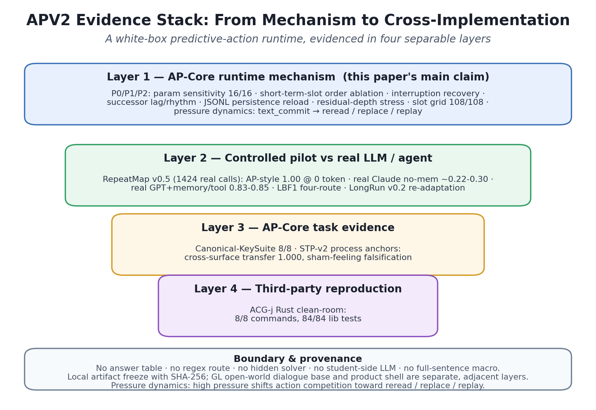
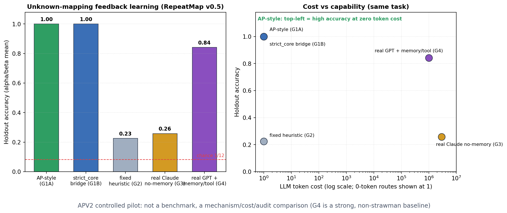

# 让机器一直是它自己: APV2 白箱人工心智架构发布

日期: 2026-06-14  
用途: 新闻稿 / 科普稿  
项目仓库: `https://github.com/ginsonko/Artificial-PsyArch-V2`  
开放中文对话仓库: `https://github.com/ginsonko/APV2-GL-OpenWorld-Chinese`  
实验复现仓库: `https://github.com/ginsonko/APV2-Reproduction-Artifacts`
发布冻结: 三个官方仓库均已在 `apv2-release-20260614-final` tag 下冻结。
许可证: `APV2 Public Research License v2026-06-14`, 允许公开阅读、本地复验和非商业研究引用，保留商业使用、模型训练、数据再打包和产品部署边界。

媒体一句话: APV2 把“机器如何持续成为同一个自己”做成了可运行、可审计、可复现的白箱预测-行动架构。

## 导语

今天的大模型很会回答问题，但它们通常不是一个持续在场的自己。每次新对话，它们都像重新读一遍上下文; 记忆常常是外部数据库，需要时检索回来，不需要时放在一边。

APV2 研究的是另一个问题: 机器怎样才能在连续时间中始终作为同一个自己运行。它不是一个更大的聊天模型，而是一套白箱预测-行动闭环架构。系统把看到的、想到的、记住的、预测的、犹豫的、行动过的和反馈过的，都放进同一个当前状态场里，让它们持续影响下一步注意、回忆、预测和行动。

## APV2 的关键想法

APV2 的核心可以用一句话概括: 把“想、看、说、改、记”放进同一条一直运行的循环里，并让每一步都能被看见。

它有几个很直观的特点。

第一，它有一个当前状态场，而不只是聊天记录。现实输入、刚刚的想法、历史经验、预测压力、行动倾向和行动后果，都同时作为可竞争的对象存在。

第二，它的“感受”来自内部过程，而不是表演。困惑、不确定、压力、错配、疲劳、闭合感都由内部预测落差、证据缺口和行动反馈生成，并能进入记忆、影响下一步行为。

第三，它会纠正错误联想。实验中，一个错误预测残留与真实上下文的相似度从 +0.36 被推到 -0.59, 而正确关联几乎不受损。这意味着系统能够把错误经验定向清除，而不是把错误永远刻进记忆。

第四，它分得清“接下来发生什么”和“两个东西是不是同类”。训练 A->B 后继时，后继强度从 0 升到 0.94, 但 A 和 B 的概念相似度保持不变。这让系统能学会接话和模仿，又不把不相关对象误当成同义。

## 为什么这件事重要

如果 AI 只是一台每次重新读上下文的超级问答机，它就很难真正形成连续经验。桌面助手、陪伴型智能体、学习伙伴和开放世界 agent 都需要另一种能力: 它要记得刚刚发生了什么，知道自己哪里不确定，能在失败后修正，能在被打断后恢复，还能把学过的经验迁移到新场景。

APV2 给出的是这种能力的底座。它不和大模型对立。大模型仍然可以作为教师、工具和评测者，但 APV2 要解决的是“一个系统怎样持续成为它自己”的底层工程问题。

## 证据链

APV2 的证据分成四层。

第一层是机制本身。底层循环在 16 种参数扰动下保持稳定; 短期记忆顺序是软偏置而不是硬规则; 系统被打断后能恢复主线; 后继预测有清晰的下一拍峰值; 记忆能持久化并重载; 压力上升会把行动从直接提交推向回看、替换和回放; 在线 learned vector 证明了有用、会纠错、不越界。

第二层是开放中文对话学习验证。GL 线在 teacher-off/no-leakage 约束下完成 OpenWorld-Foundation 受控 Live Fresh300 验证，记录为 300/300, 回复唯一性 294, ablation 6/6。Skill38 Codex Fresh300 teacher-off 冻结题库同样记录为 300/300, no-leakage 300/300。学生侧回答链依靠过程记忆、动作竞争和逐字输出; 审计同时锁定 `student_side_llm=false`、无 provider、无答案表、无 regex route、无整句动作宏、无 hidden solver。

第三层是与真实 LLM/agent 的受控对照。在一个未知规则、只能靠反馈慢慢学的任务中，AP-style 路线以 0 token、0 外部 API 达到 1.00; 真实 Claude 无记忆约 0.22-0.30; 真实 GPT 加记忆和工具约 0.83-0.85。这说明差异不是“谁更聪明”的简单胜负，而是机制、成本和可审计性的差异。

第四层是第三方独立复现。外部作者用 Rust 独立重建了 AP-inspired 机制，完成 8/8 命令、84/84 库测试、数学泛化、关系词几何学习、teacher-off/cold-retest 和 no-leakage/control probes。这说明 AP 的关键机制可以跨语言、跨工程路线被重建。

## 发布内容

本次发布采用三个仓库:

- `Artificial-PsyArch-V2`: APV2 核心 runtime、论文、AP-Core 机制实验和图表。
- `APV2-GL-OpenWorld-Chinese`: GL 学习协议、开放中文对话课程、Fresh300/Skill38 teacher-off 验证。
- `APV2-Reproduction-Artifacts`: 冻结实验产物、manifest、hash、复跑命令和第三方复现整理。

第三方独立复现仓库 `ACG-j/artificial_psyarch` 作为外部参考保留。

## 一句话总结

APV2 的价值不在于宣称机器已经拥有完整人类心智，而在于它把一个过去很难落地的问题变成了可运行、可审计、可复现的工程原型: 一个系统如何在连续时间中持续成为它自己。

本次发布更适合被理解为研究原型和证据包的冻结版本。它已经给出 AP-Core 机制、GL 学习验证和第三方复现三条证据线; 后续工作将继续把这些证据推进到更长时间的真实在线运行、更多开放领域课程和更标准的跨机器复现包。
